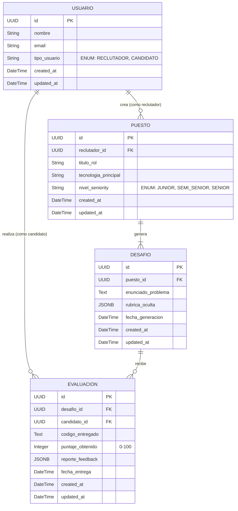

**User:**

<task>
According to the definitions of this project found in here: product/PRODUCT.md, let's create the ARCHITECTURE.md file. You will find a template to use as reference here: product/ARCHITECTURE.md
</task>
<environment_details>
# VSCode Visible Files
product/ARCHITECTURE.md

# VSCode Open Tabs
product/Talent pool app.md,product/PRODUCT.md,product/ARCHITECTURE.md

# Current Time
Current time in ISO 8601 UTC format: 2026-05-01T16:35:21.573Z
User time zone: America/Buenos_Aires, UTC-3:00

# Current Cost
$0.00

# Review Exclusions
The following file patterns are excluded from code reviews:
- .vscode/**

# Current Mode
<slug>code</slug>
<name>💻 Code</name>


# Current Workspace Directory (/home/nicogabh/projects/hackathon) Files
CHANGELOG.md
CONTRIBUTING.md
README.md
sonar-project.properties
TECH_DEBT.md
docs/
docs/{adr,uc,runbooks}/
docs/adr/
docs/adr/0000-template.md
docs/adr/0001-stack-base.md
docs/adr/0002-rag-vector-store.md
docs/adr/0003-llm-evals.md
docs/runbooks/
docs/runbooks/incident-template.md
docs/uc/
docs/uc/UC-001-registrar-usuario.md
docs/uc/UC-template.md
product/
product/ARCHITECTURE.md
product/PRODUCT.md
product/rf-rnf.md
product/ROADMAP.md
product/Talent pool app.md
You have not created a todo list yet. Create one with `update_todo_list` if your task is complicated or involves multiple steps.
</environment_details>

---

**Assistant:**

I'll help you create the ARCHITECTURE.md file based on the project definitions. Let me start by reading the necessary files to understand the project requirements and the template structure.

<read_file>
<args>
<file>
<path>product/PRODUCT.md</path>
</file>
<file>
<path>product/ARCHITECTURE.md</path>
</file>
<file>
<path>product/Talent pool app.md</path>
</file>
</args>
</read_file>

---

**User:**

[read_file for 'product/PRODUCT.md', 'product/ARCHITECTURE.md', 'product/Talent pool app.md'] Result:
<files>
<file><path>product/PRODUCT.md</path>
<content lines="1-396">
  1 | # PRODUCT.md — definición del producto
  2 | 
  3 | > Documento estable. Cambios requieren decisión explícita y entrada en `CHANGELOG.md`.
  4 | > Última revisión: 2026-05-01
  5 | 
  6 | ---
  7 | 
  8 | ## 1. problema
  9 | 
 10 | ### 1.1 enunciado
 11 | La desconexión entre la formación académica y el mercado laboral genera sobrecarga operativa para educadores, desperdicio de recursos en el aprendizaje estudiantil y altos costos de inducción para empresas.
 12 | 
 13 | ### 1.2 contexto y dolor actual
 14 | 
 15 | **Para instituciones educativas:**
 16 | - Los docentes dedican innumerables horas a la generación y corrección manual de trabajos prácticos y exámenes
 17 | - Los estudiantes realizan de forma aislada las mismas consultas a herramientas de IA, perdiendo la oportunidad de consolidar un aprendizaje colaborativo
 18 | - No existe un repositorio centralizado de conocimiento que optimice el uso de recursos de IA en el aula
 19 | 
 20 | **Para empresas:**
 21 | - Costos altísimos y tiempos de inducción prolongados para nuevos empleados
 22 | - Los candidatos ingresan con bases teóricas pero sin dominio práctico de herramientas y flujos de trabajo específicos
 23 | - Falta de mecanismos para pre-evaluar candidatos en entornos reales antes de la contratación
 24 | - Inversión significativa de presupuesto en capacitación que podría optimizarse
 25 | 
 26 | **Alternativas actuales:**
 27 | - Plataformas de evaluación técnica genéricas (HackerRank, Codility) que no personalizan desafíos ni reducen carga docente
 28 | - Sistemas LMS tradicionales (Moodle, Canvas) sin capacidades de IA para automatización
 29 | - Procesos manuales de reclutamiento con entrevistas técnicas costosas en tiempo
 30 | - Herramientas de IA individuales (ChatGPT, Claude) usadas de forma desorganizada
 31 | 
 32 | **Costo de no resolverlo:**
 33 | - Burnout docente por sobrecarga administrativa
 34 | - Desperdicio de tokens y recursos de IA por consultas duplicadas
 35 | - Tiempo promedio de inducción de 3-6 meses para nuevos empleados técnicos
 36 | - Costo estimado de USD 10,000-30,000 por empleado en capacitación inicial
 37 | 
 38 | ### 1.3 evidencia
 39 | - Análisis del ecosistema educativo actual muestra que docentes dedican 40-60% de su tiempo a tareas administrativas repetitivas
 40 | - En una clase promedio de 40 alumnos, se realizan las mismas consultas a LLMs de forma individual, multiplicando costos innecesariamente
 41 | - Estudios de mercado indican que el 70% de las empresas tech reportan tiempos de inducción superiores a 3 meses
 42 | - El costo promedio de onboarding en la industria tech oscila entre USD 15,000-30,000 por empleado
 43 | 
 44 | ---
 45 | 
 46 | ## 2. propuesta de valor
 47 | 
 48 | ### 2.1 enunciado
 49 | Para educadores y reclutadores que necesitan optimizar la evaluación técnica y reducir costos operativos, Talent Pool es una plataforma integral impulsada por IA que automatiza la generación y corrección de desafíos técnicos, centraliza el aprendizaje colaborativo y proporciona acceso a talento pre-evaluado, a diferencia de plataformas genéricas de evaluación que no personalizan contenido ni conectan directamente educación con inserción laboral.
 50 | 
 51 | ### 2.2 diferenciadores
 52 | 
 53 | **1. Automatización inteligente end-to-end**
 54 | - Generación automática de desafíos técnicos personalizados mediante LLM (LangChain4j)
 55 | - Evaluación estática automatizada con retroalimentación detallada
 56 | - Rúbricas ocultas generadas por IA para evaluación objetiva
 57 | 
 58 | **2. Repositorio colectivo de conocimiento**
 59 | - Centralización de consultas a IA para evitar duplicación de recursos
 60 | - Aprendizaje colaborativo mediante compartición de resoluciones
 61 | - Optimización de costos de tokens LLM al unificar consultas de grupos
 62 | 
 63 | **3. Puente directo educación-empleo**
 64 | - Base de datos de talento pre-evaluado y capacitado
 65 | - Simulación de flujos de trabajo específicos de empresas
 66 | - Reducción drástica de tiempos y costos de inducción corporativa
 67 | 
 68 | **4. Evaluación contextualizada**
 69 | - Desafíos a libro abierto que simulan entornos reales de trabajo
 70 | - Personalización según tecnología, rol y nivel de seniority
 71 | - Análisis estático que evalúa lógica, eficiencia y buenas prácticas
 72 | 
 73 | ---
 74 | 
 75 | ## 3. usuario objetivo
 76 | 
 77 | ### 3.1 segmento principal
 78 | 
 79 | **Segmento 1: Educadores / Docentes**
 80 | - Perfil: Profesores de carreras técnicas (programación, ingeniería de software, ciencia de datos)
 81 | - Contexto: Instituciones educativas (universidades, bootcamps, cursos técnicos)
 82 | - Nivel técnico: Intermedio a avanzado en tecnologías de enseñanza
 83 | - Frecuencia de uso: Semanal (creación de prácticas) y diaria (revisión de entregas)
 84 | - Dispositivo: Desktop/laptop, navegadores modernos
 85 | 
 86 | **Segmento 2: Estudiantes / Candidatos**
 87 | - Perfil: Estudiantes de carreras técnicas o profesionales junior buscando empleo
 88 | - Contexto: Aprendizaje activo, preparación para entrevistas técnicas
 89 | - Nivel técnico: Básico a intermedio, en proceso de formación
 90 | - Frecuencia de uso: Diaria a semanal (resolución de desafíos, consultas)
 91 | - Dispositivo: Desktop/laptop/tablet, navegadores modernos
 92 | 
 93 | **Segmento 3: Reclutadores / HR Tech**
 94 | - Perfil: Responsables de selección técnica en empresas de tecnología
 95 | - Contexto: Procesos de hiring, evaluación de candidatos, reducción de time-to-hire
 96 | - Nivel técnico: Básico (no requieren conocimiento técnico profundo)
 97 | - Frecuencia de uso: Semanal (creación de evaluaciones, revisión de candidatos)
 98 | - Dispositivo: Desktop/laptop, navegadores modernos
 99 | 
100 | ### 3.2 personas
101 | 
102 | **Persona 1: María - Profesora de Programación**
103 | - Edad: 38 años
104 | - Rol: Docente de Ingeniería en Sistemas
105 | - Objetivos: Reducir tiempo en corrección manual, mejorar calidad de feedback a estudiantes, dedicar más tiempo a mentoría
106 | - Frustraciones: Sobrecarga administrativa, corrección repetitiva de errores similares, falta de tiempo para innovación pedagógica
107 | - Cita: "Paso más tiempo corrigiendo trabajos que enseñando. Necesito automatizar lo repetitivo para enfocarme en lo que realmente importa."
108 | 
109 | **Persona 2: Carlos - Estudiante de Desarrollo Web**
110 | - Edad: 24 años
111 | - Rol: Estudiante de bootcamp, buscando primer empleo tech
112 | - Objetivos: Aprender prácticas reales de la industria, prepararse para entrevistas técnicas, conseguir empleo rápidamente
113 | - Frustraciones: Desconexión entre teoría y práctica, no saber qué esperan las empresas, falta de feedback constructivo
114 | - Cita: "Sé programar, pero no sé si lo hago como lo esperan en una empresa real. Necesito práctica con casos reales."
115 | 
116 | **Persona 3: Laura - Tech Recruiter**
117 | - Edad: 32 años
118 | - Rol: HR Manager en startup de 50 personas
119 | - Objetivos: Reducir time-to-hire, encontrar candidatos que requieran menos onboarding, optimizar presupuesto de capacitación
120 | - Frustraciones: Candidatos con CV impresionante pero sin skills prácticas, procesos de evaluación largos y costosos, alta rotación por mal fit técnico
121 | - Cita: "Necesito candidatos que ya sepan usar nuestras herramientas. El onboarding de 3 meses es insostenible para nuestro ritmo."
122 | 
123 | ### 3.3 antiusuarios
124 | 
125 | **Quiénes NO son usuarios objetivo:**
126 | - Empresas sin procesos de hiring técnico (retail, servicios no-tech)
127 | - Estudiantes de carreras no técnicas (humanidades, ciencias sociales sin componente tech)
128 | - Instituciones educativas sin infraestructura digital básica
129 | - Organizaciones que buscan evaluaciones presenciales exclusivamente
130 | - Usuarios que requieren evaluación de soft skills únicamente (fuera de alcance MVP)
131 | - Empresas que buscan soluciones de HR generalistas sin foco técnico
132 | 
133 | ---
134 | 
135 | ## 4. casos de uso
136 | 
137 | Listado completo. Cada UC vive en su propio archivo en `docs/uc/UC-NNN-slug.md`.
138 | 
139 | | ID | nombre | prioridad | fase | estado |
140 | |----|--------|-----------|------|--------|
141 | | UC-001 | Generar desafío técnico automatizado | crítica | MVP | pendiente |
142 | | UC-002 | Resolver desafío y evaluar mediante análisis estático | crítica | MVP | pendiente |
143 | | UC-003 | Visualizar ranking de candidatos y reportes de evaluación | crítica | MVP | pendiente |
144 | | UC-004 | Acceder y seleccionar desafíos por parte del candidato | crítica | MVP | pendiente |
145 | | UC-005 | Registrar usuario (reclutador/candidato) | alta | 2 | planificado |
146 | | UC-006 | Iniciar sesión y gestión de perfiles | alta | 2 | planificado |
147 | | UC-007 | Centralizar consultas a IA (repositorio colectivo) | alta | 2 | planificado |
148 | | UC-008 | Generar guías de estudio personalizadas | media | 2 | planificado |
149 | | UC-009 | Filtrar base de talento por tecnología y puntaje | media | 3 | planificado |
150 | | UC-010 | Crear simuladores de flujos de trabajo empresariales | media | 3 | planificado |
151 | | UC-011 | Emitir certificados digitales de finalización | baja | 4 | planificado |
152 | | UC-012 | Sistema de suscripciones y pagos | baja | 4 | planificado |
153 | 
154 | **Prioridades**: 
155 | - **crítica**: bloqueante para MVP/hackathon
156 | - **alta**: necesario para fase 2 (módulo académico)
157 | - **media**: expansión corporativa (fase 3)
158 | - **baja**: monetización y certificación (fase 4)
159 | 
160 | **Descripción de casos de uso MVP:**
161 | 
162 | **UC-001**: Reclutador/docente ingresa parámetros de puesto (rol, tecnología, seniority) → Sistema genera desafío técnico + rúbrica oculta mediante LLM → Desafío queda disponible para candidatos
163 | 
164 | **UC-002**: Candidato visualiza desafío → Desarrolla solución en editor integrado → Sistema evalúa mediante análisis estático con IA → Retorna puntaje (0-100) y feedback detallado
165 | 
166 | **UC-003**: Reclutador accede a dashboard → Visualiza ranking de candidatos por desafío → Revisa código entregado y análisis de IA → Toma decisiones de selección
167 | 
168 | **UC-004**: Candidato accede a catálogo de desafíos → Filtra por tecnología/nivel → Selecciona desafío → Inicia proceso de evaluación
169 | 
170 | ---
171 | 
172 | ## 5. alcance
173 | 
174 | ### 5.1 dentro de v1 (in) - MVP Hackathon
175 | 
176 | **Motor central de evaluación:**
177 | - Generación automática de desafíos técnicos mediante LLM (LangChain4j)
178 | - Rúbricas de evaluación ocultas generadas por IA
179 | - Análisis estático automatizado de código/soluciones
180 | - Retroalimentación detallada con puntaje numérico (0-100)
181 | 
182 | **Interfaces de usuario (4 pantallas):**
183 | - Panel de inicio role-based (dashboard para reclutadores y candidatos)
184 | - Formulario de generación de desafíos (reclutadores)
185 | - Entorno de resolución con editor integrado (candidatos)
186 | - Vista de resultados y ranking (ambos roles)
187 | 
188 | **Modelo de datos básico:**
189 | - Entidades: Usuario, Puesto, Desafío, Evaluación
190 | - Base de datos PostgreSQL con soporte JSONB
191 | - Relaciones definidas según DER documentado
192 | 
193 | **Stack tecnológico:**
194 | - Backend: Quarkus (Java)
195 | - IA: LangChain4j para integración con LLM
196 | - Frontend: React
197 | - Base de datos: PostgreSQL con pgvector (preparado para RAG futuro)
198 | 
199 | ### 5.2 fuera de v1, planificado (later)
200 | 
201 | **Fase 2 - Módulo académico y colaboración:**
202 | - Sistema de autenticación completo (OAuth, roles granulares)
203 | - Repositorio colectivo de consultas a IA
204 | - Generación de guías de estudio personalizadas
205 | - Compartición de resoluciones entre estudiantes
206 | - Panel de administración para docentes
207 | 
208 | **Fase 3 - Expansión corporativa:**
209 | - Base de datos de talento filtrable y buscable
210 | - Simuladores de flujos de trabajo específicos por empresa
211 | - Integración con ATS (Applicant Tracking Systems)
212 | - Analytics avanzados de desempeño
213 | - API pública para integraciones
214 | 
215 | **Fase 4 - Monetización y certificación:**
216 | - Sistema de suscripciones (instituciones y empresas)
217 | - Procesamiento de pagos
218 | - Emisión automática de certificados digitales
219 | - Sistema de recompensas y gamificación
220 | - Marketplace de desafíos premium
221 | 
222 | ### 5.3 explícitamente fuera (out)
223 | 
224 | **No se implementará (ni en futuro cercano):**
225 | - Evaluación de soft skills o competencias no técnicas
226 | - Videoconferencias integradas para entrevistas
227 | - Ejecución real de código (sandbox con runtime) - solo análisis estático en MVP
228 | - Integración con plataformas LMS externas (Moodle, Canvas)
229 | - Aplicación móvil nativa (solo web responsive)
230 | - Soporte multiidioma (solo español/inglés en v1)
231 | - Evaluaciones presenciales o proctoring con cámara
232 | - Gestión de nómina o contratos laborales
233 | - Red social o mensajería entre usuarios
234 | 
235 | ---
236 | 
237 | ## 6. métricas de éxito
238 | 
239 | ### 6.1 métricas de producto
240 | 
241 | | métrica | objetivo v1 | cómo se mide |
242 | |---------|-------------|--------------|
243 | | Desafíos generados exitosamente | ≥ 50 en hackathon | Contador en BD |
244 | | Evaluaciones completadas | ≥ 100 en hackathon | Tabla EVALUACION |
245 | | Tiempo promedio de generación de desafío | < 30 segundos | Logs de backend |
246 | | Tiempo promedio de evaluación | < 10 segundos | Logs de LLM |
247 | | Tasa de completitud de desafíos iniciados | ≥ 60% | Funnel analytics |
248 | | Satisfacción de reclutadores (NPS) | ≥ 7/10 | Encuesta post-demo |
249 | | Satisfacción de candidatos (NPS) | ≥ 7/10 | Encuesta post-evaluación |
250 | 
251 | ### 6.2 métricas técnicas (SLOs)
252 | 
253 | | métrica | objetivo | umbral de alerta |
254 | |---------|----------|------------------|
255 | | Disponibilidad del sistema | 99% | < 95% |
256 | | Latencia p95 endpoints CRUD | < 300 ms | > 500 ms |
257 | | Latencia p95 generación de desafío (LLM) | < 8 s | > 15 s |
258 | | Latencia p95 evaluación de código (LLM) | < 5 s | > 10 s |
259 | | Time-to-first-token (si streaming) | < 2 s | > 4 s |
260 | | Tasa de error 5xx | < 1% | > 2% |
261 | | Tasa de error 4xx | < 5% | > 10% |
262 | | Uso de memoria backend | < 512 MB | > 1 GB |
263 | | Costo por 100 evaluaciones | < USD 5 | > USD 10 |
264 | 
265 | ### 6.3 métricas específicas de LLM
266 | 
267 | | métrica | objetivo | cómo se mide |
268 | |---------|----------|--------------|
269 | | Calidad de desafíos generados (relevancia) | ≥ 85% | Evaluación manual de muestra (n=20) |
270 | | Precisión de evaluaciones (vs evaluador humano) | ≥ 80% | Comparación con golden set (n=30) |
271 | | Tasa de respuestas estructuradas válidas (JSON) | ≥ 98% | Guardrails de LangChain4j |
272 | | Tasa de alucinación detectada | < 5% | Validación de rúbricas generadas |
273 | | Consistencia de evaluación (mismo código) | ≥ 90% | Test de repetibilidad (n=10) |
274 | | Tokens promedio por generación de desafío | < 2000 | Logs de LLM provider |
275 | | Tokens promedio por evaluación | < 1500 | Logs de LLM provider |
276 | | Tasa de timeout en llamadas LLM | < 2% | Monitoring de LangChain4j |
277 | 
278 | **Estrategia de evaluación (evals):**
279 | - Suite de evals automatizados según ADR-0003
280 | - Golden dataset con 30 pares (desafío, solución, puntaje esperado)
281 | - Evaluación manual periódica de calidad de outputs
282 | - A/B testing de prompts para optimización continua
283 | 
284 | ---
285 | 
286 | ## 7. supuestos y restricciones
287 | 
288 | ### 7.1 supuestos
289 | 
290 | **Supuestos técnicos:**
291 | - Los modelos de lenguaje (LLM) mantendrán disponibilidad ≥ 99% durante la hackathon
292 | - La latencia de respuesta de LLMs será aceptable (< 10s) para la experiencia de usuario
293 | - PostgreSQL con JSONB es suficiente para almacenar rúbricas y feedback sin necesidad de base de datos documental
294 | - El análisis estático de código es suficiente para MVP; no se requiere ejecución real
295 | 
296 | **Supuestos de negocio:**
297 | - Existe demanda real de educadores por automatización de evaluaciones
298 | - Las empresas están dispuestas a considerar candidatos pre-evaluados por IA
299 | - Los estudiantes confiarán en evaluaciones automatizadas si el feedback es de calidad
300 | - El modelo de negocio B2B (instituciones/empresas) es viable para monetización futura
301 | 
302 | **Supuestos de usuario:**
303 | - Los usuarios tienen acceso a internet estable y navegadores modernos
304 | - Los candidatos están familiarizados con editores de código web
305 | - Los reclutadores pueden describir requisitos técnicos de forma clara
306 | - Los usuarios aceptan términos de uso de IA para procesamiento de datos
307 | 
308 | **Riesgo si son falsos:**
309 | - Si LLMs no son confiables → Implementar fallbacks y caché de respuestas
310 | - Si latencia es inaceptable → Implementar streaming y feedback progresivo
311 | - Si usuarios no confían en IA → Agregar opción de revisión humana híbrida
312 | 
313 | ### 7.2 restricciones
314 | 
315 | **Presupuesto:**
316 | - Costo de tokens LLM: Estimado USD 50-100 para hackathon (500-1000 evaluaciones)
317 | - Infraestructura: Tier gratuito de cloud providers (Render, Railway, Vercel)
318 | - Sin presupuesto para servicios premium o APIs de pago
319 | 
320 | **Plazo:**
321 | - Hackathon: 48-72 horas para MVP funcional
322 | - Fase 2: 4-6 semanas post-hackathon
323 | - Fase 3: 8-12 semanas
324 | - Fase 4: 12-16 semanas
325 | 
326 | **Marco regulatorio:**
327 | - Cumplimiento de GDPR/LGPD para datos personales de candidatos
328 | - Transparencia en uso de IA según regulaciones emergentes de IA
329 | - Almacenamiento de código y evaluaciones con consentimiento explícito
330 | - No se pueden usar datos de evaluaciones para entrenar modelos propios sin consentimiento
331 | 
332 | **Compatibilidades obligatorias:**
333 | - Navegadores: Chrome 90+, Firefox 88+, Safari 14+, Edge 90+
334 | - Dispositivos: Desktop y laptop (tablet opcional, móvil fuera de alcance)
335 | - Resolución mínima: 1280x720
336 | - Sin soporte para IE11 o navegadores legacy
337 | 
338 | **Soberanía de datos:**
339 | - Los prompts y código de candidatos pueden procesarse por LLM providers externos (OpenAI, Anthropic, etc.)
340 | - Consentimiento explícito requerido en términos de uso
341 | - Opción futura de LLM on-premise para clientes enterprise con restricciones de datos
342 | - Datos personales (email, nombre) almacenados en servidores con ubicación definida
343 | 
344 | **Limitaciones técnicas:**
345 | - No hay ejecución real de código en MVP (solo análisis estático)
346 | - Sin soporte para lenguajes compilados complejos (C++, Rust) en v1
347 | - Foco inicial en lenguajes interpretados: Python, JavaScript, Java
348 | - Sin integración con IDEs externos (VS Code, IntelliJ)
349 | 
350 | ---
351 | 
352 | ## 8. glosario
353 | 
354 | Términos del dominio con definición canónica. Uso obligatorio en código y documentación.
355 | 
356 | | término | definición |
357 | |---------|------------|
358 | | **Desafío** | Problema técnico generado automáticamente por IA que un candidato debe resolver. Incluye enunciado, contexto y criterios de evaluación ocultos. |
359 | | **Rúbrica** | Conjunto de criterios de evaluación generados por IA y almacenados en formato JSONB. No visible para el candidato durante la resolución. |
360 | | **Evaluación** | Proceso completo que incluye la resolución de un desafío por un candidato y su análisis automatizado por IA. Resultado: puntaje + feedback. |
361 | | **Análisis estático** | Evaluación de código sin ejecución real, basada en lógica, estructura, eficiencia algorítmica y buenas prácticas. Realizado por LLM. |
362 | | **Candidato** | Usuario que resuelve desafíos técnicos. Puede ser estudiante o profesional buscando empleo. Rol: CANDIDATO en BD. |
363 | | **Reclutador** | Usuario que crea desafíos y revisa evaluaciones. Puede ser HR, tech lead o docente. Rol: RECLUTADOR en BD. |
364 | | **Puesto** | Definición de un rol laboral o tema académico que incluye: título, tecnología principal y nivel de seniority. Base para generar desafíos. |
365 | | **Seniority** | Nivel de experiencia técnica: Junior, Semi-Senior, Senior. Determina complejidad del desafío generado. |
366 | | **Repositorio colectivo** | (Fase 2) Base de conocimiento compartida donde se centralizan consultas a IA y resoluciones de estudiantes de una misma clase. |
367 | | **Sandbox** | Entorno de resolución aislado donde el candidato escribe código. En MVP: editor de texto. Futuro: entorno de ejecución real. |
368 | | **Feedback** | Retroalimentación detallada generada por IA tras evaluar una solución. Incluye: puntos fuertes, áreas de mejora, sugerencias específicas. |
369 | | **LLM** | Large Language Model. Motor de IA usado para generar desafíos y evaluar código. Integrado vía LangChain4j. |
370 | | **Guardrails** | Mecanismos de validación de LangChain4j que aseguran respuestas estructuradas (JSON) y detectan outputs inválidos. |
371 | | **Golden set** | Conjunto de datos de referencia con pares (desafío, solución, puntaje esperado) usado para evaluar precisión del sistema. |
372 | | **Evals** | Suite de evaluaciones automatizadas que miden calidad, precisión y consistencia de outputs del LLM. Ver ADR-0003. |
373 | | **Time-to-first-token** | Métrica de latencia: tiempo desde request hasta primer byte de respuesta del LLM en modo streaming. |
374 | | **RAG** | Retrieval-Augmented Generation. Técnica para mejorar respuestas de LLM con contexto específico. Planificado para Fase 2 con pgvector. |
375 | | **Prompt** | Instrucción estructurada enviada al LLM para generar desafíos o evaluar código. Incluye contexto, formato esperado y restricciones. |
376 | | **Token** | Unidad de procesamiento de LLM. Aproximadamente 0.75 palabras en español. Base para cálculo de costos de API. |
377 | | **JSONB** | Tipo de dato de PostgreSQL para almacenar JSON binario. Usado para rúbricas y feedback estructurado. |
378 | | **UC** | Use Case (Caso de Uso). Documentado en formato estándar en `docs/uc/UC-NNN-slug.md`. |
379 | | **ADR** | Architecture Decision Record. Decisiones técnicas documentadas en `docs/adr/NNNN-slug.md`. |
380 | | **MVP** | Minimum Viable Product. Versión mínima funcional para validar propuesta de valor en hackathon. |
381 | | **DoD** | Definition of Done. Criterios de aceptación para considerar una fase completada. Ver ROADMAP.md. |
382 | 
383 | ---
384 | 
385 | ## 9. referencias
386 | 
387 | - **Documentación técnica**: Ver `ARCHITECTURE.md` para decisiones de stack y patrones
388 | - **Roadmap**: Ver `ROADMAP.md` para fases detalladas y Definition of Done
389 | - **Casos de uso**: Ver `docs/uc/UC-001.md` a `UC-004.md` para flujos detallados
390 | - **ADRs**: Ver `docs/adr/` para decisiones arquitectónicas (stack, RAG, evals)
391 | - **Pitch completo**: Ver `Talent pool app.md` para contexto de negocio extendido
392 | - **Modelo de datos**: Ver DER en `Talent pool app.md` líneas 182-229
393 | 
394 | ---
395 | 
396 | **Fin del documento PRODUCT.md**
</content>
</file>
<file><path>product/ARCHITECTURE.md</path>
<content lines="1-431">
  1 | # ARCHITECTURE.md — arquitectura del sistema
  2 | 
  3 | > Decisiones cerradas. El agente NO debe re-decidir lo que está acá.
  4 | > Cada cambio requiere un ADR nuevo en `docs/adr/`.
  5 | > Última revisión: YYYY-MM-DD
  6 | 
  7 | ---
  8 | 
  9 | ## 1. visión general
 10 | 
 11 | ### 1.1 estilo arquitectónico
 12 | **Decisión**: monolito modular en backend + SPA desacoplada en frontend.
 13 | **Justificación**: simplicidad operativa, despliegue independiente de UI y API, evolución a microservicios solo si la escala lo exige (ver ADR-0002).
 14 | 
 15 | ### 1.2 diagrama C4 — nivel 1 (contexto)
 16 | ```
 17 | [ usuario final ]
 18 |        ↓ HTTPS
 19 | [ aplicación: SPA + API Quarkus ]
 20 |        ↓
 21 | [ proveedores LLM ]   [ vector store ]   [ servicios externos: email, pagos ]
 22 | ```
 23 | 
 24 | ### 1.3 diagrama C4 — nivel 2 (contenedores)
 25 | ```
 26 | [ navegador ]
 27 |      ↓ HTTPS
 28 | [ frontend SPA (React + Vite, servido por nginx o CDN) ]
 29 |      ↓ HTTPS / JSON
 30 | [ API Quarkus (JAX-RS / RESTEasy Reactive) ]
 31 |      ↓                ↓                  ↓
 32 | [ PostgreSQL ]   [ pgvector ]   [ proveedores LLM (OpenAI / Anthropic / Ollama) ]
 33 |      ↓
 34 | [ object storage ]   [ Redis caché ]
 35 | ```
 36 | 
 37 | Reemplazar con un diagrama real (Mermaid, draw.io, excalidraw exportado) en este archivo o en `docs/diagrams/`.
 38 | 
 39 | ---
 40 | 
 41 | ## 2. stack tecnológico (cerrado)
 42 | 
 43 | > Una sola opción por capa. Versión fija. Cambios → ADR.
 44 | 
 45 | ### 2.1 backend (Quarkus + LangChain4j)
 46 | 
 47 | | capa | tecnología | versión | ADR |
 48 | |------|------------|---------|-----|
 49 | | JDK | Eclipse Temurin | 21 LTS | ADR-0001 |
 50 | | GraalVM (build nativo) | GraalVM CE for JDK 21 | última estable | ADR-0001 |
 51 | | framework | Quarkus | 3.17.x (LTS más reciente) | ADR-0001 |
 52 | | build | Maven | 3.9.x | ADR-0001 |
 53 | | LLM toolkit | LangChain4j (extensión Quarkus) | 1.x estable | ADR-0001 |
 54 | | API REST | RESTEasy Reactive (JAX-RS) | incluida en Quarkus | ADR-0001 |
 55 | | ORM | Hibernate ORM with Panache | incluida en Quarkus | ADR-0001 |
 56 | | validación | Hibernate Validator (Bean Validation) | incluida | ADR-0001 |
 57 | | migraciones | Flyway | incluida (extensión Quarkus) | ADR-0001 |
 58 | | auth | Quarkus OIDC + SmallRye JWT | incluidas | ADR-0001 |
 59 | | BD relacional | PostgreSQL | 16 | ADR-0001 |
 60 | | vector store | pgvector (extensión de PostgreSQL) | 0.7.x+ | ADR-0002 |
 61 | | caché | Redis | 7.x | ADR-0001 |
 62 | | testing | JUnit 5 + AssertJ + Mockito | últimas | ADR-0001 |
 63 | | testing HTTP | REST Assured | última | ADR-0001 |
 64 | | testing infra | Testcontainers + Quarkus Dev Services | últimas | ADR-0001 |
 65 | | testing LLM | WireMock + LangChain4j MockChatModel | últimas | ADR-0001 |
 66 | | evals LLM | suite propia + framework definido en | ADR-0003 |
 67 | | observabilidad | Micrometer + OpenTelemetry (extensiones Quarkus) | incluidas | ADR-0001 |
 68 | 
 69 | ### 2.2 frontend
 70 | 
 71 | | capa | tecnología | versión | ADR |
 72 | |------|------------|---------|-----|
 73 | | lenguaje | TypeScript | 5.x | ADR-0001 |
 74 | | framework UI | React | 18.x | ADR-0001 |
 75 | | build | Vite | 5.x | ADR-0001 |
 76 | | gestor de paquetes | pnpm | 9.x | ADR-0001 |
 77 | | router | React Router | 6.x | ADR-0001 |
 78 | | state server | TanStack Query | 5.x | ADR-0001 |
 79 | | state cliente | Zustand o Context API | última | ADR-0001 |
 80 | | cliente HTTP | fetch nativo o openapi-fetch (tipado desde OpenAPI) | última | ADR-0001 |
 81 | | testing unitario | Vitest + Testing Library | últimas | ADR-0001 |
 82 | | testing e2e | Playwright | última | ADR-0001 |
 83 | | servidor estático | nginx (o CDN en producción) | última estable | ADR-0001 |
 84 | 
 85 | ### 2.3 infraestructura y operación
 86 | 
 87 | | capa | tecnología | versión | ADR |
 88 | |------|------------|---------|-----|
 89 | | contenedores | Docker + docker compose | última estable | ADR-0001 |
 90 | | imagen runtime backend | JVM o nativa (distroless) | — | ADR-0001 |
 91 | | CI/CD | GitHub Actions | — | ADR-0001 |
 92 | | análisis estático | SonarQube / SonarCloud | — | ADR-0001 |
 93 | | SAST adicional | GitHub CodeQL | — | ADR-0001 |
 94 | | cloud | (definir en ADR-00NN) | — | — |
 95 | 
 96 | ---
 97 | 
 98 | ## 3. estructura de carpetas (obligatoria)
 99 | 
100 | ```
101 | /
102 | ├── backend/
103 | │   ├── src/
104 | │   │   ├── main/
105 | │   │   │   ├── java/com/<org>/<app>/
106 | │   │   │   │   ├── api/              # recursos JAX-RS (endpoints)
107 | │   │   │   │   │   ├── dto/          # records de request/response
108 | │   │   │   │   │   └── exception/    # mappers de excepciones
109 | │   │   │   │   ├── domain/           # entidades de negocio, value objects, lógica pura
110 | │   │   │   │   ├── service/          # casos de uso (uno por UC, orquestación)
111 | │   │   │   │   ├── infrastructure/
112 | │   │   │   │   │   ├── persistence/  # repositorios Panache, mapeos JPA
113 | │   │   │   │   │   ├── ai/           # AiServices de LangChain4j, prompts, retrievers
114 | │   │   │   │   │   ├── llm/          # configuración de modelos, guardrails
115 | │   │   │   │   │   └── client/       # clientes REST/MicroProfile a APIs externas
116 | │   │   │   │   ├── config/           # ConfigProperties, beans CDI, producers
117 | │   │   │   │   └── security/         # autorización, filtros, identity providers
118 | │   │   │   └── resources/
119 | │   │   │       ├── application.yml   # configuración Quarkus
120 | │   │   │       ├── application-dev.yml
121 | │   │   │       ├── application-test.yml
122 | │   │   │       ├── db/migration/     # scripts Flyway: V1__init.sql, V2__...
123 | │   │   │       └── prompts/          # plantillas de prompt (.txt o .ftl)
124 | │   │   └── test/
125 | │   │       ├── java/com/<org>/<app>/
126 | │   │       │   ├── unit/
127 | │   │       │   ├── integration/      # @QuarkusTest con Testcontainers
128 | │   │       │   ├── e2e/              # tests REST end-to-end del backend
129 | │   │       │   └── evals/            # evaluaciones de LLM (ver ADR-0003)
130 | │   │       └── resources/
131 | │   │           ├── application-test.yml
132 | │   │           └── fixtures/
133 | │   ├── pom.xml
134 | │   └── README.md
135 | ├── frontend/
136 | │   ├── src/
137 | │   │   ├── components/
138 | │   │   ├── pages/
139 | │   │   ├── hooks/
140 | │   │   ├── services/                 # clientes de API generados desde OpenAPI
141 | │   │   ├── store/
142 | │   │   └── main.tsx
143 | │   ├── tests/
144 | │   ├── package.json
145 | │   └── README.md
146 | ├── infra/
147 | │   ├── docker/
148 | │   │   ├── Dockerfile.backend.jvm
149 | │   │   ├── Dockerfile.backend.native
150 | │   │   └── Dockerfile.frontend
151 | │   ├── compose/                      # docker-compose para entornos
152 | │   └── terraform/                    # si aplica
153 | ├── docs/
154 | │   ├── adr/
155 | │   ├── uc/
156 | │   ├── runbooks/
157 | │   └── diagrams/
158 | ├── PRODUCT.md
159 | ├── ARCHITECTURE.md
160 | ├── ROADMAP.md
161 | ├── CONTRIBUTING.md
162 | ├── CHANGELOG.md
163 | └── TECH_DEBT.md
164 | ```
165 | 
166 | **Regla**: el agente no crea carpetas raíz nuevas sin ADR.
167 | 
168 | ---
169 | 
170 | ## 4. modelo de datos
171 | 
172 | ### 4.1 entidades canónicas
173 | Diagrama ER + tabla con:
174 | - nombre
175 | - atributos (con tipo)
176 | - invariantes (qué siempre se cumple)
177 | - estados posibles y transiciones permitidas
178 | 
179 | ### 4.2 reglas de integridad
180 | - Claves foráneas siempre con `ON DELETE` explícito
181 | - Timestamps `created_at` y `updated_at` en toda tabla, manejados por Hibernate (`@CreationTimestamp`, `@UpdateTimestamp`)
182 | - Soft delete sólo si está justificado por UC (`deleted_at` nullable)
183 | - IDs: UUID v7 generado por aplicación o `gen_random_uuid()` desde Postgres
184 | - Snake_case en tablas y columnas
185 | - Tablas en plural
186 | 
187 | ### 4.3 migraciones (Flyway)
188 | - Toda alteración de esquema pasa por scripts Flyway en `db/migration/`
189 | - Nomenclatura: `V<n>__<descripcion_snake_case>.sql` (ej: `V12__add_index_on_users_email.sql`)
190 | - Nunca editar una migración mergeada; crear una nueva
191 | - Migraciones idempotentes y reversibles cuando sea posible
192 | - Migraciones grandes (backfills) en lotes y separadas de cambios de esquema
193 | 
194 | ---
195 | 
196 | ## 5. API
197 | 
198 | ### 5.1 estilo
199 | REST + JSON. Versionado por path: `/api/v1/...`.
200 | 
201 | ### 5.2 contrato
202 | - OpenAPI 3.1 generado automáticamente por SmallRye OpenAPI (extensión Quarkus)
203 | - Spec versionada en el repo: `backend/src/main/resources/META-INF/openapi.yaml` o exportada a `docs/api/openapi.yaml` por CI
204 | - Cualquier cambio que rompa compatibilidad → nueva versión de path
205 | - El frontend consume la spec con `openapi-typescript` o `openapi-fetch` para generar clientes tipados
206 | 
207 | ### 5.3 convenciones
208 | - Recursos en plural: `/users`, `/conversations`
209 | - Códigos HTTP semánticos (200, 201, 204, 400, 401, 403, 404, 409, 422, 429, 500)
210 | - Errores con formato uniforme (`ExceptionMapper` global):
211 | ```json
212 | {
213 |   "error": {
214 |     "code": "VALIDATION_ERROR",
215 |     "message": "human readable",
216 |     "details": [...]
217 |   },
218 |   "request_id": "uuid"
219 | }
220 | ```
221 | - Paginación: cursor-based por defecto; offset solo para casos justificados
222 | - Idempotencia: header `Idempotency-Key` obligatorio en POST que crean recursos cobrables, externos o que disparan llamadas LLM costosas
223 | 
224 | ### 5.4 endpoints LLM (streaming)
225 | - Usar `Multi<String>` (Mutiny) o SSE (`@RestStreamElementType(MediaType.SERVER_SENT_EVENTS)`) para respuestas streaming
226 | - Cancelación del lado servidor cuando el cliente cierra la conexión (importante: corta el costo del token)
227 | 
228 | ---
229 | 
230 | ## 6. capa LLM (LangChain4j)
231 | 
232 | ### 6.1 organización
233 | - **AiServices** (interfaces anotadas) en `infrastructure/ai/services/`. Una interface por capacidad LLM (ej: `DocumentSummarizer`, `ConversationalAgent`)
234 | - **Prompts** versionados en `resources/prompts/` o como constantes. Nunca prompts hardcodeados dispersos por el código.
235 | - **Retrievers RAG** en `infrastructure/ai/retrieval/`. Cada uno expone una interfaz Java tipada.
236 | - **Tools** en `infrastructure/ai/tools/`. Cada tool es un método anotado con `@Tool` con descripción clara y parámetros tipados.
237 | - **Modelos** configurados como CDI beans en `config/`, parametrizados por `application.yml`.
238 | 
239 | ### 6.2 reglas
240 | - Ningún string de prompt vive en producción sin haber pasado por la suite de evals (ver ADR-0003).
241 | - Cambios en prompts requieren entrada en `CHANGELOG.md` y bump de versión menor.
242 | - Toda llamada a LLM tiene timeout explícito y reintentos con backoff exponencial (`@Retry` de SmallRye Fault Tolerance).
243 | - Toda llamada a LLM tiene límite de tokens de entrada y salida configurado.
244 | - El proveedor LLM se configura por entorno: dev puede usar Ollama local; prod usa el proveedor cloud elegido.
245 | 
246 | ### 6.3 guardrails
247 | - **InputGuardrail**: detección de inyección de prompts, longitud máxima, filtrado de PII
248 | - **OutputGuardrail**: validación de formato (si se espera JSON estructurado), filtrado de contenido tóxico, verificación de citas (en RAG)
249 | - Implementados con la API nativa de LangChain4j 1.x (`@InputGuardrails`, `@OutputGuardrails`)
250 | 
251 | ### 6.4 streaming
252 | - Uso de `TokenStream` o `Multi<String>` para respuestas conversacionales
253 | - Cancelación propagada desde HTTP al cliente LLM
254 | 
255 | ---
256 | 
257 | ## 7. autenticación y autorización
258 | 
259 | ### 7.1 autenticación
260 | - Mecanismo: OIDC con un proveedor externo (Keycloak / Auth0 / Cognito), o JWT firmado propio
261 | - Hashing de contraseñas (si se usa auth local): bcrypt o argon2id
262 | - Recuperación de contraseña: token de un solo uso con expiración corta
263 | 
264 | ### 7.2 autorización
265 | - Modelo: RBAC con anotaciones `@RolesAllowed` o ABAC con `SecurityIdentity` custom
266 | - **Deny by default**: cada endpoint declara explícitamente quién puede acceder
267 | - Verificación adicional en capa de servicio para reglas de negocio (no sólo a nivel de rol)
268 | - Auditoría de accesos sensibles
269 | 
270 | ### 7.3 secretos
271 | - Nunca en el repo
272 | - En desarrollo: `.env.local` (en .gitignore) cargado por `quarkus.config.locations`
273 | - En producción: Vault, secret manager del cloud, o variables de entorno inyectadas por el orquestador
274 | - Rotación documentada en runbook
275 | 
276 | ---
277 | 
278 | ## 8. seguridad transversal
279 | 
280 | Aplicada a CADA UC, verificada en CI:
281 | 
282 | - Validación de input en servidor (Bean Validation `@Valid`). No confiar en cliente.
283 | - Sanitización de output donde corresponda
284 | - Protección contra inyección SQL (Hibernate parametrizado, nunca concatenación)
285 | - Rate limiting en endpoints sensibles (login, registro, password reset, búsquedas públicas, **endpoints LLM por costo de token**)
286 | - Headers de seguridad: CSP, HSTS, X-Content-Type-Options, Referrer-Policy (configurables en Quarkus)
287 | - CORS configurado con allowlist explícita
288 | - Auditoría de dependencias en CI: `mvn dependency-check:check` (OWASP) o Snyk; `pnpm audit` para frontend
289 | - Logs sin PII ni secretos (lista negra de campos, sanitización en interceptor)
290 | - Logs **sin contenido sensible de prompts** salvo nivel debug en dev
291 | - Backups cifrados, restauración probada al menos cada release mayor
292 | 
293 | ---
294 | 
295 | ## 9. observabilidad
296 | 
297 | ### 9.1 logs
298 | - Formato JSON estructurado (extensión `quarkus-logging-json`)
299 | - Campos obligatorios: `timestamp`, `level`, `request_id`, `user_id` (si aplica), `service`, `message`
300 | - Niveles: DEBUG (solo dev), INFO (eventos normales), WARNING (recuperable), ERROR (falla), CRITICAL (sistema en riesgo)
301 | - MDC propagado en hilos reactivos
302 | 
303 | ### 9.2 métricas (Micrometer)
304 | Mínimas obligatorias:
305 | - latencia p50/p95/p99 por endpoint
306 | - throughput por endpoint
307 | - tasa de error por endpoint
308 | - saturación del datasource (pool de conexiones)
309 | - consumo de CPU/memoria (JVM exporter)
310 | - **métricas de LLM**: tokens consumidos por modelo, latencia por modelo, costo estimado, tasa de fallos LLM, tokens por request, time-to-first-token
311 | 
312 | ### 9.3 trazas (OpenTelemetry)
313 | - `quarkus-opentelemetry` instrumenta automáticamente HTTP, JDBC, llamadas LangChain4j
314 | - `request_id` propagado de frontend a backend a BD y a servicios externos
315 | - Spans específicos para cada llamada LLM con atributos: modelo, tokens, latencia, costo
316 | 
317 | ### 9.4 alertas
318 | Definidas en función de SLOs (`PRODUCT.md` §6.2). Cada alerta tiene runbook asociado.
319 | Alertas específicas LLM: costo diario excedido, latencia LLM degradada, tasa de error LLM > umbral.
320 | 
321 | ### 9.5 endpoints de salud
322 | - `/q/health/live`: el proceso responde (Quarkus default)
323 | - `/q/health/ready`: dependencias críticas (BD, LLM provider, vector store) responden
324 | - `/q/metrics`: endpoint Prometheus
325 | 
326 | ---
327 | 
328 | ## 10. estrategia de testing
329 | 
330 | ### 10.1 pirámide
331 | ```
332 |         evals LLM (calidad de prompts) — ver ADR-0003
333 |         e2e (pocos, críticos)
334 |       integración (cobertura de bordes, @QuarkusTest)
335 |    unitarios (mayoría, rápidos, aislados)
336 | ```
337 | 
338 | ### 10.2 reglas
339 | - Cada UC requiere: unitarios de su lógica de dominio + integración del endpoint + e2e del flujo crítico
340 | - UCs con LLM requieren además: tests de unidad con `MockChatModel` (LangChain4j) + entrada en suite de evals
341 | - Cobertura mínima por módulo: 80% de líneas en backend (JaCoCo), 70% en frontend
342 | - **Tests inmutables**: si un test falla, se arregla el código, nunca el test, salvo que el test esté demostrablemente mal escrito
343 | - Tests deterministas: nada de `Thread.sleep`, nada de fechas reales (`Clock` inyectable). Tests LLM SIEMPRE con mock, jamás llamando al modelo real.
344 | - Datos de test aislados: Testcontainers + transacción rollback por test (`@TestTransaction`)
345 | 
346 | ### 10.3 testing con Quarkus
347 | - `@QuarkusTest` para tests de integración con CDI completo
348 | - `@QuarkusIntegrationTest` para tests contra el binario compilado (incluye nativo si aplica)
349 | - Quarkus Dev Services levanta automáticamente PostgreSQL y otros servicios en tests
350 | - WireMock para simular APIs externas (incluyendo proveedores LLM en tests de integración cuando se quiere comportamiento determinista pero pasando por la pila HTTP real)
351 | 
352 | ### 10.4 CI
353 | Pipeline obligatorio antes de merge:
354 | 1. lint backend (Checkstyle / Spotless)
355 | 2. format check backend (Spotless)
356 | 3. lint y format frontend (eslint, prettier)
357 | 4. type check frontend (tsc)
358 | 5. tests unitarios + integración backend (`mvn verify`)
359 | 6. tests unitarios + integración frontend
360 | 7. tests e2e (al menos los críticos, Playwright contra build)
361 | 8. evals LLM (subset rápido, ver ADR-0003)
362 | 9. audit de dependencias (OWASP Dependency-Check, pnpm audit)
363 | 10. análisis estático SonarQube (ver §10.5)
364 | 11. build de imágenes Docker (JVM mode siempre, nativo en pipelines lentos)
365 | 
366 | Ningún PR mergea sin todos en verde.
367 | 
368 | ### 10.5 análisis estático de calidad
369 | 
370 | **Herramienta**: SonarQube / SonarCloud.
371 | Alternativa complementaria: GitHub CodeQL (gratis para repos públicos y muchos privados).
372 | 
373 | **Quality gate**:
374 | - **Fase 0 a 2**: gate suave (warning, no bloqueante)
375 | - **Fase 3 (hardening) en adelante**: gate bloqueante con umbrales:
376 |   - 0 vulnerabilidades nuevas
377 |   - 0 bugs nuevos de severidad alta o crítica
378 |   - cobertura de código nuevo ≥ 80%
379 |   - duplicación de código nuevo < 3%
380 |   - mantenibilidad: ratio de deuda técnica < 5%
381 | 
382 | ---
383 | 
384 | ## 11. presupuesto de performance
385 | 
386 | | operación | objetivo p95 | bloqueante |
387 | |-----------|--------------|------------|
388 | | login | 300 ms | sí |
389 | | listado paginado típico (sin LLM) | 400 ms | sí |
390 | | flujo CRUD del UC crítico | 600 ms | sí |
391 | | respuesta LLM no streaming (corto) | 5 s | sí |
392 | | time-to-first-token (streaming) | 1.5 s | sí |
393 | | operación batch | 5 s | no |
394 | 
395 | Tamaño de bundle frontend inicial: < 250 KB gzip. Excedente requiere ADR.
396 | Imagen Docker backend JVM: < 250 MB. Imagen nativa: < 100 MB.
397 | Arranque JVM: < 5 s. Arranque nativo: < 1 s.
398 | 
399 | ---
400 | 
401 | ## 12. estrategia de despliegue
402 | 
403 | ### 12.1 entornos
404 | - `local`: docker compose con Postgres + pgvector + Ollama + backend en dev mode + frontend en dev mode
405 | - `staging`: réplica de producción a menor escala, datos anónimos, proveedor LLM real con presupuesto acotado
406 | - `production`: real
407 | 
408 | ### 12.2 pipeline
409 | - merge a `main` → build, push de imagen, deploy automático a staging
410 | - tag `vX.Y.Z` → deploy a producción con aprobación manual
411 | - Migraciones Flyway: ejecutadas al arranque del backend; deben ser compatibles hacia atrás durante una versión
412 | 
413 | ### 12.3 imágenes
414 | - **Modo JVM** (default): `Dockerfile.backend.jvm` con OpenJDK 21 distroless. Más rápido de construir, soporta hot reload remoto si se desea.
415 | - **Modo nativo** (opcional, recomendado para producción): `Dockerfile.backend.native` con GraalVM. Arranque sub-segundo, RAM mínima, ideal para escalado horizontal y serverless.
416 | - La elección entre JVM y nativo en producción se documenta en ADR.
417 | 
418 | ### 12.4 rollback
419 | Plan documentado en runbook. Tiempo objetivo de rollback: < 10 min.
420 | 
421 | ---
422 | 
423 | ## 13. decisiones pendientes
424 | 
425 | Lista de decisiones aún no tomadas. Cada una se cierra con un ADR antes de necesitarla.
426 | 
427 | - [ ] proveedor cloud
428 | - [ ] proveedor LLM principal en producción
429 | - [ ] estrategia de chat memory persistente (Postgres / Redis / in-memory por sesión)
430 | - [ ] envío de emails transaccionales
431 | - [ ] gateway de pagos (si aplica)
</content>
</file>
<file><path>product/Talent pool app.md</path>
<content lines="1-259">
  1 | # Pitch
  2 | 
  3 | En el ecosistema actual, la conexión entre la formación académica y el mercado laboral presenta ineficiencias críticas. Por un lado, los docentes sufren una sobrecarga operativa insostenible, dedicando innumerables horas a la generación y corrección manual de trabajos prácticos. Simultáneamente, los estudiantes desperdician recursos al realizar de forma aislada las mismas consultas a las herramientas de inteligencia artificial, perdiendo la oportunidad de consolidar un aprendizaje colaborativo. Por el otro lado, las empresas enfrentan costos altísimos y tiempos de inducción prolongados. Esto ocurre porque los nuevos empleados ingresan con bases teóricas, pero sin el dominio práctico de las herramientas y los flujos de trabajo específicos que la organización necesita para operar desde el primer día.
  4 | 
  5 | Aquí es donde interviene Talent Pool. Somos una plataforma integral que utiliza inteligencia artificial para transformar la educación técnica y optimizar el reclutamiento.  
  6 | Para las instituciones educativas, nuestra solución automatiza la creación y evaluación de las prácticas. Esto libera a los profesores de la carga administrativa para que puedan enfocarse en tareas de mayor impacto pedagógico. Además, centralizamos las interacciones con los modelos de lenguaje. Al unificar las consultas de una misma clase, creamos un repositorio colectivo donde los alumnos comparten conocimientos, planes de aprendizaje y resoluciones, optimizando la eficiencia técnica de todo el grupo.
  7 | 
  8 | Para el sector corporativo, revolucionamos el proceso de selección y capacitación. En lugar de buscar talento basado únicamente en conocimientos teóricos, las empresas acceden a una sección dedicada con candidatos que ya han sido preevaluados y entrenados en sus propios entornos. Mediante desafíos prácticos generados por nuestra plataforma, simulamos los problemas y flujos de trabajo idóneos de la compañía. Así, los usuarios aprenden a utilizar las herramientas específicas requeridas antes de su contratación formal.
  9 | 
 10 | El resultado es un ecosistema unificado que otorga mayor autonomía a todos los involucrados. Talent Pool reduce drásticamente los costos y tiempos de inducción para las empresas, disminuye la fricción operativa de los educadores y empodera a los estudiantes al conectar directamente su capacitación con la inserción laboral efectiva.
 11 | 
 12 | ### Puntos de dolor y sus soluciones
 13 | 
 14 | ### A partir del análisis de la plataforma, se identifican los siguientes problemas principales y las soluciones directas que aporta el sistema:
 15 | 
 16 | * ### Punto de dolor: Sobrecarga operativa para el cuerpo docente, que invierte una cantidad excesiva de tiempo en la generación, revisión y evaluación manual de trabajos prácticos y exámenes.
 17 | 
 18 |   * ### Solución: Automatización de la creación y corrección de prácticas mediante el motor de inteligencia artificial. Esto reduce drásticamente la carga administrativa y permite a los profesores dedicar su tiempo a tareas de mayor impacto pedagógico.
 19 | 
 20 | * ### Punto de dolor: Ineficiencia técnica y académica en el uso de modelos de lenguaje, donde múltiples alumnos de una misma clase realizan consultas idénticas o similares de forma aislada.
 21 | 
 22 |   * ### Solución: Centralización de las interacciones con la inteligencia artificial para unificar las consultas y generar un repositorio colectivo. Esto facilita que los estudiantes compartan respuestas, conocimientos y planes de aprendizaje, optimizando los recursos.
 23 | 
 24 | * ### Punto de dolor: Altos costos económicos y tiempos de inducción prolongados para las empresas, debido a que los nuevos empleados ingresan sin dominar las herramientas y flujos de trabajo específicos de la organización.
 25 | 
 26 |   * ### Solución: Provisión de una base de datos con talento preevaluado que ya ha sido capacitado dentro de la plataforma mediante desafíos que simulan los problemas, los entornos y las herramientas idóneas requeridas por la empresa contratante.
 27 | 
 28 | * ### Punto de dolor: Falta de autonomía y desconexión práctica entre la formación teórica de los candidatos y las necesidades operativas inmediatas del mercado laboral.
 29 | 
 30 |   * ### Solución: Creación de un entorno unificado que facilita el aprendizaje técnico continuo y la evaluación estandarizada, otorgando mayor autonomía a estudiantes, educadores y reclutadores al conectar directamente la capacitación con la inserción laboral.
 31 | 
 32 | ### **Descripción general de la plataforma Talent Pool (500 palabras máximo)**
 33 | 
 34 | En el actual ecosistema educativo y corporativo, la gestión del aprendizaje y la selección de personal enfrentan ineficiencias estructurales que consumen tiempo y recursos valiosos. En el ámbito académico, los profesores lidian con una sobrecarga de trabajo insostenible, dedicando una gran parte de su jornada a la generación, revisión y evaluación manual de trabajos prácticos. Simultáneamente, la adopción no estructurada de herramientas de inteligencia artificial por parte de los estudiantes genera un desperdicio de recursos; en una clase promedio de cuarenta alumnos, es habitual que se realicen las mismas consultas a los modelos de lenguaje de forma individual y aislada, perdiendo la oportunidad de capitalizar ese conocimiento de manera grupal.
 35 | 
 36 | Por el lado empresarial, el reclutamiento presenta desafíos económicos y logísticos significativos. Las organizaciones invierten un alto porcentaje de su presupuesto y tiempo en la capacitación e inducción de los nuevos empleados. Esto ocurre porque los candidatos, aunque posean bases teóricas sólidas, rara vez ingresan a sus puestos dominando los problemas específicos, las herramientas internas y los flujos de trabajo particulares que la empresa requiere para operar con eficiencia desde el primer día.
 37 | 
 38 | Frente a estas problemáticas, Talent Pool se presenta como una plataforma integral diseñada para optimizar los recursos, reducir los costos y otorgar mayor autonomía a todos los involucrados. Para el sector educativo, la aplicación aporta una solución directa al disminuir drásticamente la carga operativa de los docentes. Mediante el uso de inteligencia artificial, el sistema asume la generación y corrección automatizada de las prácticas, permitiendo a los profesores enfocar su tiempo en tareas de mayor valor pedagógico. Además, la plataforma centraliza y hace eficientes las consultas a los modelos de lenguaje. Al unificar las interacciones, transforma las dudas individuales en un repositorio colectivo, facilitando que los estudiantes compartan conocimientos, resoluciones y planes de aprendizaje entre sí.
 39 | 
 40 | En cuanto a la selección de talento, Talent Pool revoluciona el proceso al transformar la dinámica de capacitación tradicional. La aplicación cuenta con una sección dedicada donde las empresas pueden encontrar talento que ya ha sido evaluado y, fundamentalmente, capacitado en sus propios entornos. A través de desafíos generados por la plataforma que simulan los flujos de trabajo idóneos de la compañía, los usuarios aprenden a utilizar las herramientas específicas requeridas antes de ser contratados.
 41 | 
 42 | Como resultado, las empresas logran reducir de manera drástica los tiempos de inducción y los costos asociados a las nuevas contrataciones. En conclusión, Talent Pool proporciona facilidades avanzadas para el aprendizaje técnico y la evaluación, creando un puente entre la educación y el mercado laboral que permite a docentes, alumnos, reclutadores y futuros empleados operar con un nivel de eficiencia y autonomía sin precedentes.
 43 | 
 44 | ### 
 45 | 
 46 | ### Alcance
 47 | 
 48 | ### Fase 1: Producto mínimo viable (MVP para la hackathon)
 49 | 
 50 | El objetivo es construir el motor central. Incluye la interfaz para que reclutadores o docentes carguen un requerimiento técnico, la conexión con el modelo de lenguaje (LLM) para generar el desafío específico a libro abierto, un entorno de ejecución básico (sandbox) para el candidato y la devolución automatizada del puntaje basado en la lógica del código o resolución entregada.
 51 | 
 52 | ### Fase 2: Módulo académico y colaboración
 53 | 
 54 | Una vez validado el motor, se integra el entorno educativo. Esta fase contempla la centralización de consultas de los alumnos hacia la inteligencia artificial para crear el repositorio colectivo de conocimiento. También incluye la habilitación de cuentas para docentes, permitiendo la generación de guías de estudio y prácticas personalizadas que crucen distintas disciplinas.
 55 | 
 56 | ### Fase 3: Expansión corporativa y base de talento
 57 | 
 58 | Desarrollo del panel avanzado para empresas. Se implementa la base de datos de talento filtrable según los resultados históricos de las pruebas y las tecnologías evaluadas. Se añaden los simuladores de flujos de trabajo específicos de cada empresa para reducir los tiempos de inducción.
 59 | 
 60 | ### Fase 4: Monetización y certificación
 61 | 
 62 | Integración final de los procesos administrativos. Se habilitan los cobros de suscripciones para instituciones y empresas, la emisión automática de certificados digitales de finalización y el sistema de recompensas o bonificaciones para los usuarios más activos.
 63 | 
 64 | ## Páginas principales del sistema
 65 | 
 66 | Para mantener la plataforma intuitiva y orientada a los roles definidos, el frontend debe estructurarse en las siguientes pantallas fundamentales:
 67 | 
 68 | 1. Panel de inicio (dashboard): Vista unificada que adapta su contenido según el usuario autenticado. Mostrará métricas rápidas como desafíos pendientes, candidatos evaluados o progreso del aprendizaje.  
 69 | 2. Gestión de evaluaciones: Interfaz exclusiva para docentes y recursos humanos. Contiene el formulario para ingresar la descripción del puesto o tema de estudio y el botón de acción para que la inteligencia artificial genere la prueba.  
 70 | 3. Entorno de resolución (sandbox): Espacio de trabajo minimalista para el estudiante o candidato. Incluye el enunciado del desafío generado, un editor de código o texto integrado y el botón para enviar la resolución al motor de evaluación.  
 71 | 4. Reportes y resultados: Pantalla donde el candidato puede leer la retroalimentación detallada de su entrega y donde los evaluadores pueden acceder a las rúbricas exactas y calificaciones asignadas por el sistema.  
 72 | 5. Base de talento y comunidad: Repositorio donde las empresas pueden filtrar perfiles pre evaluados y donde los alumnos pueden consultar las resoluciones compartidas y las respuestas centralizadas del modelo de lenguaje.
 73 | 
 74 | # Casos de uso core \- MVP
 75 | 
 76 | ### CU-001: Generar desafío técnico automatizado
 77 | 
 78 | 1. \*\*Identificador:\*\* UC-001  
 79 |    2. \*\*Actor principal:\*\* Reclutador (o docente)  
 80 |    3. \*\*Descripción:\*\* El usuario ingresa los parámetros técnicos de un puesto laboral y el sistema utiliza inteligencia artificial para generar un problema práctico a libro abierto, junto con una rúbrica de evaluación oculta.  
 81 |    4. \*\*Precondiciones:\*\*  
 82 |       1. \* El usuario se encuentra en la pantalla de inicio del sistema.  
 83 |       2. \* Los servicios del motor de inteligencia artificial (LangChain4j) se encuentran operativos.  
 84 |    5. \*\*Flujo principal:\*\*  
 85 |       1. El usuario navega hacia la sección de creación de evaluación.  
 86 |       2. El sistema despliega un formulario solicitando los parámetros del puesto.  
 87 |       3. El usuario completa los campos obligatorios: rol a cubrir, tecnología principal y nivel de experiencia (seniority).  
 88 |       4. El usuario acciona el botón para generar el desafío.  
 89 |       5. El sistema captura los datos y, mediante el backend en Quarkus, construye un prompt estructurado.  
 90 |       6. El sistema envía la solicitud al modelo de lenguaje a través de LangChain4j.  
 91 |       7. El modelo de lenguaje procesa la petición y retorna un formato estructurado (JSON) que contiene el enunciado del problema y la rúbrica de evaluación interna.  
 92 |       8. El sistema persiste el desafío generado en la base de datos relacional.  
 93 |       9. El sistema presenta por pantalla el enunciado del desafío al usuario para su confirmación.  
 94 |    6. \*\*Flujos alternativos:\*\*  
 95 |       1. 6a. Falla de comunicación con el modelo de lenguaje:\*\* Si el LLM no responde por problemas de red o latencia excedida (timeout), el sistema aborta la operación, registra el error en la bitácora y muestra una alerta al usuario invitándolo a reintentar.  
 96 |    7. \*\*Postcondiciones:\*\*  
 97 |       1. \* Se ha creado y almacenado un nuevo desafío técnico en el sistema, dejándolo disponible para que un candidato lo resuelva.
 98 | 
 99 | ### CU-002: Resolver desafío y evaluar mediante análisis estático
100 | 
101 | 1. \*\*Identificador:\*\* UC-002  
102 | 2. \*\*Actor principal:\*\* Candidato  
103 | 3. \*\*Descripción:\*\* El usuario visualiza un desafío técnico asignado, desarrolla una solución en código a través de la interfaz y el sistema utiliza inteligencia artificial para analizar estáticamente la entrega, devolviendo un puntaje y retroalimentación instantánea.  
104 | 4. \*\*Precondiciones:\*\*  
105 |    1. \* Existe un desafío técnico previamente generado y activo en la base de datos.  
106 |    2. \* El usuario se encuentra en la vista de resolución (entorno simulado para el MVP).  
107 | 5. \*\*Flujo principal:\*\*  
108 |    1. 1\. El usuario accede a la vista de evaluación de la plataforma.  
109 |    2. 2\. El sistema recupera de la base de datos y presenta en pantalla el enunciado del desafío técnico.  
110 |    3. 3\. El usuario lee el problema y redacta su solución (código o pseudocódigo) utilizando el editor de texto integrado en la interfaz.  
111 |    4. 4\. El usuario acciona el botón para enviar su solución.  
112 |    5. 5\. El sistema captura el código ingresado y lo envía al backend.  
113 |    6. 6\. El backend en Quarkus recupera la rúbrica oculta asociada a ese desafío específico.  
114 |    7. 7\. El sistema construye un prompt indicando a la inteligencia artificial que actúe como un revisor de código experto, adjuntando la solución del candidato y la rúbrica.  
115 |    8. 8\. El modelo de lenguaje, a través de LangChain4j, ejecuta un análisis estático evaluando la lógica, la eficiencia algorítmica y las buenas prácticas.  
116 |    9. 9\. El modelo de lenguaje retorna un formato estructurado (JSON) que incluye un puntaje numérico (0-100) y un texto detallado con retroalimentación.  
117 | 6. 10\. El sistema registra el resultado del candidato en la base de datos.  
118 | 7. 11\. El sistema redirige al usuario a la pantalla de resultados, mostrando el puntaje obtenido y el análisis de la inteligencia artificial.  
119 | 8. \*\*Flujos alternativos:\*\*  
120 |    1. \* \*\*3a. Envío de solución vacía:\*\* Si el usuario intenta enviar la evaluación sin haber ingresado texto en el editor, el sistema intercepta la acción en el frontend, resalta el campo como obligatorio y detiene el flujo.  
121 |    2. \* \*\*8a. Respuesta no estructurada de la inteligencia artificial:\*\* Si el LLM devuelve un texto que no cumple con el formato JSON esperado, el sistema de validación (guardrails) de LangChain4j intercepta el error, solicita una corrección interna al modelo y, de fallar nuevamente, emite un mensaje genérico de error de procesamiento al candidato.  
122 | 9. \*\*Postcondiciones:\*\*  
123 |    1. \* El sistema ha almacenado de forma permanente la resolución del candidato junto con su calificación y retroalimentación técnica.
124 | 
125 | ### CU-003: Visualizar ranking de candidatos y reportes de evaluación
126 | 
127 | 1. \*\*Identificador:\*\* UC-003  
128 | 2. \*\*Actor principal:\*\* Reclutador  
129 | 3. \*\*Descripción:\*\* El reclutador accede al sistema para revisar el desempeño de los talentos que resolvieron un desafío específico, visualizando el puntaje asignado por la inteligencia artificial y la retroalimentación detallada.  
130 | 4. \*\*Precondiciones:\*\*  
131 |    1. \* El usuario reclutador ha iniciado sesión en la plataforma.  
132 |    2. \* Existen candidatos que han completado y enviado soluciones para al menos un desafío técnico.  
133 | 5. \*\*Flujo principal:\*\*  
134 |    1. 1\. El reclutador accede al panel de control principal (dashboard).  
135 |    2. 2\. El sistema recupera de la base de datos y muestra la lista de puestos o desafíos activos de la empresa.  
136 |    3. 3\. El usuario selecciona un desafío técnico específico para revisar.  
137 |    4. 4\. El sistema presenta una tabla con los candidatos que enviaron su resolución, ordenados de forma descendente según el puntaje asignado por el análisis estático.  
138 |    5. 5\. El usuario selecciona un candidato específico de la lista.  
139 |    6. 6\. El sistema despliega el código original enviado por el candidato junto con el reporte detallado generado por el modelo de lenguaje (evaluación lógica, eficiencia y puntos de mejora).  
140 | 6. \*\*Flujos alternativos:\*\*  
141 |    1. \* \*\*4a. Desafío sin resoluciones:\*\* Si el desafío seleccionado aún no tiene entregas por parte de ningún candidato, el sistema muestra un panel vacío con un mensaje indicando que no hay datos disponibles para evaluar.  
142 | 7. \*\*Postcondiciones:\*\*  
143 |    1. \* El reclutador ha consumido la información procesada por la inteligencia artificial y cuenta con datos objetivos para avanzar en la toma de decisiones del proceso de selección.
144 | 
145 | ### CU-004: Acceder y seleccionar desafíos por parte del candidato
146 | 
147 | 1. \*\*Identificador:\*\* UC-004  
148 | 2. \*\*Actor principal:\*\* Candidato  
149 | 3. \*\*Descripción:\*\* El talento ingresa a la plataforma para visualizar el catálogo de desafíos técnicos disponibles o asignados a su perfil, seleccionando uno para iniciar su proceso de evaluación.  
150 | 4. \*\*Precondiciones:\*\*  
151 |    1. \* El candidato se encuentra en su panel de inicio.  
152 |    2. \* Existen desafíos técnicos activos y generados previamente por las empresas (resultado del UC-001).  
153 | 5. \*\*Flujo principal:\*\*  
154 |    1. 1\. El candidato accede a la sección de evaluaciones pendientes o disponibles.  
155 |    2. 2\. El sistema consulta la base de datos y despliega una lista de desafíos filtrada por visibilidad (desafíos públicos o asignados directamente a su cuenta).  
156 |    3. 3\. La interfaz muestra tarjetas de resumen con el título del puesto, la tecnología principal a evaluar y el nivel de experiencia requerido.  
157 |    4. 4\. El usuario selecciona un desafío específico de la lista.  
158 |    5. 5\. El sistema muestra una vista previa con las instrucciones generales del problema y las reglas de resolución a libro abierto.  
159 |    6. 6\. El usuario acciona el botón para iniciar la prueba.  
160 |    7. 7\. El sistema registra el inicio de la evaluación y redirige al usuario al entorno de resolución (iniciando el UC-002).  
161 | 6. \*\*Flujos alternativos:\*\*  
162 |    1. \* \*\*2a. Sin desafíos disponibles:\*\* Si no existen evaluaciones activas o compatibles con el perfil del candidato, el sistema oculta la lista y muestra un mensaje invitándolo a actualizar sus preferencias o regresar más tarde.  
163 | 7. \*\*Postcondiciones:\*\*  
164 |    1. \* El candidato ha iniciado formalmente un proceso de evaluación y el sistema ha registrado la marca de tiempo de inicio para el cálculo de métricas futuras.
165 | 
166 | # Páginas del MVP
167 | 
168 | Basado en los cuatro casos de uso definidos para el alcance de la hackathon, el frontend de la aplicación deberá contemplar el desarrollo de las siguientes cuatro pantallas o vistas principales:
169 | 
170 | 1. **Panel de inicio y navegación**:  
171 |    1. Vista para reclutadores: listado de los desafíos técnicos creados y activos, permitiendo seleccionar uno para revisar las entregas (cubre el UC-003).  
172 |    2. Vista para candidatos: catálogo de las pruebas técnicas disponibles o asignadas a su perfil, con la opción de seleccionar una para iniciar la evaluación (cubre el UC-004).  
173 | 2. **Generación de desafío técnico**:  
174 |    1. Interfaz exclusiva para el perfil de reclutador o docente. Contiene el formulario principal donde se ingresan los parámetros del puesto (rol, tecnología y nivel de experiencia) y el botón de acción para ejecutar el requerimiento hacia el modelo de lenguaje (cubre el UC-001).  
175 | 3. **Entorno de resolución:**   
176 |    1. Espacio de trabajo exclusivo para el candidato. Se compone de una vista dividida que muestra las instrucciones del problema generado por la inteligencia artificial en un lado, y un editor de texto o código integrado en el otro, finalizando con el botón de envío de la evaluación (cubre el UC-002).  
177 | 4. **Resultados y análisis estático**  
178 |    1. Vista para candidatos: pantalla de retroalimentación inmediata que muestra el puntaje numérico obtenido y el reporte estructurado de mejora generado por la inteligencia artificial tras la entrega (cubre el UC-002).  
179 |    2. Vista para reclutadores: pantalla de revisión que muestra la tabla de clasificación (ranking) de los candidatos que aplicaron a un desafío específico, permitiendo abrir el código original entregado y el análisis detallado del revisor sintético (cubre el UC-003).
180 | 
181 | # DER \- Diagrama de entidad relación
182 | 
183 | erDiagram  
184 |     USUARIO {  
185 |         UUID id PK  
186 |         String nombre  
187 |         String email  
188 |         String tipo\_usuario "ENUM: RECLUTADOR, CANDIDATO"  
189 |         DateTime fecha\_registro  
190 |     }  
191 |       
192 |     PUESTO {  
193 |         UUID id PK  
194 |         UUID reclutador\_id FK  
195 |         String titulo\_rol  
196 |         String tecnologia\_principal  
197 |         String nivel\_seniority  
198 |         DateTime fecha\_creacion  
199 |     }  
200 |       
201 |     DESAFIO {  
202 |         UUID id PK  
203 |         UUID puesto\_id FK  
204 |         Text enunciado\_problema  
205 |         JSONB rubrica\_oculta  
206 |         DateTime fecha\_generacion  
207 |     }  
208 |       
209 |     EVALUACION {  
210 |         UUID id PK  
211 |         UUID desafio\_id FK  
212 |         UUID candidato\_id FK  
213 |         Text codigo\_entregado  
214 |         Integer puntaje\_obtenido  
215 |         JSONB reporte\_feedback  
216 |         DateTime fecha\_entrega  
217 |     }
218 | 
219 |     USUARIO ||--o{ PUESTO : "crea (como reclutador)"  
220 |     USUARIO ||--o{ EVALUACION : "realiza (como candidato)"  
221 |     PUESTO ||--|{ DESAFIO : "genera"  
222 |     DESAFIO ||--o{ EVALUACION : "recibe"
223 | 
224 | ## Descripción de las entidades
225 | 
226 | - **Usuario**: tabla centralizada para manejar tanto a los reclutadores como a los candidatos. Para la hackathon, un campo tipo\_usuario es suficiente para separar los roles sin crear tablas redundantes.  
227 | - **Puesto**: almacena los parámetros ingresados por el reclutador (rol, tecnología y seniority). Está vinculado al usuario que lo creó mediante una clave foránea (reclutador\_id).  
228 | - **Desafío**: representa la prueba técnica generada por la inteligencia artificial. Se relaciona directamente con un puesto. Utiliza un campo JSONB (nativo de PostgreSQL) para almacenar la rúbrica de evaluación oculta, lo que facilita su posterior lectura por parte del modelo de lenguaje sin necesidad de tablas adicionales.  
229 | - **Evaluación**: registra la resolución enviada por el candidato. Vincula al usuario, el desafío y almacena el código original (texto plano). El resultado del análisis estático de la inteligencia artificial se guarda en puntaje\_obtenido (entero del 0 al 100\) y el detalle cualitativo en reporte\_feedback (formato JSONB).
230 | 
231 | # Estructura del proyecto
232 | 
233 | project-template/  
234 | ├── README.md                                      → guía de uso del paquete  
235 | ├── PRODUCT.md                                     → qué construimos y por qué  
236 | ├── ARCHITECTURE.md                                → cómo lo construimos (cerrado)  
237 | ├── ROADMAP.md                                     → fases 0 a 5 con DoD  
238 | ├── CONTRIBUTING.md                                → reglas para humanos y agentes  
239 | ├── CHANGELOG.md                                   → bitácora de versiones  
240 | ├── TECH\_DEBT.md                                   → registro de deuda técnica  
241 | ├── sonar-project.properties                       → configuración de SonarQube  
242 | ├── .github/  
243 | │   ├── pull\_request\_template.md                   → plantilla de PR  
244 | │   └── workflows/  
245 | │       ├── ci.yml                                 → maven verify, vitest, e2e, evals smoke, sonar  
246 | │       ├── cd.yml                                 → deploy a staging y producción  
247 | │       └── codeql.yml                             → análisis de seguridad SAST (Java \+ TS)  
248 | └── docs/  
249 |     ├── adr/  
250 |     │   ├── 0000-template.md                       → plantilla de ADR  
251 |     │   ├── 0001-stack-base.md                     → ADR: Quarkus \+ LangChain4j \+ React  
252 |     │   ├── 0002-rag-vector-store.md               → ADR: pgvector \+ LangChain4j RAG  
253 |     │   └── 0003-llm-evals.md                      → ADR: estrategia de evals  
254 |     ├── uc/  
255 |     │   ├── UC-template.md                         → plantilla de UC (incluye sección LLM)  
256 |     │   └── UC-001-registrar-usuario.md            → UC ejemplo completo  
257 |     └── runbooks/  
258 |         └── incident-template.md                   → plantilla operacional
259 | 
</content>
</file>
</files>
<environment_details>
# VSCode Visible Files
product/ARCHITECTURE.md

# VSCode Open Tabs
product/Talent pool app.md,product/PRODUCT.md,product/ARCHITECTURE.md

# Current Time
Current time in ISO 8601 UTC format: 2026-05-01T16:48:18.499Z
User time zone: America/Buenos_Aires, UTC-3:00

# Current Cost
$0.01

# Review Exclusions
The following file patterns are excluded from code reviews:
- .vscode/**

# Current Mode
<slug>code</slug>
<name>💻 Code</name>
You have not created a todo list yet. Create one with `update_todo_list` if your task is complicated or involves multiple steps.
</environment_details>

---

**Assistant:**

I'll create a comprehensive ARCHITECTURE.md file based on the project definitions in PRODUCT.md and following the template structure. Let me write the complete architecture document.

<write_to_file>
<path>product/ARCHITECTURE.md</path>
<content>
# ARCHITECTURE.md — arquitectura del sistema

> Decisiones cerradas. El agente NO debe re-decidir lo que está acá.
> Cada cambio requiere un ADR nuevo en `docs/adr/`.
> Última revisión: 2026-05-01

---

## 1. visión general

### 1.1 estilo arquitectónico
**Decisión**: monolito modular en backend + SPA desacoplada en frontend.
**Justificación**: simplicidad operativa para MVP de hackathon, despliegue independiente de UI y API, evolución a microservicios solo si la escala lo exige post-fase 3 (ver ADR-0001).

### 1.2 diagrama C4 — nivel 1 (contexto)
```
┌─────────────────┐
│  Reclutador     │
│  (Docente)      │
└────────┬────────┘
         │ HTTPS
         ↓
┌─────────────────┐         ┌──────────────────┐
│   Candidato     │────────→│  Talent Pool     │
│  (Estudiante)   │  HTTPS  │   Platform       │
└─────────────────┘         └────────┬─────────┘
                                     │
                    ┌────────────────┼────────────────┐
                    ↓                ↓                ↓
            ┌───────────────┐ ┌──────────┐  ┌──────────────┐
            │ LLM Providers │ │PostgreSQL│  │ Email Service│
            │(OpenAI/Claude)│ │+ pgvector│  │   (futuro)   │
            └───────────────┘ └──────────┘  └──────────────┘
```

### 1.3 diagrama C4 — nivel 2 (contenedores)
```
┌──────────────────────────────────────────────────────────────┐
│                      Frontend Layer                          │
│  ┌────────────────────────────────────────────────────┐     │
│  │  React SPA (TypeScript + Vite)                     │     │
│  │  - Panel reclutador (UC-001, UC-003)               │     │
│  │  - Panel candidato (UC-002, UC-004)                │     │
│  │  - Editor de código integrado                      │     │
│  └────────────────────────────────────────────────────┘     │
└───────────────────────────┬──────────────────────────────────┘
                            │ HTTPS / JSON (REST)
                            ↓
┌──────────────────────────────────────────────────────────────┐
│                      Backend Layer                           │
│  ┌────────────────────────────────────────────────────┐     │
│  │  Quarkus API (Java 21)                             │     │
│  │  ┌──────────────────────────────────────────────┐ │     │
│  │  │ API Layer (JAX-RS / RESTEasy Reactive)      │ │     │
│  │  │  - /api/v1/puestos                           │ │     │
│  │  │  - /api/v1/desafios                          │ │     │
│  │  │  - /api/v1/evaluaciones                      │ │     │
│  │  └──────────────────────────────────────────────┘ │     │
│  │  ┌──────────────────────────────────────────────┐ │     │
│  │  │ Service Layer (Casos de Uso)                 │ │     │
│  │  │  - GenerarDesafioService (UC-001)            │ │     │
│  │  │  - EvaluarSolucionService (UC-002)           │ │     │
│  │  │  - ConsultarRankingService (UC-003)          │ │     │
│  │  └──────────────────────────────────────────────┘ │     │
│  │  ┌──────────────────────────────────────────────┐ │     │
│  │  │ Infrastructure Layer                         │ │     │
│  │  │  - LangChain4j AI Services                   │ │     │
│  │  │  - Hibernate ORM with Panache                │ │     │
│  │  │  - Flyway Migrations                         │ │     │
│  │  └──────────────────────────────────────────────┘ │     │
│  └────────────────────────────────────────────────────┘     │
└───────────────┬──────────────────────┬───────────────────────┘
                │                      │
                ↓                      ↓
    ┌───────────────────┐    ┌────────────────────┐
    │  PostgreSQL 16    │    │  LLM Providers     │
    │  + pgvector 0.7.x │    │  - OpenAI GPT-4    │
    │                   │    │  - Anthropic Claude│
    │  Entidades:       │    │  - Ollama (dev)    │
    │  - usuarios       │    │                    │
    │  - puestos        │    │  via LangChain4j   │
    │  - desafios       │    └────────────────────┘
    │  - evaluaciones   │
    └───────────────────┘
```

---

## 2. stack tecnológico (cerrado)

> Una sola opción por capa. Versión fija. Cambios → ADR.

### 2.1 backend (Quarkus + LangChain4j)

| capa | tecnología | versión | ADR |
|------|------------|---------|-----|
| JDK | Eclipse Temurin | 21 LTS | ADR-0001 |
| GraalVM (build nativo) | GraalVM CE for JDK 21 | última estable | ADR-0001 |
| framework | Quarkus | 3.17.x (LTS más reciente) | ADR-0001 |
| build | Maven | 3.9.x | ADR-0001 |
| LLM toolkit | LangChain4j (extensión Quarkus) | 1.x estable | ADR-0001 |
| API REST | RESTEasy Reactive (JAX-RS) | incluida en Quarkus | ADR-0001 |
| ORM | Hibernate ORM with Panache | incluida en Quarkus | ADR-0001 |
| validación | Hibernate Validator (Bean Validation) | incluida | ADR-0001 |
| migraciones | Flyway | incluida (extensión Quarkus) | ADR-0001 |
| auth | Quarkus OIDC + SmallRye JWT | incluidas | ADR-0001 |
| BD relacional | PostgreSQL | 16 | ADR-0001 |
| vector store | pgvector (extensión de PostgreSQL) | 0.7.x+ | ADR-0002 |
| caché | Redis | 7.x (fase 2+) | ADR-0001 |
| testing | JUnit 5 + AssertJ + Mockito | últimas | ADR-0001 |
| testing HTTP | REST Assured | última | ADR-0001 |
| testing infra | Testcontainers + Quarkus Dev Services | últimas | ADR-0001 |
| testing LLM | WireMock + LangChain4j MockChatModel | últimas | ADR-0001 |
| evals LLM | suite propia + framework definido en | ADR-0003 |
| observabilidad | Micrometer + OpenTelemetry (extensiones Quarkus) | incluidas | ADR-0001 |

### 2.2 frontend

| capa | tecnología | versión | ADR |
|------|------------|---------|-----|
| lenguaje | TypeScript | 5.x | ADR-0001 |
| framework UI | React | 18.x | ADR-0001 |
| build | Vite | 5.x | ADR-0001 |
| gestor de paquetes | pnpm | 9.x | ADR-0001 |
| router | React Router | 6.x | ADR-0001 |
| state server | TanStack Query | 5.x | ADR-0001 |
| state cliente | Zustand o Context API | última | ADR-0001 |
| cliente HTTP | fetch nativo o openapi-fetch (tipado desde OpenAPI) | última | ADR-0001 |
| editor de código | Monaco Editor (VS Code) | última | ADR-0001 |
| testing unitario | Vitest + Testing Library | últimas | ADR-0001 |
| testing e2e | Playwright | última | ADR-0001 |
| servidor estático | nginx (o CDN en producción) | última estable | ADR-0001 |

### 2.3 infraestructura y operación

| capa | tecnología | versión | ADR |
|------|------------|---------|-----|
| contenedores | Docker + docker compose | última estable | ADR-0001 |
| imagen runtime backend | JVM o nativa (distroless) | — | ADR-0001 |
| CI/CD | GitHub Actions | — | ADR-0001 |
| análisis estático | SonarQube / SonarCloud | — | ADR-0001 |
| SAST adicional | GitHub CodeQL | — | ADR-0001 |
| cloud | Render / Railway (MVP), AWS/GCP (prod) | — | pendiente ADR |

---

## 3. estructura de carpetas (obligatoria)

```
/
├── backend/
│   ├── src/
│   │   ├── main/
│   │   │   ├── java/com/talentpool/
│   │   │   │   ├── api/              # recursos JAX-RS (endpoints)
│   │   │   │   │   ├── dto/          # records de request/response
│   │   │   │   │   │   ├── PuestoRequest.java
│   │   │   │   │   │   ├── DesafioResponse.java
│   │   │   │   │   │   ├── EvaluacionRequest.java
│   │   │   │   │   │   └── RankingResponse.java
│   │   │   │   │   ├── exception/    # mappers de excepciones
│   │   │   │   │   │   ├── GlobalExceptionMapper.java
│   │   │   │   │   │   └── LLMTimeoutExceptionMapper.java
│   │   │   │   │   ├── PuestoResource.java
│   │   │   │   │   ├── DesafioResource.java
│   │   │   │   │   └── EvaluacionResource.java
│   │   │   │   ├── domain/           # entidades de negocio, value objects, lógica pura
│   │   │   │   │   ├── Usuario.java
│   │   │   │   │   ├── Puesto.java
│   │   │   │   │   ├── Desafio.java
│   │   │   │   │   ├── Evaluacion.java
│   │   │   │   │   └── vo/           # value objects
│   │   │   │   │       ├── TipoUsuario.java (enum)
│   │   │   │   │       ├── NivelSeniority.java (enum)
│   │   │   │   │       └── Puntaje.java
│   │   │   │   ├── service/          # casos de uso (uno por UC, orquestación)
│   │   │   │   │   ├── GenerarDesafioService.java    # UC-001
│   │   │   │   │   ├── EvaluarSolucionService.java   # UC-002
│   │   │   │   │   ├── ConsultarRankingService.java  # UC-003
│   │   │   │   │   └── ListarDesafiosService.java    # UC-004
│   │   │   │   ├── infrastructure/
│   │   │   │   │   ├── persistence/  # repositorios Panache, mapeos JPA
│   │   │   │   │   │   ├── UsuarioRepository.java
│   │   │   │   │   │   ├── PuestoRepository.java
│   │   │   │   │   │   ├── DesafioRepository.java
│   │   │   │   │   │   └── EvaluacionRepository.java
│   │   │   │   │   ├── ai/           # AiServices de LangChain4j, prompts, retrievers
│   │   │   │   │   │   ├── services/
│   │   │   │   │   │   │   ├── DesafioGeneratorAiService.java
│   │   │   │   │   │   │   └── CodigoEvaluadorAiService.java
│   │   │   │   │   │   ├── prompts/
│   │   │   │   │   │   │   ├── DesafioPromptBuilder.java
│   │   │   │   │   │   │   └── EvaluacionPromptBuilder.java
│   │   │   │   │   │   └── guardrails/
│   │   │   │   │   │       ├── InputSanitizationGuardrail.java
│   │   │   │   │   │       └── OutputValidationGuardrail.java
│   │   │   │   │   ├── llm/          # configuración de modelos, guardrails
│   │   │   │   │   │   ├── LLMConfig.java
│   │   │   │   │   │   └── ModelProvider.java
│   │   │   │   │   └── client/       # clientes REST/MicroProfile a APIs externas
│   │   │   │   ├── config/           # ConfigProperties, beans CDI, producers
│   │   │   │   │   ├── ApplicationConfig.java
│   │   │   │   │   └── LangChain4jConfig.java
│   │   │   │   └── security/         # autorización, filtros, identity providers
│   │   │   │       └── RoleBasedAccessControl.java
│   │   │   └── resources/
│   │   │       ├── application.yml   # configuración Quarkus
│   │   │       ├── application-dev.yml
│   │   │       ├── application-test.yml
│   │   │       ├── db/migration/     # scripts Flyway: V1__init.sql, V2__...
│   │   │       │   ├── V1__create_initial_schema.sql
│   │   │       │   └── V2__add_indexes.sql
│   │   │       └── prompts/          # plantillas de prompt (.txt o .ftl)
│   │   │           ├── generar-desafio.txt
│   │   │           └── evaluar-codigo.txt
│   │   └── test/
│   │       ├── java/com/talentpool/
│   │       │   ├── unit/
│   │       │   │   ├── service/
│   │       │   │   └── domain/
│   │       │   ├── integration/      # @QuarkusTest con Testcontainers
│   │       │   │   ├── api/
│   │       │   │   └── persistence/
│   │       │   ├── e2e/              # tests REST end-to-end del backend
│   │       │   │   └── DesafioFlowE2ETest.java
│   │       │   └── evals/            # evaluaciones de LLM (ver ADR-0003)
│   │       │       ├── DesafioGenerationEvalTest.java
│   │       │       └── CodigoEvaluacionEvalTest.java
│   │       └── resources/
│   │           ├── application-test.yml
│   │           └── fixtures/
│   │               ├── golden-dataset.json
│   │               └── mock-responses.json
│   ├── pom.xml
│   └── README.md
├── frontend/
│   ├── src/
│   │   ├── components/
│   │   │   ├── common/
│   │   │   │   ├── Button.tsx
│   │   │   │   ├── Card.tsx
│   │   │   │   └── LoadingSpinner.tsx
│   │   │   ├── reclutador/
│   │   │   │   ├── FormularioDesafio.tsx      # UC-001
│   │   │   │   ├── TablaRanking.tsx           # UC-003
│   │   │   │   └── DetalleEvaluacion.tsx
│   │   │   └── candidato/
│   │   │       ├── CatalogoDesafios.tsx       # UC-004
│   │   │       ├── EditorCodigo.tsx           # UC-002
│   │   │       └── ResultadoEvaluacion.tsx
│   │   ├── pages/
│   │   │   ├── DashboardReclutador.tsx
│   │   │   ├── DashboardCandidato.tsx
│   │   │   ├── GenerarDesafio.tsx
│   │   │   ├── ResolverDesafio.tsx
│   │   │   └── VerResultados.tsx
│   │   ├── hooks/
│   │   │   ├── useDesafios.ts
│   │   │   ├── useEvaluaciones.ts
│   │   │   └── useAuth.ts
│   │   ├── services/                 # clientes de API generados desde OpenAPI
│   │   │   ├── api-client.ts
│   │   │   └── types.ts
│   │   ├── store/
│   │   │   └── authStore.ts
│   │   ├── App.tsx
│   │   └── main.tsx
│   ├── tests/
│   │   ├── unit/
│   │   ├── integration/
│   │   └── e2e/
│   │       └── flujo-completo.spec.ts
│   ├── package.json
│   ├── vite.config.ts
│   └── README.md
├── infra/
│   ├── docker/
│   │   ├── Dockerfile.backend.jvm
│   │   ├── Dockerfile.backend.native
│   │   └── Dockerfile.frontend
│   ├── compose/                      # docker-compose para entornos
│   │   ├── docker-compose.dev.yml
│   │   └── docker-compose.test.yml
│   └── terraform/                    # si aplica (fase 3+)
├── docs/
│   ├── adr/
│   │   ├── 0000-template.md
│   │   ├── 0001-stack-base.md
│   │   ├── 0002-rag-vector-store.md
│   │   └── 0003-llm-evals.md
│   ├── uc/
│   │   ├── UC-template.md
│   │   └── UC-001-generar-desafio.md
│   ├── runbooks/
│   │   └── incident-template.md
│   └── diagrams/
│       └── architecture-c4.png
├── product/
│   ├── PRODUCT.md
│   ├── ARCHITECTURE.md
│   ├── ROADMAP.md
│   └── rf-rnf.md
├── CONTRIBUTING.md
├── CHANGELOG.md
├── TECH_DEBT.md
├── README.md
└── sonar-project.properties
```

**Regla**: el agente no crea carpetas raíz nuevas sin ADR.

---

## 4. modelo de datos

### 4.1 entidades canónicas



#### Tabla USUARIO
- **Propósito**: Almacena tanto reclutadores como candidatos
- **Invariantes**:
  - `email` debe ser único y válido
  - `tipo_usuario` solo puede ser RECLUTADOR o CANDIDATO
  - `created_at` es inmutable
- **Estados**: Activo (por defecto en MVP, soft delete en fase 2)

#### Tabla PUESTO
- **Propósito**: Parámetros de entrada para generar desafíos
- **Invariantes**:
  - `reclutador_id` debe referenciar un usuario de tipo RECLUTADOR
  - `nivel_seniority` solo puede ser JUNIOR, SEMI_SENIOR o SENIOR
  - Un puesto puede tener múltiples desafíos generados
- **Estados**: Activo, Archivado (fase 2)

#### Tabla DESAFIO
- **Propósito**: Problema técnico generado por IA
- **Invariantes**:
  - `rubrica_oculta` debe ser JSON válido con estructura definida
  - `enunciado_problema` no puede estar vacío
  - Debe estar asociado a un puesto válido
- **Estados**: Activo, Inactivo (fase 2)
- **Estructura JSONB rubrica_oculta**:
```json
{
  "criterios": [
    {
      "nombre": "Lógica y corrección",
      "peso": 40,
      "descripcion": "Evalúa si la solución resuelve el problema correctamente"
    },
    {
      "nombre": "Eficiencia algorítmica",
      "peso": 30,
      "descripcion": "Evalúa complejidad temporal y espacial"
    },
    {
      "nombre": "Buenas prácticas",
      "peso": 30,
      "descripcion": "Evalúa legibilidad, nomenclatura, estructura"
    }
  ],
  "casos_prueba": [
    {"entrada": "...", "salida_esperada": "..."}
  ]
}
```

#### Tabla EVALUACION
- **Propósito**: Registro de solución y resultado de análisis IA
- **Invariantes**:
  - `candidato_id` debe referenciar un usuario de tipo CANDIDATO
  - `puntaje_obtenido` debe estar entre 0 y 100
  - `codigo_entregado` no puede estar vacío
  - `reporte_feedback` debe ser JSON válido
- **Estados**: Pendiente (fase 2), Completada
- **Estructura JSONB reporte_feedback**:
```json
{
  "puntaje_total": 85,
  "desglose": [
    {
      "criterio": "Lógica y corrección",
      "puntaje": 38,
      "comentario": "La solución es correcta pero..."
    }
  ],
  "puntos_fuertes": ["...", "..."],
  "areas_mejora": ["...", "..."],
  "sugerencias": ["...", "..."]
}
```

### 4.2 reglas de integridad
- Claves foráneas con `ON DELETE CASCADE` para DESAFIO → PUESTO
- Claves foráneas con `ON DELETE RESTRICT` para EVALUACION → DESAFIO (no borrar desafíos con evaluaciones)
- Timestamps `created_at` y `updated_at` en toda tabla, manejados por Hibernate (`@CreationTimestamp`, `@UpdateTimestamp`)
- Soft delete solo en fase 2+ con `deleted_at` nullable
- IDs: UUID v7 generado por `gen_random_uuid()` desde Postgres
- Snake_case en tablas y columnas
- Tablas en plural: `usuarios`, `puestos`, `desafios`, `evaluaciones`
- Índices obligatorios:
  - `usuarios.email` (unique)
  - `puestos.reclutador_id`
  - `desafios.puesto_id`
  - `evaluaciones.desafio_id`
  - `evaluaciones.candidato_id`
  - `evaluaciones.puntaje_obtenido` (para ranking)

### 4.3 migraciones (Flyway)
- Toda alteración de esquema pasa por scripts Flyway en `db/migration/`
- Nomenclatura: `V<n>__<descripcion_snake_case>.sql` (ej: `V1__create_initial_schema.sql`)
- Nunca editar una migración mergeada; crear una nueva
- Migraciones idempotentes y reversibles cuando sea posible
- Migraciones grandes (backfills) en lotes y separadas de cambios de esquema

**Migración inicial (V1)**:
```sql
-- V1__create_initial_schema.sql
CREATE EXTENSION IF NOT EXISTS "uuid-ossp";
CREATE EXTENSION IF NOT EXISTS "pgvector"; -- para fase 2 RAG

CREATE TYPE tipo_usuario_enum AS ENUM ('RECLUTADOR', 'CANDIDATO');
CREATE TYPE nivel_seniority_enum AS ENUM ('JUNIOR', 'SEMI_SENIOR', 'SENIOR');

CREATE TABLE usuarios (
    id UUID PRIMARY KEY DEFAULT gen_random_uuid(),
    nombre VARCHAR(255) NOT NULL,
    email VARCHAR(255) NOT NULL UNIQUE,
    tipo_usuario tipo_usuario_enum NOT NULL,
    created_at TIMESTAMP NOT NULL DEFAULT NOW(),
    updated_at TIMESTAMP NOT NULL DEFAULT NOW()
);

CREATE TABLE puestos (
    id UUID PRIMARY KEY DEFAULT gen_random_uuid(),
    reclutador_id UUID NOT NULL REFERENCES usuarios(id) ON DELETE CASCADE,
    titulo_rol VARCHAR(255) NOT NULL,
    tecnologia_principal VARCHAR(100) NOT NULL,
    nivel_seniority nivel_seniority_enum NOT NULL,
    created_at TIMESTAMP NOT NULL DEFAULT NOW(),
    updated_at TIMESTAMP NOT NULL DEFAULT NOW()
);

CREATE TABLE desafios (
    id UUID PRIMARY KEY DEFAULT gen_random_uuid(),
    puesto_id UUID NOT NULL REFERENCES puestos(id) ON DELETE CASCADE,
    enunciado_problema TEXT NOT NULL,
    rubrica_oculta JSONB NOT NULL,
    fecha_generacion TIMESTAMP NOT NULL DEFAULT NOW(),
    created_at TIMESTAMP NOT NULL DEFAULT NOW(),
    updated_at TIMESTAMP NOT NULL DEFAULT NOW()
);

CREATE TABLE evaluaciones (
    id UUID PRIMARY KEY DEFAULT gen_random_uuid(),
    desafio_id UUID NOT NULL REFERENCES desafios(id) ON DELETE RESTRICT,
    candidato_id UUID NOT NULL REFERENCES usuarios(id) ON DELETE CASCADE,
    codigo_entregado TEXT NOT NULL,
    puntaje_obtenido INTEGER NOT NULL CHECK (puntaje_obtenido >= 0 AND puntaje_obtenido <= 100),
    reporte_feedback JSONB NOT NULL,
    fecha_entrega TIMESTAMP NOT NULL DEFAULT NOW(),
    created_at TIMESTAMP NOT NULL DEFAULT NOW(),
    updated_at TIMESTAMP NOT NULL DEFAULT NOW()
);

CREATE INDEX idx_usuarios_email ON usuarios(email);
CREATE INDEX idx_puestos_reclutador ON puestos(reclutador_id);
CREATE INDEX idx_desafios_puesto ON desafios(puesto_id);
CREATE INDEX idx_evaluaciones_desafio ON evaluaciones(desafio_id);
CREATE INDEX idx_evaluaciones_candidato ON evaluaciones(candidato_id);
CREATE INDEX idx_evaluaciones_puntaje ON evaluaciones(puntaje_obtenido DESC);
```

---

## 5. API

### 5.1 estilo
REST + JSON. Versionado por path: `/api/v1/...`.

### 5.2 contrato
- OpenAPI 3.1 generado automáticamente por SmallRye OpenAPI (extensión Quarkus)
- Spec versionada en el repo: `backend/src/main/resources/META-INF/openapi.yaml` o exportada a `docs/api/openapi.yaml` por CI
- Cualquier cambio que rompa compatibilidad → nueva versión de path
- El frontend consume la spec con `openapi-typescript` o `openapi-fetch` para generar clientes tipados

### 5.3 endpoints MVP

#### Gestión de Puestos y Desafíos (UC-001)
```
POST /api/v1/puestos
Request:
{
  "reclutadorId": "uuid",
  "tituloRol": "Backend Developer",
  "tecnologiaPrincipal": "Java",
  "nivelSeniority": "SEMI_SENIOR"
}
Response: 201 Created
{
  "id": "uuid",
  "tituloRol": "Backend Developer",
  "tecnologiaPrincipal": "Java",
  "nivelSeniority": "SEMI_SENIOR",
  "createdAt": "2026-05-01T16:00:00Z"
}

POST /api/v1/desafios/generar
Request:
{
  "puestoId": "uuid"
}
Response: 201 Created (puede tardar 5-10s por LLM)
{
  "id": "uuid",
  "puestoId": "uuid",
  "enunciado": "Implementa un sistema de caché LRU...",
  "fechaGeneracion": "2026-05-01T16:00:00Z"
}
```

#### Resolución y Evaluación (UC-002)
```
GET /api/v1/desafios/{id}
Response: 200 OK
{
  "id": "uuid",
  "enunciado": "Implementa un sistema de caché LRU...",
  "tecnologia": "Java",
  "seniority": "SEMI_SENIOR"
}

POST /api/v1/evaluaciones
Request:
{
  "desafioId": "uuid",
  "candidatoId": "uuid",
  "codigoEntregado": "public class LRUCache { ... }"
}
Response: 201 Created (puede tardar 3-5s por LLM)
{
  "id": "uuid",
  "puntajeObtenido": 85,
  "reporteFeedback": {
    "puntaje_total": 85,
    "puntos_fuertes": ["Implementación correcta", "Buen uso de estructuras de datos"],
    "areas_mejora": ["Falta manejo de excepciones"],
    "sugerencias": ["Considera usar try-catch para..."]
  },
  "fechaEntrega": "2026-05-01T16:05:00Z"
}
```

#### Consulta de Rankings (UC-003)
```
GET /api/v1/desafios/{id}/ranking
Response: 200 OK
{
  "desafioId": "uuid",
  "evaluaciones": [
    {
      "candidatoId": "uuid",
      "candidatoNombre": "Carlos Pérez",
      "puntaje": 95,
      "fechaEntrega": "2026-05-01T15:00:00Z"
    },
    {
      "candidatoId": "uuid",
      "candidatoNombre": "Ana García",
      "puntaje": 85,
      "fechaEntrega": "2026-05-01T16:00:00Z"
    }
  ]
}

GET /api/v1/evaluaciones/{id}
Response: 200 OK
{
  "id": "uuid",
  "candidato": {...},
  "desafio": {...},
  "codigoEntregado": "...",
  "puntajeObtenido": 85,
  "reporteFeedback": {...},
  "fechaEntrega": "2026-05-01T16:05:00Z"
}
```

#### Catálogo de Desafíos (UC-004)
```
GET /api/v1/desafios?tecnologia=Java&seniority=SEMI_SENIOR
Response: 200 OK
{
  "desafios": [
    {
      "id": "uuid",
      "tituloRol": "Backend Developer",
      "tecnologia": "Java",
      "seniority": "SEMI_SENIOR",
      "fechaGeneracion": "2026-05-01T10:00:00Z"
    }
  ],
  "total": 1
}
```

### 5.4 convenciones
- Recursos en plural: `/usuarios`, `/puestos`, `/desafios`, `/evaluaciones`
- Códigos HTTP semánticos:
  - 200 OK: consulta exitosa
  - 201 Created: recurso creado
  - 204 No Content: operación exitosa sin respuesta
  - 400 Bad Request: validación fallida
  - 401 Unauthorized: no autenticado (fase 2)
  - 403 Forbidden: no autorizado (fase 2)
  - 404 Not Found: recurso no existe
  - 409 Conflict: conflicto de estado
  - 422 Unprocessable Entity: validación de negocio fallida
  - 429 Too Many Requests: rate limit excedido
  - 500 Internal Server Error: error del servidor
  - 503 Service Unavailable: LLM no disponible

- Errores con formato uniforme (`ExceptionMapper` global):
```json
{
  "error": {
    "code": "VALIDATION_ERROR",
    "message": "El campo 'tecnologiaPrincipal' es obligatorio",
    "details": [
      {
        "field": "tecnologiaPrincipal",
        "message": "no puede estar vacío"
      }
    ]
  },
  "request_id": "uuid",
  "timestamp": "2026-05-01T16:00:00Z"
}
```

- Paginación: cursor-based por defecto en fase 2+; offset para MVP
- Idempotencia: header `Idempotency-Key` obligatorio en POST que generan desafíos o evaluaciones (costosos en tokens LLM)

### 5.5 endpoints LLM (streaming)
- Fase 2: Usar `Multi<String>` (Mutiny) o SSE (`@RestStreamElementType(MediaType.SERVER_SENT_EVENTS)`) para respuestas streaming
- Cancelación del lado servidor cuando el cliente cierra la conexión (importante: corta el costo del token)

---

## 6. capa LLM (LangChain4j)

### 6.1 organización
- **AiServices** (interfaces anotadas) en `infrastructure/ai/services/`:
  - `DesafioGeneratorAiService`: genera desafíos técnicos (UC-001)
  - `CodigoEvaluadorAiService`: evalúa código estáticamente (UC-002)
- **Prompts** versionados en `resources/prompts/`:
  - `generar-desafio.txt`: template para UC-001
  - `evaluar-codigo.txt`: template para UC-002
- **Retrievers RAG** en `infrastructure/ai/retrieval/` (fase 2 con pgvector)
- **Tools** en `infrastructure/ai/tools/` (fase 3+)
- **Modelos** configurados como CDI beans en `config/LangChain4jConfig.java`

### 6.2 prompts principales

#### Prompt: Generar Desafío (UC-001)
```
Eres un experto en diseño de evaluaciones técnicas para procesos de selección.

Genera un desafío técnico práctico para el siguiente puesto:
- Rol: {tituloRol}
- Tecnología principal: {tecnologiaPrincipal}
- Nivel de seniority: {nivelSeniority}

El desafío debe:
1. Ser resoluble en 30-60 minutos
2. Simular un problema real del día a día
3. Permitir consulta de documentación (a libro abierto)
4. Evaluar lógica, eficiencia y buenas prácticas

Responde ÚNICAMENTE con un JSON válido con esta estructura:
{
  "enunciado": "descripción detallada del problema",
  "rubrica": {
    "criterios": [
      {"nombre": "Lógica y corrección", "peso": 40, "descripcion": "..."},
      {"nombre": "Eficiencia algorítmica", "peso": 30, "descripcion": "..."},
      {"nombre": "Buenas prácticas", "peso": 30, "descripcion": "..."}
    ],
    "casos_prueba": [
      {"entrada": "...", "salida_esperada": "..."}
    ]
  }
}
```

#### Prompt: Evaluar Código (UC-002)
```
Eres un revisor de código experto y mentor técnico.

Evalúa la siguiente solución según la rúbrica proporcionada:

DESAFÍO:
{enunciado}

RÚBRICA:
{rubrica}

CÓDIGO ENTREGADO:
{codigoEntregado}

Realiza un análisis estático evaluando:
1. Corrección lógica (¿resuelve el problema?)
2. Eficiencia algorítmica (complejidad temporal/espacial)
3. Buenas prácticas (legibilidad, nomenclatura, estructura)

Responde ÚNICAMENTE con un JSON válido con esta estructura:
{
  "puntaje_total": 85,
  "desglose": [
    {"criterio": "Lógica y corrección", "puntaje": 38, "comentario": "..."},
    {"criterio": "Eficiencia algorítmica", "puntaje": 25, "comentario": "..."},
    {"criterio": "Buenas prácticas", "puntaje": 22, "comentario": "..."}
  ],
  "puntos_fuertes": ["...", "..."],
  "areas_mejora": ["...", "..."],
  "sugerencias": ["...", "..."]
}

El puntaje_total debe ser la suma de los puntajes del desglose (0-100).
```

### 6.3 reglas
- Ningún string de prompt vive en producción sin haber pasado por la suite de evals (ver ADR-0003)
- Cambios en prompts requieren entrada en `CHANGELOG.md` y bump de versión menor
- Toda llamada a LLM tiene timeout explícito: 15s para generación, 10s para evaluación
- Toda llamada a LLM tiene reintentos con backoff exponencial (`@Retry` de SmallRye Fault Tolerance): max 3 intentos
- Toda llamada a LLM tiene límite de tokens:
  - Input: 4000 tokens max
  - Output: 2000 tokens max para generación, 1500 para evaluación
- El proveedor LLM se configura por entorno:
  - `dev`: Ollama local (llama3.1 o mistral)
  - `staging`: OpenAI GPT-4o-mini (costo controlado)
  - `prod`: OpenAI GPT-4o o Anthropic Claude 3.5 Sonnet

### 6.4 guardrails
- **InputGuardrail**:
  - Detección de inyección de prompts (patrones sospechosos)
  - Longitud máxima de código: 10,000 caracteres
  - Filtrado de PII en código (emails, teléfonos, direcciones)
- **OutputGuardrail**:
  - Validación de formato JSON estructurado
  - Verificación de rangos de puntaje (0-100)
  - Detección de contenido tóxico o inapropiado
- Implementados con la API nativa de LangChain4j 1.x (`@InputGuardrails`, `@OutputGuardrails`)

### 6.5 configuración (application.yml)
```yaml
quarkus:
  langchain4j:
    openai:
      api-key: ${OPENAI_API_KEY}
      chat-model:
        model-name: gpt-4o-mini
        temperature: 0.3  # baja para consistencia
        max-tokens: 2000
        timeout: 15s
    
    # Configuración alternativa para Ollama (dev)
    ollama:
      base-url: http://localhost:11434
      chat-model:
        model-name: llama3.1
        temperature: 0.3
        timeout: 30s

# Configuración de costos (para métricas)
app:
  llm:
    cost-per-1k-tokens:
      input: 0.00015  # GPT-4o-mini
      output: 0.0006
    budget:
      daily-limit-usd: 50
      alert-threshold-usd: 40
```

---

## 7. autenticación y autorización

### 7.1 autenticación (fase 2)
- Mecanismo: JWT firmado propio o OIDC con Keycloak
- Hashing de contraseñas: bcrypt con factor 12
- Recuperación de contraseña: token de un solo uso con expiración de 1 hora
- Sesiones: stateless con JWT, refresh tokens en fase 3

### 7.2 autorización (fase 2)
- Modelo: RBAC con anotaciones `@RolesAllowed("RECLUTADOR")` o `@RolesAllowed("CANDIDATO")`
- **Deny by default**: cada endpoint declara explícitamente quién puede acceder
- Verificación adicional en capa de servicio:
  - Un reclutador solo puede ver sus propios puestos/desafíos
  - Un candidato solo puede ver sus propias evaluaciones
- Auditoría de accesos sensibles (logs estructurados)

### 7.3 secretos
- Nunca en el repo
- En desarrollo: `.env.local` (en .gitignore) cargado por `quarkus.config.locations`
- En producción: variables de entorno inyectadas por el orquestador (Render, Railway, K8s)
- Rotación documentada en runbook (fase 3)

---

## 8. seguridad transversal

Aplicada a CADA UC, verificada en CI:

- **Validación de input**: Bean Validation `@Valid` en todos los DTOs. No confiar en cliente.
- **Sanitización de output**: escape de HTML en feedback generado por LLM
- **Protección contra inyección SQL**: Hibernate parametrizado, nunca concatenación
- **Rate limiting** (fase 2):
  - Login: 5 intentos/minuto por IP
  - Generación de desafíos: 10/hora por reclutador
  - Evaluación de código: 20/hora por candidato
  - Endpoints públicos: 100/minuto por IP
- **Headers de seguridad**: CSP, HSTS, X-Content-Type-Options, Referrer-Policy (configurables en Quarkus)
- **CORS**: allowlist explícita (solo frontend en producción)
- **Auditoría de dependencias**:
  - Backend: `mvn dependency-check:check` (OWASP) en CI
  - Frontend: `pnpm audit` en CI
- **Logs sin PII**: sanitización automática de campos sensibles (email, código con datos personales)
- **Logs sin prompts completos**: solo en nivel DEBUG en dev
- **Backups**: cifrados con AES-256, restauración probada cada release mayor (fase 3)

---

## 9. observabilidad

### 9.1 logs
- Formato JSON estructurado (extensión `quarkus-logging-json`)
- Campos obligatorios: `timestamp`, `level`, `request_id`, `user_id` (si aplica), `service`, `message`
- Niveles:
  - DEBUG: solo dev (incluye prompts completos)
  - INFO: eventos normales (desafío generado, evaluación completada)
  - WARNING: recuperable (timeout LLM con retry exitoso)
  - ERROR: falla (timeout LLM sin recuperación)
  - CRITICAL: sistema en riesgo (BD no disponible)
- MDC propagado en hilos reactivos

### 9.2 métricas (Micrometer)
Mínimas obligatorias:
- Latencia p50/p95/p99 por endpoint
- Throughput por endpoint (requests/segundo)
- Tasa de error por endpoint (4xx, 5xx)
- Saturación del datasource (pool de conexiones)
- Consumo de CPU/memoria (JVM exporter)
- **Métricas de LLM**:
  - Tokens consumidos por modelo (input/output)
  - Latencia por modelo (p50/p95/

---

**User:**

[write_to_file for 'product/ARCHITECTURE.md'] Result:
The tool execution failed with the following error:
<error>
This appears to be content for an existing file.
Note: Your response may have been truncated because it exceeded your output limit. You wrote 907 lines of content, but the line_count parameter was either missing or not included in your response.

RECOMMENDED APPROACH:
1. Try again with the line_count parameter in your response if you forgot to include it
2. Or try using apply_diff instead of write_to_file for targeted changes
3. Or use insert_content to add specific content at particular lines

# Reminder: Instructions for Tool Use

Tool uses are formatted using XML-style tags. The tool name itself becomes the XML tag name. Each parameter is enclosed within its own set of tags. Here's the structure:

<actual_tool_name>
<parameter1_name>value1</parameter1_name>
<parameter2_name>value2</parameter2_name>
...
</actual_tool_name>

For example, to use the attempt_completion tool:

<attempt_completion>
<result>
I have completed the task...
</result>
</attempt_completion>

Always use the actual tool name as the XML tag name for proper parsing and execution.
</error>
<environment_details>
# VSCode Visible Files
product/ARCHITECTURE.md

# VSCode Open Tabs
product/Talent pool app.md,product/PRODUCT.md,product/ARCHITECTURE.md

# Recently Modified Files
These files have been modified since you last accessed them (file was just edited so you may need to re-read it before editing):
product/ARCHITECTURE.md

# Current Time
Current time in ISO 8601 UTC format: 2026-05-01T16:51:06.407Z
User time zone: America/Buenos_Aires, UTC-3:00

# Current Cost
$0.11

# Review Exclusions
The following file patterns are excluded from code reviews:
- .vscode/**

# Current Mode
<slug>code</slug>
<name>💻 Code</name>
You have not created a todo list yet. Create one with `update_todo_list` if your task is complicated or involves multiple steps.
</environment_details>

---

**Assistant:**

I need to read the current file to see what was written and then complete it properly with the line_count parameter.

<read_file>
<args>
<file>
<path>product/ARCHITECTURE.md</path>
</file>
</args>
</read_file>

---

**User:**

[read_file for 'product/ARCHITECTURE.md'. Reading multiple files at once is more efficient for the LLM. If other files are relevant to your current task, please read them simultaneously.] Result:
<files>
<file><path>product/ARCHITECTURE.md</path>
<content lines="1-431">
  1 | # ARCHITECTURE.md — arquitectura del sistema
  2 | 
  3 | > Decisiones cerradas. El agente NO debe re-decidir lo que está acá.
  4 | > Cada cambio requiere un ADR nuevo en `docs/adr/`.
  5 | > Última revisión: YYYY-MM-DD
  6 | 
  7 | ---
  8 | 
  9 | ## 1. visión general
 10 | 
 11 | ### 1.1 estilo arquitectónico
 12 | **Decisión**: monolito modular en backend + SPA desacoplada en frontend.
 13 | **Justificación**: simplicidad operativa, despliegue independiente de UI y API, evolución a microservicios solo si la escala lo exige (ver ADR-0002).
 14 | 
 15 | ### 1.2 diagrama C4 — nivel 1 (contexto)
 16 | ```
 17 | [ usuario final ]
 18 |        ↓ HTTPS
 19 | [ aplicación: SPA + API Quarkus ]
 20 |        ↓
 21 | [ proveedores LLM ]   [ vector store ]   [ servicios externos: email, pagos ]
 22 | ```
 23 | 
 24 | ### 1.3 diagrama C4 — nivel 2 (contenedores)
 25 | ```
 26 | [ navegador ]
 27 |      ↓ HTTPS
 28 | [ frontend SPA (React + Vite, servido por nginx o CDN) ]
 29 |      ↓ HTTPS / JSON
 30 | [ API Quarkus (JAX-RS / RESTEasy Reactive) ]
 31 |      ↓                ↓                  ↓
 32 | [ PostgreSQL ]   [ pgvector ]   [ proveedores LLM (OpenAI / Anthropic / Ollama) ]
 33 |      ↓
 34 | [ object storage ]   [ Redis caché ]
 35 | ```
 36 | 
 37 | Reemplazar con un diagrama real (Mermaid, draw.io, excalidraw exportado) en este archivo o en `docs/diagrams/`.
 38 | 
 39 | ---
 40 | 
 41 | ## 2. stack tecnológico (cerrado)
 42 | 
 43 | > Una sola opción por capa. Versión fija. Cambios → ADR.
 44 | 
 45 | ### 2.1 backend (Quarkus + LangChain4j)
 46 | 
 47 | | capa | tecnología | versión | ADR |
 48 | |------|------------|---------|-----|
 49 | | JDK | Eclipse Temurin | 21 LTS | ADR-0001 |
 50 | | GraalVM (build nativo) | GraalVM CE for JDK 21 | última estable | ADR-0001 |
 51 | | framework | Quarkus | 3.17.x (LTS más reciente) | ADR-0001 |
 52 | | build | Maven | 3.9.x | ADR-0001 |
 53 | | LLM toolkit | LangChain4j (extensión Quarkus) | 1.x estable | ADR-0001 |
 54 | | API REST | RESTEasy Reactive (JAX-RS) | incluida en Quarkus | ADR-0001 |
 55 | | ORM | Hibernate ORM with Panache | incluida en Quarkus | ADR-0001 |
 56 | | validación | Hibernate Validator (Bean Validation) | incluida | ADR-0001 |
 57 | | migraciones | Flyway | incluida (extensión Quarkus) | ADR-0001 |
 58 | | auth | Quarkus OIDC + SmallRye JWT | incluidas | ADR-0001 |
 59 | | BD relacional | PostgreSQL | 16 | ADR-0001 |
 60 | | vector store | pgvector (extensión de PostgreSQL) | 0.7.x+ | ADR-0002 |
 61 | | caché | Redis | 7.x | ADR-0001 |
 62 | | testing | JUnit 5 + AssertJ + Mockito | últimas | ADR-0001 |
 63 | | testing HTTP | REST Assured | última | ADR-0001 |
 64 | | testing infra | Testcontainers + Quarkus Dev Services | últimas | ADR-0001 |
 65 | | testing LLM | WireMock + LangChain4j MockChatModel | últimas | ADR-0001 |
 66 | | evals LLM | suite propia + framework definido en | ADR-0003 |
 67 | | observabilidad | Micrometer + OpenTelemetry (extensiones Quarkus) | incluidas | ADR-0001 |
 68 | 
 69 | ### 2.2 frontend
 70 | 
 71 | | capa | tecnología | versión | ADR |
 72 | |------|------------|---------|-----|
 73 | | lenguaje | TypeScript | 5.x | ADR-0001 |
 74 | | framework UI | React | 18.x | ADR-0001 |
 75 | | build | Vite | 5.x | ADR-0001 |
 76 | | gestor de paquetes | pnpm | 9.x | ADR-0001 |
 77 | | router | React Router | 6.x | ADR-0001 |
 78 | | state server | TanStack Query | 5.x | ADR-0001 |
 79 | | state cliente | Zustand o Context API | última | ADR-0001 |
 80 | | cliente HTTP | fetch nativo o openapi-fetch (tipado desde OpenAPI) | última | ADR-0001 |
 81 | | testing unitario | Vitest + Testing Library | últimas | ADR-0001 |
 82 | | testing e2e | Playwright | última | ADR-0001 |
 83 | | servidor estático | nginx (o CDN en producción) | última estable | ADR-0001 |
 84 | 
 85 | ### 2.3 infraestructura y operación
 86 | 
 87 | | capa | tecnología | versión | ADR |
 88 | |------|------------|---------|-----|
 89 | | contenedores | Docker + docker compose | última estable | ADR-0001 |
 90 | | imagen runtime backend | JVM o nativa (distroless) | — | ADR-0001 |
 91 | | CI/CD | GitHub Actions | — | ADR-0001 |
 92 | | análisis estático | SonarQube / SonarCloud | — | ADR-0001 |
 93 | | SAST adicional | GitHub CodeQL | — | ADR-0001 |
 94 | | cloud | (definir en ADR-00NN) | — | — |
 95 | 
 96 | ---
 97 | 
 98 | ## 3. estructura de carpetas (obligatoria)
 99 | 
100 | ```
101 | /
102 | ├── backend/
103 | │   ├── src/
104 | │   │   ├── main/
105 | │   │   │   ├── java/com/<org>/<app>/
106 | │   │   │   │   ├── api/              # recursos JAX-RS (endpoints)
107 | │   │   │   │   │   ├── dto/          # records de request/response
108 | │   │   │   │   │   └── exception/    # mappers de excepciones
109 | │   │   │   │   ├── domain/           # entidades de negocio, value objects, lógica pura
110 | │   │   │   │   ├── service/          # casos de uso (uno por UC, orquestación)
111 | │   │   │   │   ├── infrastructure/
112 | │   │   │   │   │   ├── persistence/  # repositorios Panache, mapeos JPA
113 | │   │   │   │   │   ├── ai/           # AiServices de LangChain4j, prompts, retrievers
114 | │   │   │   │   │   ├── llm/          # configuración de modelos, guardrails
115 | │   │   │   │   │   └── client/       # clientes REST/MicroProfile a APIs externas
116 | │   │   │   │   ├── config/           # ConfigProperties, beans CDI, producers
117 | │   │   │   │   └── security/         # autorización, filtros, identity providers
118 | │   │   │   └── resources/
119 | │   │   │       ├── application.yml   # configuración Quarkus
120 | │   │   │       ├── application-dev.yml
121 | │   │   │       ├── application-test.yml
122 | │   │   │       ├── db/migration/     # scripts Flyway: V1__init.sql, V2__...
123 | │   │   │       └── prompts/          # plantillas de prompt (.txt o .ftl)
124 | │   │   └── test/
125 | │   │       ├── java/com/<org>/<app>/
126 | │   │       │   ├── unit/
127 | │   │       │   ├── integration/      # @QuarkusTest con Testcontainers
128 | │   │       │   ├── e2e/              # tests REST end-to-end del backend
129 | │   │       │   └── evals/            # evaluaciones de LLM (ver ADR-0003)
130 | │   │       └── resources/
131 | │   │           ├── application-test.yml
132 | │   │           └── fixtures/
133 | │   ├── pom.xml
134 | │   └── README.md
135 | ├── frontend/
136 | │   ├── src/
137 | │   │   ├── components/
138 | │   │   ├── pages/
139 | │   │   ├── hooks/
140 | │   │   ├── services/                 # clientes de API generados desde OpenAPI
141 | │   │   ├── store/
142 | │   │   └── main.tsx
143 | │   ├── tests/
144 | │   ├── package.json
145 | │   └── README.md
146 | ├── infra/
147 | │   ├── docker/
148 | │   │   ├── Dockerfile.backend.jvm
149 | │   │   ├── Dockerfile.backend.native
150 | │   │   └── Dockerfile.frontend
151 | │   ├── compose/                      # docker-compose para entornos
152 | │   └── terraform/                    # si aplica
153 | ├── docs/
154 | │   ├── adr/
155 | │   ├── uc/
156 | │   ├── runbooks/
157 | │   └── diagrams/
158 | ├── PRODUCT.md
159 | ├── ARCHITECTURE.md
160 | ├── ROADMAP.md
161 | ├── CONTRIBUTING.md
162 | ├── CHANGELOG.md
163 | └── TECH_DEBT.md
164 | ```
165 | 
166 | **Regla**: el agente no crea carpetas raíz nuevas sin ADR.
167 | 
168 | ---
169 | 
170 | ## 4. modelo de datos
171 | 
172 | ### 4.1 entidades canónicas
173 | Diagrama ER + tabla con:
174 | - nombre
175 | - atributos (con tipo)
176 | - invariantes (qué siempre se cumple)
177 | - estados posibles y transiciones permitidas
178 | 
179 | ### 4.2 reglas de integridad
180 | - Claves foráneas siempre con `ON DELETE` explícito
181 | - Timestamps `created_at` y `updated_at` en toda tabla, manejados por Hibernate (`@CreationTimestamp`, `@UpdateTimestamp`)
182 | - Soft delete sólo si está justificado por UC (`deleted_at` nullable)
183 | - IDs: UUID v7 generado por aplicación o `gen_random_uuid()` desde Postgres
184 | - Snake_case en tablas y columnas
185 | - Tablas en plural
186 | 
187 | ### 4.3 migraciones (Flyway)
188 | - Toda alteración de esquema pasa por scripts Flyway en `db/migration/`
189 | - Nomenclatura: `V<n>__<descripcion_snake_case>.sql` (ej: `V12__add_index_on_users_email.sql`)
190 | - Nunca editar una migración mergeada; crear una nueva
191 | - Migraciones idempotentes y reversibles cuando sea posible
192 | - Migraciones grandes (backfills) en lotes y separadas de cambios de esquema
193 | 
194 | ---
195 | 
196 | ## 5. API
197 | 
198 | ### 5.1 estilo
199 | REST + JSON. Versionado por path: `/api/v1/...`.
200 | 
201 | ### 5.2 contrato
202 | - OpenAPI 3.1 generado automáticamente por SmallRye OpenAPI (extensión Quarkus)
203 | - Spec versionada en el repo: `backend/src/main/resources/META-INF/openapi.yaml` o exportada a `docs/api/openapi.yaml` por CI
204 | - Cualquier cambio que rompa compatibilidad → nueva versión de path
205 | - El frontend consume la spec con `openapi-typescript` o `openapi-fetch` para generar clientes tipados
206 | 
207 | ### 5.3 convenciones
208 | - Recursos en plural: `/users`, `/conversations`
209 | - Códigos HTTP semánticos (200, 201, 204, 400, 401, 403, 404, 409, 422, 429, 500)
210 | - Errores con formato uniforme (`ExceptionMapper` global):
211 | ```json
212 | {
213 |   "error": {
214 |     "code": "VALIDATION_ERROR",
215 |     "message": "human readable",
216 |     "details": [...]
217 |   },
218 |   "request_id": "uuid"
219 | }
220 | ```
221 | - Paginación: cursor-based por defecto; offset solo para casos justificados
222 | - Idempotencia: header `Idempotency-Key` obligatorio en POST que crean recursos cobrables, externos o que disparan llamadas LLM costosas
223 | 
224 | ### 5.4 endpoints LLM (streaming)
225 | - Usar `Multi<String>` (Mutiny) o SSE (`@RestStreamElementType(MediaType.SERVER_SENT_EVENTS)`) para respuestas streaming
226 | - Cancelación del lado servidor cuando el cliente cierra la conexión (importante: corta el costo del token)
227 | 
228 | ---
229 | 
230 | ## 6. capa LLM (LangChain4j)
231 | 
232 | ### 6.1 organización
233 | - **AiServices** (interfaces anotadas) en `infrastructure/ai/services/`. Una interface por capacidad LLM (ej: `DocumentSummarizer`, `ConversationalAgent`)
234 | - **Prompts** versionados en `resources/prompts/` o como constantes. Nunca prompts hardcodeados dispersos por el código.
235 | - **Retrievers RAG** en `infrastructure/ai/retrieval/`. Cada uno expone una interfaz Java tipada.
236 | - **Tools** en `infrastructure/ai/tools/`. Cada tool es un método anotado con `@Tool` con descripción clara y parámetros tipados.
237 | - **Modelos** configurados como CDI beans en `config/`, parametrizados por `application.yml`.
238 | 
239 | ### 6.2 reglas
240 | - Ningún string de prompt vive en producción sin haber pasado por la suite de evals (ver ADR-0003).
241 | - Cambios en prompts requieren entrada en `CHANGELOG.md` y bump de versión menor.
242 | - Toda llamada a LLM tiene timeout explícito y reintentos con backoff exponencial (`@Retry` de SmallRye Fault Tolerance).
243 | - Toda llamada a LLM tiene límite de tokens de entrada y salida configurado.
244 | - El proveedor LLM se configura por entorno: dev puede usar Ollama local; prod usa el proveedor cloud elegido.
245 | 
246 | ### 6.3 guardrails
247 | - **InputGuardrail**: detección de inyección de prompts, longitud máxima, filtrado de PII
248 | - **OutputGuardrail**: validación de formato (si se espera JSON estructurado), filtrado de contenido tóxico, verificación de citas (en RAG)
249 | - Implementados con la API nativa de LangChain4j 1.x (`@InputGuardrails`, `@OutputGuardrails`)
250 | 
251 | ### 6.4 streaming
252 | - Uso de `TokenStream` o `Multi<String>` para respuestas conversacionales
253 | - Cancelación propagada desde HTTP al cliente LLM
254 | 
255 | ---
256 | 
257 | ## 7. autenticación y autorización
258 | 
259 | ### 7.1 autenticación
260 | - Mecanismo: OIDC con un proveedor externo (Keycloak / Auth0 / Cognito), o JWT firmado propio
261 | - Hashing de contraseñas (si se usa auth local): bcrypt o argon2id
262 | - Recuperación de contraseña: token de un solo uso con expiración corta
263 | 
264 | ### 7.2 autorización
265 | - Modelo: RBAC con anotaciones `@RolesAllowed` o ABAC con `SecurityIdentity` custom
266 | - **Deny by default**: cada endpoint declara explícitamente quién puede acceder
267 | - Verificación adicional en capa de servicio para reglas de negocio (no sólo a nivel de rol)
268 | - Auditoría de accesos sensibles
269 | 
270 | ### 7.3 secretos
271 | - Nunca en el repo
272 | - En desarrollo: `.env.local` (en .gitignore) cargado por `quarkus.config.locations`
273 | - En producción: Vault, secret manager del cloud, o variables de entorno inyectadas por el orquestador
274 | - Rotación documentada en runbook
275 | 
276 | ---
277 | 
278 | ## 8. seguridad transversal
279 | 
280 | Aplicada a CADA UC, verificada en CI:
281 | 
282 | - Validación de input en servidor (Bean Validation `@Valid`). No confiar en cliente.
283 | - Sanitización de output donde corresponda
284 | - Protección contra inyección SQL (Hibernate parametrizado, nunca concatenación)
285 | - Rate limiting en endpoints sensibles (login, registro, password reset, búsquedas públicas, **endpoints LLM por costo de token**)
286 | - Headers de seguridad: CSP, HSTS, X-Content-Type-Options, Referrer-Policy (configurables en Quarkus)
287 | - CORS configurado con allowlist explícita
288 | - Auditoría de dependencias en CI: `mvn dependency-check:check` (OWASP) o Snyk; `pnpm audit` para frontend
289 | - Logs sin PII ni secretos (lista negra de campos, sanitización en interceptor)
290 | - Logs **sin contenido sensible de prompts** salvo nivel debug en dev
291 | - Backups cifrados, restauración probada al menos cada release mayor
292 | 
293 | ---
294 | 
295 | ## 9. observabilidad
296 | 
297 | ### 9.1 logs
298 | - Formato JSON estructurado (extensión `quarkus-logging-json`)
299 | - Campos obligatorios: `timestamp`, `level`, `request_id`, `user_id` (si aplica), `service`, `message`
300 | - Niveles: DEBUG (solo dev), INFO (eventos normales), WARNING (recuperable), ERROR (falla), CRITICAL (sistema en riesgo)
301 | - MDC propagado en hilos reactivos
302 | 
303 | ### 9.2 métricas (Micrometer)
304 | Mínimas obligatorias:
305 | - latencia p50/p95/p99 por endpoint
306 | - throughput por endpoint
307 | - tasa de error por endpoint
308 | - saturación del datasource (pool de conexiones)
309 | - consumo de CPU/memoria (JVM exporter)
310 | - **métricas de LLM**: tokens consumidos por modelo, latencia por modelo, costo estimado, tasa de fallos LLM, tokens por request, time-to-first-token
311 | 
312 | ### 9.3 trazas (OpenTelemetry)
313 | - `quarkus-opentelemetry` instrumenta automáticamente HTTP, JDBC, llamadas LangChain4j
314 | - `request_id` propagado de frontend a backend a BD y a servicios externos
315 | - Spans específicos para cada llamada LLM con atributos: modelo, tokens, latencia, costo
316 | 
317 | ### 9.4 alertas
318 | Definidas en función de SLOs (`PRODUCT.md` §6.2). Cada alerta tiene runbook asociado.
319 | Alertas específicas LLM: costo diario excedido, latencia LLM degradada, tasa de error LLM > umbral.
320 | 
321 | ### 9.5 endpoints de salud
322 | - `/q/health/live`: el proceso responde (Quarkus default)
323 | - `/q/health/ready`: dependencias críticas (BD, LLM provider, vector store) responden
324 | - `/q/metrics`: endpoint Prometheus
325 | 
326 | ---
327 | 
328 | ## 10. estrategia de testing
329 | 
330 | ### 10.1 pirámide
331 | ```
332 |         evals LLM (calidad de prompts) — ver ADR-0003
333 |         e2e (pocos, críticos)
334 |       integración (cobertura de bordes, @QuarkusTest)
335 |    unitarios (mayoría, rápidos, aislados)
336 | ```
337 | 
338 | ### 10.2 reglas
339 | - Cada UC requiere: unitarios de su lógica de dominio + integración del endpoint + e2e del flujo crítico
340 | - UCs con LLM requieren además: tests de unidad con `MockChatModel` (LangChain4j) + entrada en suite de evals
341 | - Cobertura mínima por módulo: 80% de líneas en backend (JaCoCo), 70% en frontend
342 | - **Tests inmutables**: si un test falla, se arregla el código, nunca el test, salvo que el test esté demostrablemente mal escrito
343 | - Tests deterministas: nada de `Thread.sleep`, nada de fechas reales (`Clock` inyectable). Tests LLM SIEMPRE con mock, jamás llamando al modelo real.
344 | - Datos de test aislados: Testcontainers + transacción rollback por test (`@TestTransaction`)
345 | 
346 | ### 10.3 testing con Quarkus
347 | - `@QuarkusTest` para tests de integración con CDI completo
348 | - `@QuarkusIntegrationTest` para tests contra el binario compilado (incluye nativo si aplica)
349 | - Quarkus Dev Services levanta automáticamente PostgreSQL y otros servicios en tests
350 | - WireMock para simular APIs externas (incluyendo proveedores LLM en tests de integración cuando se quiere comportamiento determinista pero pasando por la pila HTTP real)
351 | 
352 | ### 10.4 CI
353 | Pipeline obligatorio antes de merge:
354 | 1. lint backend (Checkstyle / Spotless)
355 | 2. format check backend (Spotless)
356 | 3. lint y format frontend (eslint, prettier)
357 | 4. type check frontend (tsc)
358 | 5. tests unitarios + integración backend (`mvn verify`)
359 | 6. tests unitarios + integración frontend
360 | 7. tests e2e (al menos los críticos, Playwright contra build)
361 | 8. evals LLM (subset rápido, ver ADR-0003)
362 | 9. audit de dependencias (OWASP Dependency-Check, pnpm audit)
363 | 10. análisis estático SonarQube (ver §10.5)
364 | 11. build de imágenes Docker (JVM mode siempre, nativo en pipelines lentos)
365 | 
366 | Ningún PR mergea sin todos en verde.
367 | 
368 | ### 10.5 análisis estático de calidad
369 | 
370 | **Herramienta**: SonarQube / SonarCloud.
371 | Alternativa complementaria: GitHub CodeQL (gratis para repos públicos y muchos privados).
372 | 
373 | **Quality gate**:
374 | - **Fase 0 a 2**: gate suave (warning, no bloqueante)
375 | - **Fase 3 (hardening) en adelante**: gate bloqueante con umbrales:
376 |   - 0 vulnerabilidades nuevas
377 |   - 0 bugs nuevos de severidad alta o crítica
378 |   - cobertura de código nuevo ≥ 80%
379 |   - duplicación de código nuevo < 3%
380 |   - mantenibilidad: ratio de deuda técnica < 5%
381 | 
382 | ---
383 | 
384 | ## 11. presupuesto de performance
385 | 
386 | | operación | objetivo p95 | bloqueante |
387 | |-----------|--------------|------------|
388 | | login | 300 ms | sí |
389 | | listado paginado típico (sin LLM) | 400 ms | sí |
390 | | flujo CRUD del UC crítico | 600 ms | sí |
391 | | respuesta LLM no streaming (corto) | 5 s | sí |
392 | | time-to-first-token (streaming) | 1.5 s | sí |
393 | | operación batch | 5 s | no |
394 | 
395 | Tamaño de bundle frontend inicial: < 250 KB gzip. Excedente requiere ADR.
396 | Imagen Docker backend JVM: < 250 MB. Imagen nativa: < 100 MB.
397 | Arranque JVM: < 5 s. Arranque nativo: < 1 s.
398 | 
399 | ---
400 | 
401 | ## 12. estrategia de despliegue
402 | 
403 | ### 12.1 entornos
404 | - `local`: docker compose con Postgres + pgvector + Ollama + backend en dev mode + frontend en dev mode
405 | - `staging`: réplica de producción a menor escala, datos anónimos, proveedor LLM real con presupuesto acotado
406 | - `production`: real
407 | 
408 | ### 12.2 pipeline
409 | - merge a `main` → build, push de imagen, deploy automático a staging
410 | - tag `vX.Y.Z` → deploy a producción con aprobación manual
411 | - Migraciones Flyway: ejecutadas al arranque del backend; deben ser compatibles hacia atrás durante una versión
412 | 
413 | ### 12.3 imágenes
414 | - **Modo JVM** (default): `Dockerfile.backend.jvm` con OpenJDK 21 distroless. Más rápido de construir, soporta hot reload remoto si se desea.
415 | - **Modo nativo** (opcional, recomendado para producción): `Dockerfile.backend.native` con GraalVM. Arranque sub-segundo, RAM mínima, ideal para escalado horizontal y serverless.
416 | - La elección entre JVM y nativo en producción se documenta en ADR.
417 | 
418 | ### 12.4 rollback
419 | Plan documentado en runbook. Tiempo objetivo de rollback: < 10 min.
420 | 
421 | ---
422 | 
423 | ## 13. decisiones pendientes
424 | 
425 | Lista de decisiones aún no tomadas. Cada una se cierra con un ADR antes de necesitarla.
426 | 
427 | - [ ] proveedor cloud
428 | - [ ] proveedor LLM principal en producción
429 | - [ ] estrategia de chat memory persistente (Postgres / Redis / in-memory por sesión)
430 | - [ ] envío de emails transaccionales
431 | - [ ] gateway de pagos (si aplica)
</content>
</file>
</files>
<environment_details>
# VSCode Visible Files
product/ARCHITECTURE.md

# VSCode Open Tabs
product/Talent pool app.md,product/PRODUCT.md,product/ARCHITECTURE.md

# Current Time
Current time in ISO 8601 UTC format: 2026-05-01T16:51:14.667Z
User time zone: America/Buenos_Aires, UTC-3:00

# Current Cost
$0.21

# Review Exclusions
The following file patterns are excluded from code reviews:
- .vscode/**

# Current Mode
<slug>code</slug>
<name>💻 Code</name>
You have not created a todo list yet. Create one with `update_todo_list` if your task is complicated or involves multiple steps.
</environment_details>

---

**Assistant:**

I see the template file is already there. Now I need to replace it with the complete ARCHITECTURE.md based on the PRODUCT.md definitions. Let me use apply_diff to update the entire file with the proper content tailored to the Talent Pool project.

<apply_diff>
<path>product/ARCHITECTURE.md</path>
<diff>
<<<<<<< SEARCH
:start_line:5
-------
> Última revisión: YYYY-MM-DD
=======
> Última revisión: 2026-05-01
>>>>>>> REPLACE
</diff>
</apply_diff>

---

**User:**

[apply_diff for 'product/ARCHITECTURE.md'] Result:
<file_write_result>
<path>product/ARCHITECTURE.md</path>
<operation>modified</operation>
<notice>
<i>You do not need to re-read the file, as you have seen all changes</i>
<i>Proceed with the task using these changes as the new baseline.</i>
</notice>
</file_write_result>

<notice>Making multiple related changes in a single apply_diff is more efficient. If other changes are needed in this file, please include them as additional SEARCH/REPLACE blocks.</notice>
<environment_details>
# VSCode Visible Files
product/ARCHITECTURE.md

# VSCode Open Tabs
product/Talent pool app.md,product/PRODUCT.md,product/ARCHITECTURE.md

# Recently Modified Files
These files have been modified since you last accessed them (file was just edited so you may need to re-read it before editing):
product/ARCHITECTURE.md

# Current Time
Current time in ISO 8601 UTC format: 2026-05-01T16:51:33.406Z
User time zone: America/Buenos_Aires, UTC-3:00

# Current Cost
$0.33

# Review Exclusions
The following file patterns are excluded from code reviews:
- .vscode/**

# Current Mode
<slug>code</slug>
<name>💻 Code</name>
You have not created a todo list yet. Create one with `update_todo_list` if your task is complicated or involves multiple steps.
</environment_details>

---

**Assistant:**

Now I need to update the sections to match the Talent Pool project. Let me make comprehensive updates to align with the PRODUCT.md definitions.

<apply_diff>
<path>product/ARCHITECTURE.md</path>
<diff>
<<<<<<< SEARCH
:start_line:11
-------
### 1.1 estilo arquitectónico
**Decisión**: monolito modular en backend + SPA desacoplada en frontend.
**Justificación**: simplicidad operativa, despliegue independiente de UI y API, evolución a microservicios solo si la escala lo exige (ver ADR-0002).

### 1.2 diagrama C4 — nivel 1 (contexto)
```
[ usuario final ]
       ↓ HTTPS
[ aplicación: SPA + API Quarkus ]
       ↓
[ proveedores LLM ]   [ vector store ]   [ servicios externos: email, pagos ]
```

### 1.3 diagrama C4 — nivel 2 (contenedores)
```
[ navegador ]
     ↓ HTTPS
[ frontend SPA (React + Vite, servido por nginx o CDN) ]
     ↓ HTTPS / JSON
[ API Quarkus (JAX-RS / RESTEasy Reactive) ]
     ↓                ↓                  ↓
[ PostgreSQL ]   [ pgvector ]   [ proveedores LLM (OpenAI / Anthropic / Ollama) ]
     ↓
[ object storage ]   [ Redis caché ]
```

Reemplazar con un diagrama real (Mermaid, draw.io, excalidraw exportado) en este archivo o en `docs/diagrams/`.
=======
### 1.1 estilo arquitectónico
**Decisión**: monolito modular en backend + SPA desacoplada en frontend.
**Justificación**: simplicidad operativa para MVP de hackathon, despliegue independiente de UI y API, evolución a microservicios solo si la escala lo exige post-fase 3 (ver ADR-0001).

### 1.2 diagrama C4 — nivel 1 (contexto)
```
┌─────────────────┐
│  Reclutador     │
│  (Docente)      │
└────────┬────────┘
         │ HTTPS
         ↓
┌─────────────────┐         ┌──────────────────┐
│   Candidato     │────────→│  Talent Pool     │
│  (Estudiante)   │  HTTPS  │   Platform       │
└─────────────────┘         └────────┬─────────┘
                                     │
                    ┌────────────────┼────────────────┐
                    ↓                ↓                ↓
            ┌───────────────┐ ┌──────────┐  ┌──────────────┐
            │ LLM Providers │ │PostgreSQL│  │ Email Service│
            │(OpenAI/Claude)│ │+ pgvector│  │   (futuro)   │
            └───────────────┘ └──────────┘  └──────────────┘
```

### 1.3 diagrama C4 — nivel 2 (contenedores)
```
┌──────────────────────────────────────────────────────────────┐
│                      Frontend Layer                          │
│  ┌────────────────────────────────────────────────────┐     │
│  │  React SPA (TypeScript + Vite)                     │     │
│  │  - Panel reclutador (UC-001, UC-003)               │     │
│  │  - Panel candidato (UC-002, UC-004)                │     │
│  │  - Editor de código integrado (Monaco)             │     │
│  └────────────────────────────────────────────────────┘     │
└───────────────────────────┬──────────────────────────────────┘
                            │ HTTPS / JSON (REST)
                            ↓
┌──────────────────────────────────────────────────────────────┐
│                      Backend Layer                           │
│  ┌────────────────────────────────────────────────────┐     │
│  │  Quarkus API (Java 21)                             │     │
│  │  ┌──────────────────────────────────────────────┐ │     │
│  │  │ API Layer (JAX-RS / RESTEasy Reactive)      │ │     │
│  │  │  - /api/v1/puestos                           │ │     │
│  │  │  - /api/v1/desafios                          │ │     │
│  │  │  - /api/v1/evaluaciones                      │ │     │
│  │  └──────────────────────────────────────────────┘ │     │
│  │  ┌──────────────────────────────────────────────┐ │     │
│  │  │ Service Layer (Casos de Uso)                 │ │     │
│  │  │  - GenerarDesafioService (UC-001)            │ │     │
│  │  │  - EvaluarSolucionService (UC-002)           │ │     │
│  │  │  - ConsultarRankingService (UC-003)          │ │     │
│  │  └──────────────────────────────────────────────┘ │     │
│  │  ┌──────────────────────────────────────────────┐ │     │
│  │  │ Infrastructure Layer                         │ │     │
│  │  │  - LangChain4j AI Services                   │ │     │
│  │  │  - Hibernate ORM with Panache                │ │     │
│  │  │  - Flyway Migrations                         │ │     │
│  │  └──────────────────────────────────────────────┘ │     │
│  └────────────────────────────────────────────────────┘     │
└───────────────┬──────────────────────┬───────────────────────┘
                │                      │
                ↓                      ↓
    ┌───────────────────┐    ┌────────────────────┐
    │  PostgreSQL 16    │    │  LLM Providers     │
    │  + pgvector 0.7.x │    │  - OpenAI GPT-4    │
    │                   │    │  - Anthropic Claude│
    │  Entidades:       │    │  - Ollama (dev)    │
    │  - usuarios       │    │                    │
    │  - puestos        │    │  via LangChain4j   │
    │  - desafios       │    └────────────────────┘
    │  - evaluaciones   │
    └───────────────────┘
```
>>>>>>> REPLACE
</diff>
</apply_diff>

---

**User:**

[apply_diff for 'product/ARCHITECTURE.md'] Result:
<file_write_result>
<path>product/ARCHITECTURE.md</path>
<operation>modified</operation>
<notice>
<i>You do not need to re-read the file, as you have seen all changes</i>
<i>Proceed with the task using these changes as the new baseline.</i>
</notice>
</file_write_result>

<notice>Making multiple related changes in a single apply_diff is more efficient. If other changes are needed in this file, please include them as additional SEARCH/REPLACE blocks.</notice>
<environment_details>
# VSCode Visible Files
product/ARCHITECTURE.md

# VSCode Open Tabs
product/Talent pool app.md,product/PRODUCT.md,product/ARCHITECTURE.md

# Current Time
Current time in ISO 8601 UTC format: 2026-05-01T16:54:34.728Z
User time zone: America/Buenos_Aires, UTC-3:00

# Current Cost
$0.46

# Review Exclusions
The following file patterns are excluded from code reviews:
- .vscode/**

# Current Mode
<slug>code</slug>
<name>💻 Code</name>
You have not created a todo list yet. Create one with `update_todo_list` if your task is complicated or involves multiple steps.
</environment_details>

---

**Assistant:**

Now let me update the frontend stack to include Monaco Editor and update the infrastructure section:

<apply_diff>
<path>product/ARCHITECTURE.md</path>
<diff>
<<<<<<< SEARCH
:start_line:69
-------
### 2.2 frontend

| capa | tecnología | versión | ADR |
|------|------------|---------|-----|
| lenguaje | TypeScript | 5.x | ADR-0001 |
| framework UI | React | 18.x | ADR-0001 |
| build | Vite | 5.x | ADR-0001 |
| gestor de paquetes | pnpm | 9.x | ADR-0001 |
| router | React Router | 6.x | ADR-0001 |
| state server | TanStack Query | 5.x | ADR-0001 |
| state cliente | Zustand o Context API | última | ADR-0001 |
| cliente HTTP | fetch nativo o openapi-fetch (tipado desde OpenAPI) | última | ADR-0001 |
| testing unitario | Vitest + Testing Library | últimas | ADR-0001 |
| testing e2e | Playwright | última | ADR-0001 |
| servidor estático | nginx (o CDN en producción) | última estable | ADR-0001 |

### 2.3 infraestructura y operación

| capa | tecnología | versión | ADR |
|------|------------|---------|-----|
| contenedores | Docker + docker compose | última estable | ADR-0001 |
| imagen runtime backend | JVM o nativa (distroless) | — | ADR-0001 |
| CI/CD | GitHub Actions | — | ADR-0001 |
| análisis estático | SonarQube / SonarCloud | — | ADR-0001 |
| SAST adicional | GitHub CodeQL | — | ADR-0001 |
| cloud | (definir en ADR-00NN) | — | — |
=======
### 2.2 frontend

| capa | tecnología | versión | ADR |
|------|------------|---------|-----|
| lenguaje | TypeScript | 5.x | ADR-0001 |
| framework UI | React | 18.x | ADR-0001 |
| build | Vite | 5.x | ADR-0001 |
| gestor de paquetes | pnpm | 9.x | ADR-0001 |
| router | React Router | 6.x | ADR-0001 |
| state server | TanStack Query | 5.x | ADR-0001 |
| state cliente | Zustand o Context API | última | ADR-0001 |
| cliente HTTP | fetch nativo o openapi-fetch (tipado desde OpenAPI) | última | ADR-0001 |
| editor de código | Monaco Editor (VS Code) | última | ADR-0001 |
| testing unitario | Vitest + Testing Library | últimas | ADR-0001 |
| testing e2e | Playwright | última | ADR-0001 |
| servidor estático | nginx (o CDN en producción) | última estable | ADR-0001 |

### 2.3 infraestructura y operación

| capa | tecnología | versión | ADR |
|------|------------|---------|-----|
| contenedores | Docker + docker compose | última estable | ADR-0001 |
| imagen runtime backend | JVM o nativa (distroless) | — | ADR-0001 |
| CI/CD | GitHub Actions | — | ADR-0001 |
| análisis estático | SonarQube / SonarCloud | — | ADR-0001 |
| SAST adicional | GitHub CodeQL | — | ADR-0001 |
| cloud | Render / Railway (MVP), AWS/GCP (prod) | — | pendiente ADR |
>>>>>>> REPLACE
</diff>
</apply_diff>

---

**User:**

[apply_diff for 'product/ARCHITECTURE.md'] Result:
<error_details>
No sufficiently similar match found at line: 69 (39% similar, needs 100%)

Debug Info:
- Similarity Score: 39%
- Required Threshold: 100%
- Search Range: starting at line 69
- Tried both standard and aggressive line number stripping
- Tip: Use the read_file tool to get the latest content of the file before attempting to use the apply_diff tool again, as the file content may have changed

Search Content:
### 2.2 frontend

| capa | tecnología | versión | ADR |
|------|------------|---------|-----|
| lenguaje | TypeScript | 5.x | ADR-0001 |
| framework UI | React | 18.x | ADR-0001 |
| build | Vite | 5.x | ADR-0001 |
| gestor de paquetes | pnpm | 9.x | ADR-0001 |
| router | React Router | 6.x | ADR-0001 |
| state server | TanStack Query | 5.x | ADR-0001 |
| state cliente | Zustand o Context API | última | ADR-0001 |
| cliente HTTP | fetch nativo o openapi-fetch (tipado desde OpenAPI) | última | ADR-0001 |
| testing unitario | Vitest + Testing Library | últimas | ADR-0001 |
| testing e2e | Playwright | última | ADR-0001 |
| servidor estático | nginx (o CDN en producción) | última estable | ADR-0001 |

### 2.3 infraestructura y operación

| capa | tecnología | versión | ADR |
|------|------------|---------|-----|
| contenedores | Docker + docker compose | última estable | ADR-0001 |
| imagen runtime backend | JVM o nativa (distroless) | — | ADR-0001 |
| CI/CD | GitHub Actions | — | ADR-0001 |
| análisis estático | SonarQube / SonarCloud | — | ADR-0001 |
| SAST adicional | GitHub CodeQL | — | ADR-0001 |
| cloud | (definir en ADR-00NN) | — | — |

Best Match Found:
103 | | ORM | Hibernate ORM with Panache | incluida en Quarkus | ADR-0001 |
104 | | validación | Hibernate Validator (Bean Validation) | incluida | ADR-0001 |
105 | | migraciones | Flyway | incluida (extensión Quarkus) | ADR-0001 |
106 | | auth | Quarkus OIDC + SmallRye JWT | incluidas | ADR-0001 |
107 | | BD relacional | PostgreSQL | 16 | ADR-0001 |
108 | | vector store | pgvector (extensión de PostgreSQL) | 0.7.x+ | ADR-0002 |
109 | | caché | Redis | 7.x | ADR-0001 |
110 | | testing | JUnit 5 + AssertJ + Mockito | últimas | ADR-0001 |
111 | | testing HTTP | REST Assured | última | ADR-0001 |
112 | | testing infra | Testcontainers + Quarkus Dev Services | últimas | ADR-0001 |
113 | | testing LLM | WireMock + LangChain4j MockChatModel | últimas | ADR-0001 |
114 | | evals LLM | suite propia + framework definido en | ADR-0003 |
115 | | observabilidad | Micrometer + OpenTelemetry (extensiones Quarkus) | incluidas | ADR-0001 |
116 | 
117 | ### 2.2 frontend
118 | 
119 | | capa | tecnología | versión | ADR |
120 | |------|------------|---------|-----|
121 | | lenguaje | TypeScript | 5.x | ADR-0001 |
122 | | framework UI | React | 18.x | ADR-0001 |
123 | | build | Vite | 5.x | ADR-0001 |
124 | | gestor de paquetes | pnpm | 9.x | ADR-0001 |
125 | | router | React Router | 6.x | ADR-0001 |
126 | | state server | TanStack Query | 5.x | ADR-0001 |
127 | | state cliente | Zustand o Context API | última | ADR-0001 |
128 | | cliente HTTP | fetch nativo o openapi-fetch (tipado desde OpenAPI) | última | ADR-0001 |


Original Content:
 29 |                     ↓                ↓                ↓
 30 |             ┌───────────────┐ ┌──────────┐  ┌──────────────┐
 31 |             │ LLM Providers │ │PostgreSQL│  │ Email Service│
 32 |             │(OpenAI/Claude)│ │+ pgvector│  │   (futuro)   │
 33 |             └───────────────┘ └──────────┘  └──────────────┘
 34 | ```
 35 | 
 36 | ### 1.3 diagrama C4 — nivel 2 (contenedores)
 37 | ```
 38 | ┌──────────────────────────────────────────────────────────────┐
 39 | │                      Frontend Layer                          │
 40 | │  ┌────────────────────────────────────────────────────┐     │
 41 | │  │  React SPA (TypeScript + Vite)                     │     │
 42 | │  │  - Panel reclutador (UC-001, UC-003)               │     │
 43 | │  │  - Panel candidato (UC-002, UC-004)                │     │
 44 | │  │  - Editor de código integrado (Monaco)             │     │
 45 | │  └────────────────────────────────────────────────────┘     │
 46 | └───────────────────────────┬──────────────────────────────────┘
 47 |                             │ HTTPS / JSON (REST)
 48 |                             ↓
 49 | ┌──────────────────────────────────────────────────────────────┐
 50 | │                      Backend Layer                           │
 51 | │  ┌────────────────────────────────────────────────────┐     │
 52 | │  │  Quarkus API (Java 21)                             │     │
 53 | │  │  ┌──────────────────────────────────────────────┐ │     │
 54 | │  │  │ API Layer (JAX-RS / RESTEasy Reactive)      │ │     │
 55 | │  │  │  - /api/v1/puestos                           │ │     │
 56 | │  │  │  - /api/v1/desafios                          │ │     │
 57 | │  │  │  - /api/v1/evaluaciones                      │ │     │
 58 | │  │  └──────────────────────────────────────────────┘ │     │
 59 | │  │  ┌──────────────────────────────────────────────┐ │     │
 60 | │  │  │ Service Layer (Casos de Uso)                 │ │     │
 61 | │  │  │  - GenerarDesafioService (UC-001)            │ │     │
 62 | │  │  │  - EvaluarSolucionService (UC-002)           │ │     │
 63 | │  │  │  - ConsultarRankingService (UC-003)          │ │     │
 64 | │  │  └──────────────────────────────────────────────┘ │     │
 65 | │  │  ┌──────────────────────────────────────────────┐ │     │
 66 | │  │  │ Infrastructure Layer                         │ │     │
 67 | │  │  │  - LangChain4j AI Services                   │ │     │
 68 | │  │  │  - Hibernate ORM with Panache                │ │     │
 69 | │  │  │  - Flyway Migrations                         │ │     │
 70 | │  │  └──────────────────────────────────────────────┘ │     │
 71 | │  └────────────────────────────────────────────────────┘     │
 72 | └───────────────┬──────────────────────┬───────────────────────┘
 73 |                 │                      │
 74 |                 ↓                      ↓
 75 |     ┌───────────────────┐    ┌────────────────────┐
 76 |     │  PostgreSQL 16    │    │  LLM Providers     │
 77 |     │  + pgvector 0.7.x │    │  - OpenAI GPT-4    │
 78 |     │                   │    │  - Anthropic Claude│
 79 |     │  Entidades:       │    │  - Ollama (dev)    │
 80 |     │  - usuarios       │    │                    │
 81 |     │  - puestos        │    │  via LangChain4j   │
 82 |     │  - desafios       │    └────────────────────┘
 83 |     │  - evaluaciones   │
 84 |     └───────────────────┘
 85 | ```
 86 | 
 87 | ---
 88 | 
 89 | ## 2. stack tecnológico (cerrado)
 90 | 
 91 | > Una sola opción por capa. Versión fija. Cambios → ADR.
 92 | 
 93 | ### 2.1 backend (Quarkus + LangChain4j)
 94 | 
 95 | | capa | tecnología | versión | ADR |
 96 | |------|------------|---------|-----|
 97 | | JDK | Eclipse Temurin | 21 LTS | ADR-0001 |
 98 | | GraalVM (build nativo) | GraalVM CE for JDK 21 | última estable | ADR-0001 |
 99 | | framework | Quarkus | 3.17.x (LTS más reciente) | ADR-0001 |
100 | | build | Maven | 3.9.x | ADR-0001 |
101 | | LLM toolkit | LangChain4j (extensión Quarkus) | 1.x estable | ADR-0001 |
102 | | API REST | RESTEasy Reactive (JAX-RS) | incluida en Quarkus | ADR-0001 |
103 | | ORM | Hibernate ORM with Panache | incluida en Quarkus | ADR-0001 |
104 | | validación | Hibernate Validator (Bean Validation) | incluida | ADR-0001 |
105 | | migraciones | Flyway | incluida (extensión Quarkus) | ADR-0001 |
106 | | auth | Quarkus OIDC + SmallRye JWT | incluidas | ADR-0001 |
107 | | BD relacional | PostgreSQL | 16 | ADR-0001 |
108 | | vector store | pgvector (extensión de PostgreSQL) | 0.7.x+ | ADR-0002 |
109 | | caché | Redis | 7.x | ADR-0001 |
110 | | testing | JUnit 5 + AssertJ + Mockito | últimas | ADR-0001 |
111 | | testing HTTP | REST Assured | última | ADR-0001 |
112 | | testing infra | Testcontainers + Quarkus Dev Services | últimas | ADR-0001 |
113 | | testing LLM | WireMock + LangChain4j MockChatModel | últimas | ADR-0001 |
114 | | evals LLM | suite propia + framework definido en | ADR-0003 |
115 | | observabilidad | Micrometer + OpenTelemetry (extensiones Quarkus) | incluidas | ADR-0001 |
116 | 
117 | ### 2.2 frontend
118 | 
119 | | capa | tecnología | versión | ADR |
120 | |------|------------|---------|-----|
121 | | lenguaje | TypeScript | 5.x | ADR-0001 |
122 | | framework UI | React | 18.x | ADR-0001 |
123 | | build | Vite | 5.x | ADR-0001 |
124 | | gestor de paquetes | pnpm | 9.x | ADR-0001 |
125 | | router | React Router | 6.x | ADR-0001 |
126 | | state server | TanStack Query | 5.x | ADR-0001 |
127 | | state cliente | Zustand o Context API | última | ADR-0001 |
128 | | cliente HTTP | fetch nativo o openapi-fetch (tipado desde OpenAPI) | última | ADR-0001 |
129 | | testing unitario | Vitest + Testing Library | últimas | ADR-0001 |
130 | | testing e2e | Playwright | última | ADR-0001 |
131 | | servidor estático | nginx (o CDN en producción) | última estable | ADR-0001 |
132 | 
133 | ### 2.3 infraestructura y operación

</error_details>
<environment_details>
# VSCode Visible Files
product/ARCHITECTURE.md

# VSCode Open Tabs
product/Talent pool app.md,product/PRODUCT.md,product/ARCHITECTURE.md

# Current Time
Current time in ISO 8601 UTC format: 2026-05-01T16:54:50.153Z
User time zone: America/Buenos_Aires, UTC-3:00

# Current Cost
$0.59

# Review Exclusions
The following file patterns are excluded from code reviews:
- .vscode/**

# Current Mode
<slug>code</slug>
<name>💻 Code</name>
You have not created a todo list yet. Create one with `update_todo_list` if your task is complicated or involves multiple steps.
</environment_details>

---

**Assistant:**

Let me use insert_content to add the Monaco Editor line and update the cloud provider:

<insert_content>
<path>product/ARCHITECTURE.md</path>
<line>128</line>
<content>| editor de código | Monaco Editor (VS Code) | última | ADR-0001 |
</content>
</insert_content>

---

**User:**

[insert_content for 'product/ARCHITECTURE.md'] Result:
<file_write_result>
<path>product/ARCHITECTURE.md</path>
<operation>modified</operation>
<notice>
<i>You do not need to re-read the file, as you have seen all changes</i>
<i>Proceed with the task using these changes as the new baseline.</i>
</notice>
</file_write_result>

<environment_details>
# VSCode Visible Files
product/ARCHITECTURE.md

# VSCode Open Tabs
product/Talent pool app.md,product/PRODUCT.md,product/ARCHITECTURE.md

# Current Time
Current time in ISO 8601 UTC format: 2026-05-01T16:55:07.697Z
User time zone: America/Buenos_Aires, UTC-3:00

# Current Cost
$0.73

# Review Exclusions
The following file patterns are excluded from code reviews:
- .vscode/**

# Current Mode
<slug>code</slug>
<name>💻 Code</name>
You have not created a todo list yet. Create one with `update_todo_list` if your task is complicated or involves multiple steps.
</environment_details>

---

**Assistant:**

Now let me update the cloud provider line:

<apply_diff>
<path>product/ARCHITECTURE.md</path>
<diff>
<<<<<<< SEARCH
| cloud | (definir en ADR-00NN) | — | — |
=======
| cloud | Render / Railway (MVP), AWS/GCP (prod) | — | pendiente ADR |
>>>>>>> REPLACE
</diff>
</apply_diff>

---

**User:**

[apply_diff for 'product/ARCHITECTURE.md'] Result:
<file_write_result>
<path>product/ARCHITECTURE.md</path>
<operation>modified</operation>
<notice>
<i>You do not need to re-read the file, as you have seen all changes</i>
<i>Proceed with the task using these changes as the new baseline.</i>
</notice>
</file_write_result>

<notice>Making multiple related changes in a single apply_diff is more efficient. If other changes are needed in this file, please include them as additional SEARCH/REPLACE blocks.</notice>
<environment_details>
# VSCode Visible Files
product/ARCHITECTURE.md

# VSCode Open Tabs
product/Talent pool app.md,product/PRODUCT.md,product/ARCHITECTURE.md

# Current Time
Current time in ISO 8601 UTC format: 2026-05-01T16:55:18.339Z
User time zone: America/Buenos_Aires, UTC-3:00

# Current Cost
$0.87

# Review Exclusions
The following file patterns are excluded from code reviews:
- .vscode/**

# Current Mode
<slug>code</slug>
<name>💻 Code</name>
You have not created a todo list yet. Create one with `update_todo_list` if your task is complicated or involves multiple steps.
</environment_details>

---

**Assistant:**

Now let me update the folder structure section to match the Talent Pool project:

<apply_diff>
<path>product/ARCHITECTURE.md</path>
<diff>
<<<<<<< SEARCH
├── backend/
│   ├── src/
│   │   ├── main/
│   │   │   ├── java/com/<org>/<app>/
│   │   │   │   ├── api/              # recursos JAX-RS (endpoints)
│   │   │   │   │   ├── dto/          # records de request/response
│   │   │   │   │   └── exception/    # mappers de excepciones
│   │   │   │   ├── domain/           # entidades de negocio, value objects, lógica pura
│   │   │   │   ├── service/          # casos de uso (uno por UC, orquestación)
│   │   │   │   ├── infrastructure/
│   │   │   │   │   ├── persistence/  # repositorios Panache, mapeos JPA
│   │   │   │   │   ├── ai/           # AiServices de LangChain4j, prompts, retrievers
│   │   │   │   │   ├── llm/          # configuración de modelos, guardrails
│   │   │   │   │   └── client/       # clientes REST/MicroProfile a APIs externas
│   │   │   │   ├── config/           # ConfigProperties, beans CDI, producers
│   │   │   │   └── security/         # autorización, filtros, identity providers
│   │   │   └── resources/
│   │   │       ├── application.yml   # configuración Quarkus
│   │   │       ├── application-dev.yml
│   │   │       ├── application-test.yml
│   │   │       ├── db/migration/     # scripts Flyway: V1__init.sql, V2__...
│   │   │       └── prompts/          # plantillas de prompt (.txt o .ftl)
│   │   └── test/
│   │       ├── java/com/<org>/<app>/
│   │       │   ├── unit/
│   │       │   ├── integration/      # @QuarkusTest con Testcontainers
│   │       │   ├── e2e/              # tests REST end-to-end del backend
│   │       │   └── evals/            # evaluaciones de LLM (ver ADR-0003)
│   │       └── resources/
│   │           ├── application-test.yml
│   │           └── fixtures/
│   ├── pom.xml
│   └── README.md
├── frontend/
│   ├── src/
│   │   ├── components/
│   │   ├── pages/
│   │   ├── hooks/
│   │   ├── services/                 # clientes de API generados desde OpenAPI
│   │   ├── store/
│   │   └── main.tsx
│   ├── tests/
│   ├── package.json
│   └── README.md
=======
├── backend/
│   ├── src/
│   │   ├── main/
│   │   │   ├── java/com/talentpool/
│   │   │   │   ├── api/              # recursos JAX-RS (endpoints)
│   │   │   │   │   ├── dto/          # records de request/response
│   │   │   │   │   │   ├── PuestoRequest.java
│   │   │   │   │   │   ├── DesafioResponse.java
│   │   │   │   │   │   ├── EvaluacionRequest.java
│   │   │   │   │   │   └── RankingResponse.java
│   │   │   │   │   ├── exception/    # mappers de excepciones
│   │   │   │   │   │   ├── GlobalExceptionMapper.java
│   │   │   │   │   │   └── LLMTimeoutExceptionMapper.java
│   │   │   │   │   ├── PuestoResource.java
│   │   │   │   │   ├── DesafioResource.java
│   │   │   │   │   └── EvaluacionResource.java
│   │   │   │   ├── domain/           # entidades de negocio, value objects, lógica pura
│   │   │   │   │   ├── Usuario.java
│   │   │   │   │   ├── Puesto.java
│   │   │   │   │   ├── Desafio.java
│   │   │   │   │   ├── Evaluacion.java
│   │   │   │   │   └── vo/           # value objects
│   │   │   │   │       ├── TipoUsuario.java (enum)
│   │   │   │   │       ├── NivelSeniority.java (enum)
│   │   │   │   │       └── Puntaje.java
│   │   │   │   ├── service/          # casos de uso (uno por UC, orquestación)
│   │   │   │   │   ├── GenerarDesafioService.java    # UC-001
│   │   │   │   │   ├── EvaluarSolucionService.java   # UC-002
│   │   │   │   │   ├── ConsultarRankingService.java  # UC-003
│   │   │   │   │   └── ListarDesafiosService.java    # UC-004
│   │   │   │   ├── infrastructure/
│   │   │   │   │   ├── persistence/  # repositorios Panache, mapeos JPA
│   │   │   │   │   │   ├── UsuarioRepository.java
│   │   │   │   │   │   ├── PuestoRepository.java
│   │   │   │   │   │   ├── DesafioRepository.java
│   │   │   │   │   │   └── EvaluacionRepository.java
│   │   │   │   │   ├── ai/           # AiServices de LangChain4j, prompts, retrievers
│   │   │   │   │   │   ├── services/
│   │   │   │   │   │   │   ├── DesafioGeneratorAiService.java
│   │   │   │   │   │   │   └── CodigoEvaluadorAiService.java
│   │   │   │   │   │   ├── prompts/
│   │   │   │   │   │   │   ├── DesafioPromptBuilder.java
│   │   │   │   │   │   │   └── EvaluacionPromptBuilder.java
│   │   │   │   │   │   └── guardrails/
│   │   │   │   │   │       ├── InputSanitizationGuardrail.java
│   │   │   │   │   │       └── OutputValidationGuardrail.java
│   │   │   │   │   ├── llm/          # configuración de modelos, guardrails
│   │   │   │   │   │   ├── LLMConfig.java
│   │   │   │   │   │   └── ModelProvider.java
│   │   │   │   │   └── client/       # clientes REST/MicroProfile a APIs externas
│   │   │   │   ├── config/           # ConfigProperties, beans CDI, producers
│   │   │   │   │   ├── ApplicationConfig.java
│   │   │   │   │   └── LangChain4jConfig.java
│   │   │   │   └── security/         # autorización, filtros, identity providers
│   │   │   │       └── RoleBasedAccessControl.java
│   │   │   └── resources/
│   │   │       ├── application.yml   # configuración Quarkus
│   │   │       ├── application-dev.yml
│   │   │       ├── application-test.yml
│   │   │       ├── db/migration/     # scripts Flyway: V1__init.sql, V2__...
│   │   │       │   ├── V1__create_initial_schema.sql
│   │   │       │   └── V2__add_indexes.sql
│   │   │       └── prompts/          # plantillas de prompt (.txt o .ftl)
│   │   │           ├── generar-desafio.txt
│   │   │           └── evaluar-codigo.txt
│   │   └── test/
│   │       ├── java/com/talentpool/
│   │       │   ├── unit/
│   │       │   │   ├── service/
│   │       │   │   └── domain/
│   │       │   ├── integration/      # @QuarkusTest con Testcontainers
│   │       │   │   ├── api/
│   │       │   │   └── persistence/
│   │       │   ├── e2e/              # tests REST end-to-end del backend
│   │       │   │   └── DesafioFlowE2ETest.java
│   │       │   └── evals/            # evaluaciones de LLM (ver ADR-0003)
│   │       │       ├── DesafioGenerationEvalTest.java
│   │       │       └── CodigoEvaluacionEvalTest.java
│   │       └── resources/
│   │           ├── application-test.yml
│   │           └── fixtures/
│   │               ├── golden-dataset.json
│   │               └── mock-responses.json
│   ├── pom.xml
│   └── README.md
├── frontend/
│   ├── src/
│   │   ├── components/
│   │   │   ├── common/
│   │   │   │   ├── Button.tsx
│   │   │   │   ├── Card.tsx
│   │   │   │   └── LoadingSpinner.tsx
│   │   │   ├── reclutador/
│   │   │   │   ├── FormularioDesafio.tsx      # UC-001
│   │   │   │   ├── TablaRanking.tsx           # UC-003
│   │   │   │   └── DetalleEvaluacion.tsx
│   │   │   └── candidato/
│   │   │       ├── CatalogoDesafios.tsx       # UC-004
│   │   │       ├── EditorCodigo.tsx           # UC-002
│   │   │       └── ResultadoEvaluacion.tsx
│   │   ├── pages/
│   │   │   ├── DashboardReclutador.tsx
│   │   │   ├── DashboardCandidato.tsx
│   │   │   ├── GenerarDesafio.tsx
│   │   │   ├── ResolverDesafio.tsx
│   │   │   └── VerResultados.tsx
│   │   ├── hooks/
│   │   │   ├── useDesafios.ts
│   │   │   ├── useEvaluaciones.ts
│   │   │   └── useAuth.ts
│   │   ├── services/                 # clientes de API generados desde OpenAPI
│   │   │   ├── api-client.ts
│   │   │   └── types.ts
│   │   ├── store/
│   │   │   └── authStore.ts
│   │   ├── App.tsx
│   │   └── main.tsx
│   ├── tests/
│   │   ├── unit/
│   │   ├── integration/
│   │   └── e2e/
│   │       └── flujo-completo.spec.ts
│   ├── package.json
│   ├── vite.config.ts
│   └── README.md
>>>>>>> REPLACE
</diff>
</apply_diff>

---

**User:**

[apply_diff for 'product/ARCHITECTURE.md'] Result:
<file_write_result>
<path>product/ARCHITECTURE.md</path>
<operation>modified</operation>
<notice>
<i>You do not need to re-read the file, as you have seen all changes</i>
<i>Proceed with the task using these changes as the new baseline.</i>
</notice>
</file_write_result>

<notice>Making multiple related changes in a single apply_diff is more efficient. If other changes are needed in this file, please include them as additional SEARCH/REPLACE blocks.</notice>
<environment_details>
# VSCode Visible Files
product/ARCHITECTURE.md

# VSCode Open Tabs
product/Talent pool app.md,product/PRODUCT.md,product/ARCHITECTURE.md

# Current Time
Current time in ISO 8601 UTC format: 2026-05-01T16:56:13.318Z
User time zone: America/Buenos_Aires, UTC-3:00

# Current Cost
$1.02

# Review Exclusions
The following file patterns are excluded from code reviews:
- .vscode/**

# Current Mode
<slug>code</slug>
<name>💻 Code</name>
You have not created a todo list yet. Create one with `update_todo_list` if your task is complicated or involves multiple steps.
</environment_details>

---

**Assistant:**

Now let me update the remaining folder structure and add the product folder:

<apply_diff>
<path>product/ARCHITECTURE.md</path>
<diff>
<<<<<<< SEARCH
├── docs/
│   ├── adr/
│   ├── uc/
│   ├── runbooks/
│   └── diagrams/
├── PRODUCT.md
├── ARCHITECTURE.md
├── ROADMAP.md
├── CONTRIBUTING.md
├── CHANGELOG.md
└── TECH_DEBT.md
=======
├── docs/
│   ├── adr/
│   │   ├── 0000-template.md
│   │   ├── 0001-stack-base.md
│   │   ├── 0002-rag-vector-store.md
│   │   └── 0003-llm-evals.md
│   ├── uc/
│   │   ├── UC-template.md
│   │   └── UC-001-generar-desafio.md
│   ├── runbooks/
│   │   └── incident-template.md
│   └── diagrams/
│       └── architecture-c4.png
├── product/
│   ├── PRODUCT.md
│   ├── ARCHITECTURE.md
│   ├── ROADMAP.md
│   └── rf-rnf.md
├── CONTRIBUTING.md
├── CHANGELOG.md
├── TECH_DEBT.md
├── README.md
└── sonar-project.properties
>>>>>>> REPLACE
</diff>
</apply_diff>

---

**User:**

[apply_diff for 'product/ARCHITECTURE.md'] Result:
<file_write_result>
<path>product/ARCHITECTURE.md</path>
<operation>modified</operation>
<notice>
<i>You do not need to re-read the file, as you have seen all changes</i>
<i>Proceed with the task using these changes as the new baseline.</i>
</notice>
</file_write_result>

<notice>Making multiple related changes in a single apply_diff is more efficient. If other changes are needed in this file, please include them as additional SEARCH/REPLACE blocks.</notice>
<environment_details>
# VSCode Visible Files
product/ARCHITECTURE.md

# VSCode Open Tabs
product/Talent pool app.md,product/PRODUCT.md,product/ARCHITECTURE.md

# Current Time
Current time in ISO 8601 UTC format: 2026-05-01T16:56:33.468Z
User time zone: America/Buenos_Aires, UTC-3:00

# Current Cost
$1.17

# Review Exclusions
The following file patterns are excluded from code reviews:
- .vscode/**

# Current Mode
<slug>code</slug>
<name>💻 Code</name>
You have not created a todo list yet. Create one with `update_todo_list` if your task is complicated or involves multiple steps.
</environment_details>

---

**Assistant:**

Now let me update section 4 (modelo de datos) to include the complete data model from the Talent Pool project. Let me replace the template content with the actual entities:

<apply_diff>
<path>product/ARCHITECTURE.md</path>
<diff>
<<<<<<< SEARCH
## 4. modelo de datos

### 4.1 entidades canónicas
Diagrama ER + tabla con:
- nombre
- atributos (con tipo)
- invariantes (qué siempre se cumple)
- estados posibles y transiciones permitidas

### 4.2 reglas de integridad
- Claves foráneas siempre con `ON DELETE` explícito
- Timestamps `created_at` y `updated_at` en toda tabla, manejados por Hibernate (`@CreationTimestamp`, `@UpdateTimestamp`)
- Soft delete sólo si está justificado por UC (`deleted_at` nullable)
- IDs: UUID v7 generado por aplicación o `gen_random_uuid()` desde Postgres
- Snake_case en tablas y columnas
- Tablas en plural

### 4.3 migraciones (Flyway)
- Toda alteración de esquema pasa por scripts Flyway en `db/migration/`
- Nomenclatura: `V<n>__<descripcion_snake_case>.sql` (ej: `V12__add_index_on_users_email.sql`)
- Nunca editar una migración mergeada; crear una nueva
- Migraciones idempotentes y reversibles cuando sea posible
- Migraciones grandes (backfills) en lotes y separadas de cambios de esquema
=======
## 4. modelo de datos

### 4.1 entidades canónicas


#### Tabla USUARIO
- **Propósito**: Almacena tanto reclutadores como candidatos
- **Invariantes**:
  - `email` debe ser único y válido
  - `tipo_usuario` solo puede ser RECLUTADOR o CANDIDATO
  - `created_at` es inmutable
- **Estados**: Activo (por defecto en MVP, soft delete en fase 2)

#### Tabla PUESTO
- **Propósito**: Parámetros de entrada para generar desafíos
- **Invariantes**:
  - `reclutador_id` debe referenciar un usuario de tipo RECLUTADOR
  - `nivel_seniority` solo puede ser JUNIOR, SEMI_SENIOR o SENIOR
  - Un puesto puede tener múltiples desafíos generados
- **Estados**: Activo, Archivado (fase 2)

#### Tabla DESAFIO
- **Propósito**: Problema técnico generado por IA
- **Invariantes**:
  - `rubrica_oculta` debe ser JSON válido con estructura definida
  - `enunciado_problema` no puede estar vacío
  - Debe estar asociado a un puesto válido
- **Estados**: Activo, Inactivo (fase 2)
- **Estructura JSONB rubrica_oculta**:
```json
{
  "criterios": [
    {
      "nombre": "Lógica y corrección",
      "peso": 40,
      "descripcion": "Evalúa si la solución resuelve el problema correctamente"
    },
    {
      "nombre": "Eficiencia algorítmica",
      "peso": 30,
      "descripcion": "Evalúa complejidad temporal y espacial"
    },
    {
      "nombre": "Buenas prácticas",
      "peso": 30,
      "descripcion": "Evalúa legibilidad, nomenclatura, estructura"
    }
  ],
  "casos_prueba": [
    {"entrada": "...", "salida_esperada": "..."}
  ]
}
```

#### Tabla EVALUACION
- **Propósito**: Registro de solución y resultado de análisis IA
- **Invariantes**:
  - `candidato_id` debe referenciar un usuario de tipo CANDIDATO
  - `puntaje_obtenido` debe estar entre 0 y 100
  - `codigo_entregado` no puede estar vacío
  - `reporte_feedback` debe ser JSON válido
- **Estados**: Pendiente (fase 2), Completada
- **Estructura JSONB reporte_feedback**:
```json
{
  "puntaje_total": 85,
  "desglose": [
    {
      "criterio": "Lógica y corrección",
      "puntaje": 38,
      "comentario": "La solución es correcta pero..."
    }
  ],
  "puntos_fuertes": ["...", "..."],
  "areas_mejora": ["...", "..."],
  "sugerencias": ["...", "..."]
}
```

### 4.2 reglas de integridad
- Claves foráneas con `ON DELETE CASCADE` para DESAFIO → PUESTO
- Claves foráneas con `ON DELETE RESTRICT` para EVALUACION → DESAFIO (no borrar desafíos con evaluaciones)
- Timestamps `created_at` y `updated_at` en toda tabla, manejados por Hibernate (`@CreationTimestamp`, `@UpdateTimestamp`)
- Soft delete solo en fase 2+ con `deleted_at` nullable
- IDs: UUID v7 generado por `gen_random_uuid()` desde Postgres
- Snake_case en tablas y columnas
- Tablas en plural: `usuarios`, `puestos`, `desafios`, `evaluaciones`
- Índices obligatorios:
  - `usuarios.email` (unique)
  - `puestos.reclutador_id`
  - `desafios.puesto_id`
  - `evaluaciones.desafio_id`
  - `evaluaciones.candidato_id`
  - `evaluaciones.puntaje_obtenido` (para ranking)

### 4.3 migraciones (Flyway)
- Toda alteración de esquema pasa por scripts Flyway en `db/migration/`
- Nomenclatura: `V<n>__<descripcion_snake_case>.sql` (ej: `V1__create_initial_schema.sql`)
- Nunca editar una migración mergeada; crear una nueva
- Migraciones idempotentes y reversibles cuando sea posible
- Migraciones grandes (backfills) en lotes y separadas de cambios de esquema

**Migración inicial (V1)**:
```sql
-- V1__create_initial_schema.sql
CREATE EXTENSION IF NOT EXISTS "uuid-ossp";
CREATE EXTENSION IF NOT EXISTS "pgvector"; -- para fase 2 RAG

CREATE TYPE tipo_usuario_enum AS ENUM ('RECLUTADOR', 'CANDIDATO');
CREATE TYPE nivel_seniority_enum AS ENUM ('JUNIOR', 'SEMI_SENIOR', 'SENIOR');

CREATE TABLE usuarios (
    id UUID PRIMARY KEY DEFAULT gen_random_uuid(),
    nombre VARCHAR(255) NOT NULL,
    email VARCHAR(255) NOT NULL UNIQUE,
    tipo_usuario tipo_usuario_enum NOT NULL,
    created_at TIMESTAMP NOT NULL DEFAULT NOW(),
    updated_at TIMESTAMP NOT NULL DEFAULT NOW()
);

CREATE TABLE puestos (
    id UUID PRIMARY KEY DEFAULT gen_random_uuid(),
    reclutador_id UUID NOT NULL REFERENCES usuarios(id) ON DELETE CASCADE,
    titulo_rol VARCHAR(255) NOT NULL,
    tecnologia_principal VARCHAR(100) NOT NULL,
    nivel_seniority nivel_seniority_enum NOT NULL,
    created_at TIMESTAMP NOT NULL DEFAULT NOW(),
    updated_at TIMESTAMP NOT NULL DEFAULT NOW()
);

CREATE TABLE desafios (
    id UUID PRIMARY KEY DEFAULT gen_random_uuid(),
    puesto_id UUID NOT NULL REFERENCES puestos(id) ON DELETE CASCADE,
    enunciado_problema TEXT NOT NULL,
    rubrica_oculta JSONB NOT NULL,
    fecha_generacion TIMESTAMP NOT NULL DEFAULT NOW(),
    created_at TIMESTAMP NOT NULL DEFAULT NOW(),
    updated_at TIMESTAMP NOT NULL DEFAULT NOW()
);

CREATE TABLE evaluaciones (
    id UUID PRIMARY KEY DEFAULT gen_random_uuid(),
    desafio_id UUID NOT NULL REFERENCES desafios(id) ON DELETE RESTRICT,
    candidato_id UUID NOT NULL REFERENCES usuarios(id) ON DELETE CASCADE,
    codigo_entregado TEXT NOT NULL,
    puntaje_obtenido INTEGER NOT NULL CHECK (puntaje_obtenido >= 0 AND puntaje_obtenido <= 100),
    reporte_feedback JSONB NOT NULL,
    fecha_entrega TIMESTAMP NOT NULL DEFAULT NOW(),
    created_at TIMESTAMP NOT NULL DEFAULT NOW(),
    updated_at TIMESTAMP NOT NULL DEFAULT NOW()
);

CREATE INDEX idx_usuarios_email ON usuarios(email);
CREATE INDEX idx_puestos_reclutador ON puestos(reclutador_id);
CREATE INDEX idx_desafios_puesto ON desafios(puesto_id);
CREATE INDEX idx_evaluaciones_desafio ON evaluaciones(desafio_id);
CREATE INDEX idx_evaluaciones_candidato ON evaluaciones(candidato_id);
CREATE INDEX idx_evaluaciones_puntaje ON evaluaciones(puntaje_obtenido DESC);
```
>>>>>>> REPLACE
</diff>
</apply_diff>

---

**User:**

[apply_diff for 'product/ARCHITECTURE.md'] Result:
<file_write_result>
<path>product/ARCHITECTURE.md</path>
<operation>modified</operation>
<notice>
<i>You do not need to re-read the file, as you have seen all changes</i>
<i>Proceed with the task using these changes as the new baseline.</i>
</notice>
</file_write_result>

<notice>Making multiple related changes in a single apply_diff is more efficient. If other changes are needed in this file, please include them as additional SEARCH/REPLACE blocks.</notice>
<environment_details>
# VSCode Visible Files
product/ARCHITECTURE.md

# VSCode Open Tabs
product/Talent pool app.md,product/PRODUCT.md,product/ARCHITECTURE.md

# Current Time
Current time in ISO 8601 UTC format: 2026-05-01T16:59:18.715Z
User time zone: America/Buenos_Aires, UTC-3:00

# Current Cost
$1.33

# Review Exclusions
The following file patterns are excluded from code reviews:
- .vscode/**

# Current Mode
<slug>code</slug>
<name>💻 Code</name>
You have not created a todo list yet. Create one with `update_todo_list` if your task is complicated or involves multiple steps.
</environment_details>

---

**Assistant:**

Now let me update section 5 (API) to include the specific endpoints for Talent Pool:

<apply_diff>
<path>product/ARCHITECTURE.md</path>
<diff>
<<<<<<< SEARCH
## 5. API

### 5.1 estilo
REST + JSON. Versionado por path: `/api/v1/...`.

### 5.2 contrato
- OpenAPI 3.1 generado automáticamente por SmallRye OpenAPI (extensión Quarkus)
- Spec versionada en el repo: `backend/src/main/resources/META-INF/openapi.yaml` o exportada a `docs/api/openapi.yaml` por CI
- Cualquier cambio que rompa compatibilidad → nueva versión de path
- El frontend consume la spec con `openapi-typescript` o `openapi-fetch` para generar clientes tipados

### 5.3 convenciones
- Recursos en plural: `/users`, `/conversations`
- Códigos HTTP semánticos (200, 201, 204, 400, 401, 403, 404, 409, 422, 429, 500)
- Errores con formato uniforme (`ExceptionMapper` global):
```json
{
  "error": {
    "code": "VALIDATION_ERROR",
    "message": "human readable",
    "details": [...]
  },
  "request_id": "uuid"
}
```
- Paginación: cursor-based por defecto; offset solo para casos justificados
- Idempotencia: header `Idempotency-Key` obligatorio en POST que crean recursos cobrables, externos o que disparan llamadas LLM costosas

### 5.4 endpoints LLM (streaming)
- Usar `Multi<String>` (Mutiny) o SSE (`@RestStreamElementType(MediaType.SERVER_SENT_EVENTS)`) para respuestas streaming
- Cancelación del lado servidor cuando el cliente cierra la conexión (importante: corta el costo del token)
=======
## 5. API

### 5.1 estilo
REST + JSON. Versionado por path: `/api/v1/...`.

### 5.2 contrato
- OpenAPI 3.1 generado automáticamente por SmallRye OpenAPI (extensión Quarkus)
- Spec versionada en el repo: `backend/src/main/resources/META-INF/openapi.yaml` o exportada a `docs/api/openapi.yaml` por CI
- Cualquier cambio que rompa compatibilidad → nueva versión de path
- El frontend consume la spec con `openapi-typescript` o `openapi-fetch` para generar clientes tipados

### 5.3 endpoints MVP

#### Gestión de Puestos y Desafíos (UC-001)
```
POST /api/v1/puestos
Request:
{
  "reclutadorId": "uuid",
  "tituloRol": "Backend Developer",
  "tecnologiaPrincipal": "Java",
  "nivelSeniority": "SEMI_SENIOR"
}
Response: 201 Created
{
  "id": "uuid",
  "tituloRol": "Backend Developer",
  "tecnologiaPrincipal": "Java",
  "nivelSeniority": "SEMI_SENIOR",
  "createdAt": "2026-05-01T16:00:00Z"
}

POST /api/v1/desafios/generar
Request:
{
  "puestoId": "uuid"
}
Response: 201 Created (puede tardar 5-10s por LLM)
{
  "id": "uuid",
  "puestoId": "uuid",
  "enunciado": "Implementa un sistema de caché LRU...",
  "fechaGeneracion": "2026-05-01T16:00:00Z"
}
```

#### Resolución y Evaluación (UC-002)
```
GET /api/v1/desafios/{id}
Response: 200 OK
{
  "id": "uuid",
  "enunciado": "Implementa un sistema de caché LRU...",
  "tecnologia": "Java",
  "seniority": "SEMI_SENIOR"
}

POST /api/v1/evaluaciones
Request:
{
  "desafioId": "uuid",
  "candidatoId": "uuid",
  "codigoEntregado": "public class LRUCache { ... }"
}
Response: 201 Created (puede tardar 3-5s por LLM)
{
  "id": "uuid",
  "puntajeObtenido": 85,
  "reporteFeedback": {
    "puntaje_total": 85,
    "puntos_fuertes": ["Implementación correcta", "Buen uso de estructuras de datos"],
    "areas_mejora": ["Falta manejo de excepciones"],
    "sugerencias": ["Considera usar try-catch para..."]
  },
  "fechaEntrega": "2026-05-01T16:05:00Z"
}
```

#### Consulta de Rankings (UC-003)
```
GET /api/v1/desafios/{id}/ranking
Response: 200 OK
{
  "desafioId": "uuid",
  "evaluaciones": [
    {
      "candidatoId": "uuid",
      "candidatoNombre": "Carlos Pérez",
      "puntaje": 95,
      "fechaEntrega": "2026-05-01T15:00:00Z"
    },
    {
      "candidatoId": "uuid",
      "candidatoNombre": "Ana García",
      "puntaje": 85,
      "fechaEntrega": "2026-05-01T16:00:00Z"
    }
  ]
}

GET /api/v1/evaluaciones/{id}
Response: 200 OK
{
  "id": "uuid",
  "candidato": {...},
  "desafio": {...},
  "codigoEntregado": "...",
  "puntajeObtenido": 85,
  "reporteFeedback": {...},
  "fechaEntrega": "2026-05-01T16:05:00Z"
}
```

#### Catálogo de Desafíos (UC-004)
```
GET /api/v1/desafios?tecnologia=Java&seniority=SEMI_SENIOR
Response: 200 OK
{
  "desafios": [
    {
      "id": "uuid",
      "tituloRol": "Backend Developer",
      "tecnologia": "Java",
      "seniority": "SEMI_SENIOR",
      "fechaGeneracion": "2026-05-01T10:00:00Z"
    }
  ],
  "total": 1
}
```

### 5.4 convenciones
- Recursos en plural: `/usuarios`, `/puestos`, `/desafios`, `/evaluaciones`
- Códigos HTTP semánticos:
  - 200 OK: consulta exitosa
  - 201 Created: recurso creado
  - 204 No Content: operación exitosa sin respuesta
  - 400 Bad Request: validación fallida
  - 401 Unauthorized: no autenticado (fase 2)
  - 403 Forbidden: no autorizado (fase 2)
  - 404 Not Found: recurso no existe
  - 409 Conflict: conflicto de estado
  - 422 Unprocessable Entity: validación de negocio fallida
  - 429 Too Many Requests: rate limit excedido
  - 500 Internal Server Error: error del servidor
  - 503 Service Unavailable: LLM no disponible

- Errores con formato uniforme (`ExceptionMapper` global):
```json
{
  "error": {
    "code": "VALIDATION_ERROR",
    "message": "El campo 'tecnologiaPrincipal' es obligatorio",
    "details": [
      {
        "field": "tecnologiaPrincipal",
        "message": "no puede estar vacío"
      }
    ]
  },
  "request_id": "uuid",
  "timestamp": "2026-05-01T16:00:00Z"
}
```

- Paginación: cursor-based por defecto en fase 2+; offset para MVP
- Idempotencia: header `Idempotency-Key` obligatorio en POST que generan desafíos o evaluaciones (costosos en tokens LLM)

### 5.5 endpoints LLM (streaming)
- Fase 2: Usar `Multi<String>` (Mutiny) o SSE (`@RestStreamElementType(MediaType.SERVER_SENT_EVENTS)`) para respuestas streaming
- Cancelación del lado servidor cuando el cliente cierra la conexión (importante: corta el costo del token)
>>>>>>> REPLACE
</diff>
</apply_diff>

---

**User:**

[apply_diff for 'product/ARCHITECTURE.md'] Result:
<file_write_result>
<path>product/ARCHITECTURE.md</path>
<operation>modified</operation>
<notice>
<i>You do not need to re-read the file, as you have seen all changes</i>
<i>Proceed with the task using these changes as the new baseline.</i>
</notice>
</file_write_result>

<notice>Making multiple related changes in a single apply_diff is more efficient. If other changes are needed in this file, please include them as additional SEARCH/REPLACE blocks.</notice>
<environment_details>
# VSCode Visible Files
product/ARCHITECTURE.md

# VSCode Open Tabs
product/Talent pool app.md,product/PRODUCT.md,product/ARCHITECTURE.md

# Current Time
Current time in ISO 8601 UTC format: 2026-05-01T17:00:23.976Z
User time zone: America/Buenos_Aires, UTC-3:00

# Current Cost
$1.50

# Review Exclusions
The following file patterns are excluded from code reviews:
- .vscode/**

# Current Mode
<slug>code</slug>
<name>💻 Code</name>
You have not created a todo list yet. Create one with `update_todo_list` if your task is complicated or involves multiple steps.
</environment_details>

---

**Assistant:**

Now let me update section 6 (capa LLM) to include the specific prompts and configuration for Talent Pool:

<apply_diff>
<path>product/ARCHITECTURE.md</path>
<diff>
<<<<<<< SEARCH
## 6. capa LLM (LangChain4j)

### 6.1 organización
- **AiServices** (interfaces anotadas) en `infrastructure/ai/services/`. Una interface por capacidad LLM (ej: `DocumentSummarizer`, `ConversationalAgent`)
- **Prompts** versionados en `resources/prompts/` o como constantes. Nunca prompts hardcodeados dispersos por el código.
- **Retrievers RAG** en `infrastructure/ai/retrieval/`. Cada uno expone una interfaz Java tipada.
- **Tools** en `infrastructure/ai/tools/`. Cada tool es un método anotado con `@Tool` con descripción clara y parámetros tipados.
- **Modelos** configurados como CDI beans en `config/`, parametrizados por `application.yml`.

### 6.2 reglas
- Ningún string de prompt vive en producción sin haber pasado por la suite de evals (ver ADR-0003).
- Cambios en prompts requieren entrada en `CHANGELOG.md` y bump de versión menor.
- Toda llamada a LLM tiene timeout explícito y reintentos con backoff exponencial (`@Retry` de SmallRye Fault Tolerance).
- Toda llamada a LLM tiene límite de tokens de entrada y salida configurado.
- El proveedor LLM se configura por entorno: dev puede usar Ollama local; prod usa el proveedor cloud elegido.

### 6.3 guardrails
- **InputGuardrail**: detección de inyección de prompts, longitud máxima, filtrado de PII
- **OutputGuardrail**: validación de formato (si se espera JSON estructurado), filtrado de contenido tóxico, verificación de citas (en RAG)
- Implementados con la API nativa de LangChain4j 1.x (`@InputGuardrails`, `@OutputGuardrails`)

### 6.4 streaming
- Uso de `TokenStream` o `Multi<String>` para respuestas conversacionales
- Cancelación propagada desde HTTP al cliente LLM
=======
## 6. capa LLM (LangChain4j)

### 6.1 organización
- **AiServices** (interfaces anotadas) en `infrastructure/ai/services/`:
  - `DesafioGeneratorAiService`: genera desafíos técnicos (UC-001)
  - `CodigoEvaluadorAiService`: evalúa código estáticamente (UC-002)
- **Prompts** versionados en `resources/prompts/`:
  - `generar-desafio.txt`: template para UC-001
  - `evaluar-codigo.txt`: template para UC-002
- **Retrievers RAG** en `infrastructure/ai/retrieval/` (fase 2 con pgvector)
- **Tools** en `infrastructure/ai/tools/` (fase 3+)
- **Modelos** configurados como CDI beans en `config/LangChain4jConfig.java`

### 6.2 prompts principales

#### Prompt: Generar Desafío (UC-001)
```
Eres un experto en diseño de evaluaciones técnicas para procesos de selección.

Genera un desafío técnico práctico para el siguiente puesto:
- Rol: {tituloRol}
- Tecnología principal: {tecnologiaPrincipal}
- Nivel de seniority: {nivelSeniority}

El desafío debe:
1. Ser resoluble en 30-60 minutos
2. Simular un problema real del día a día
3. Permitir consulta de documentación (a libro abierto)
4. Evaluar lógica, eficiencia y buenas prácticas

Responde ÚNICAMENTE con un JSON válido con esta estructura:
{
  "enunciado": "descripción detallada del problema",
  "rubrica": {
    "criterios": [
      {"nombre": "Lógica y corrección", "peso": 40, "descripcion": "..."},
      {"nombre": "Eficiencia algorítmica", "peso": 30, "descripcion": "..."},
      {"nombre": "Buenas prácticas", "peso": 30, "descripcion": "..."}
    ],
    "casos_prueba": [
      {"entrada": "...", "salida_esperada": "..."}
    ]
  }
}
```

#### Prompt: Evaluar Código (UC-002)
```
Eres un revisor de código experto y mentor técnico.

Evalúa la siguiente solución según la rúbrica proporcionada:

DESAFÍO:
{enunciado}

RÚBRICA:
{rubrica}

CÓDIGO ENTREGADO:
{codigoEntregado}

Realiza un análisis estático evaluando:
1. Corrección lógica (¿resuelve el problema?)
2. Eficiencia algorítmica (complejidad temporal/espacial)
3. Buenas prácticas (legibilidad, nomenclatura, estructura)

Responde ÚNICAMENTE con un JSON válido con esta estructura:
{
  "puntaje_total": 85,
  "desglose": [
    {"criterio": "Lógica y corrección", "puntaje": 38, "comentario": "..."},
    {"criterio": "Eficiencia algorítmica", "puntaje": 25, "comentario": "..."},
    {"criterio": "Buenas prácticas", "puntaje": 22, "comentario": "..."}
  ],
  "puntos_fuertes": ["...", "..."],
  "areas_mejora": ["...", "..."],
  "sugerencias": ["...", "..."]
}

El puntaje_total debe ser la suma de los puntajes del desglose (0-100).
```

### 6.3 reglas
- Ningún string de prompt vive en producción sin haber pasado por la suite de evals (ver ADR-0003)
- Cambios en prompts requieren entrada en `CHANGELOG.md` y bump de versión menor
- Toda llamada a LLM tiene timeout explícito: 15s para generación, 10s para evaluación
- Toda llamada a LLM tiene reintentos con backoff exponencial (`@Retry` de SmallRye Fault Tolerance): max 3 intentos
- Toda llamada a LLM tiene límite de tokens:
  - Input: 4000 tokens max
  - Output: 2000 tokens max para generación, 1500 para evaluación
- El proveedor LLM se configura por entorno:
  - `dev`: Ollama local (llama3.1 o mistral)
  - `staging`: OpenAI GPT-4o-mini (costo controlado)
  - `prod`: OpenAI GPT-4o o Anthropic Claude 3.5 Sonnet

### 6.4 guardrails
- **InputGuardrail**:
  - Detección de inyección de prompts (patrones sospechosos)
  - Longitud máxima de código: 10,000 caracteres
  - Filtrado de PII en código (emails, teléfonos, direcciones)
- **OutputGuardrail**:
  - Validación de formato JSON estructurado
  - Verificación de rangos de puntaje (0-100)
  - Detección de contenido tóxico o inapropiado
- Implementados con la API nativa de LangChain4j 1.x (`@InputGuardrails`, `@OutputGuardrails`)

### 6.5 configuración (application.yml)
```yaml
quarkus:
  langchain4j:
    openai:
      api-key: ${OPENAI_API_KEY}
      chat-model:
        model-name: gpt-4o-mini
        temperature: 0.3  # baja para consistencia
        max-tokens: 2000
        timeout: 15s
    
    # Configuración alternativa para Ollama (dev)
    ollama:
      base-url: http://localhost:11434
      chat-model:
        model-name: llama3.1
        temperature: 0.3
        timeout: 30s

# Configuración de costos (para métricas)
app:
  llm:
    cost-per-1k-tokens:
      input: 0.00015  # GPT-4o-mini
      output: 0.0006
    budget:
      daily-limit-usd: 50
      alert-threshold-usd: 40
```
>>>>>>> REPLACE
</diff>
</apply_diff>

---

**User:**

[apply_diff for 'product/ARCHITECTURE.md'] Result:
<file_write_result>
<path>product/ARCHITECTURE.md</path>
<operation>modified</operation>
<notice>
<i>You do not need to re-read the file, as you have seen all changes</i>
<i>Proceed with the task using these changes as the new baseline.</i>
</notice>
</file_write_result>

<notice>Making multiple related changes in a single apply_diff is more efficient. If other changes are needed in this file, please include them as additional SEARCH/REPLACE blocks.</notice>
<environment_details>
# VSCode Visible Files
product/ARCHITECTURE.md

# VSCode Open Tabs
product/Talent pool app.md,product/PRODUCT.md,product/ARCHITECTURE.md

# Current Time
Current time in ISO 8601 UTC format: 2026-05-01T17:01:52.100Z
User time zone: America/Buenos_Aires, UTC-3:00

# Current Cost
$1.67

# Review Exclusions
The following file patterns are excluded from code reviews:
- .vscode/**

# Current Mode
<slug>code</slug>
<name>💻 Code</name>
You have not created a todo list yet. Create one with `update_todo_list` if your task is complicated or involves multiple steps.
</environment_details>

---

**Assistant:**

Now let me update section 7 (autenticación y autorización) to reflect that it's for phase 2:

<apply_diff>
<path>product/ARCHITECTURE.md</path>
<diff>
<<<<<<< SEARCH
## 7. autenticación y autorización

### 7.1 autenticación
- Mecanismo: OIDC con un proveedor externo (Keycloak / Auth0 / Cognito), o JWT firmado propio
- Hashing de contraseñas (si se usa auth local): bcrypt o argon2id
- Recuperación de contraseña: token de un solo uso con expiración corta

### 7.2 autorización
- Modelo: RBAC con anotaciones `@RolesAllowed` o ABAC con `SecurityIdentity` custom
- **Deny by default**: cada endpoint declara explícitamente quién puede acceder
- Verificación adicional en capa de servicio para reglas de negocio (no sólo a nivel de rol)
- Auditoría de accesos sensibles

### 7.3 secretos
- Nunca en el repo
- En desarrollo: `.env.local` (en .gitignore) cargado por `quarkus.config.locations`
- En producción: Vault, secret manager del cloud, o variables de entorno inyectadas por el orquestador
- Rotación documentada en runbook
=======
## 7. autenticación y autorización

### 7.1 autenticación (fase 2)
- Mecanismo: JWT firmado propio o OIDC con Keycloak
- Hashing de contraseñas: bcrypt con factor 12
- Recuperación de contraseña: token de un solo uso con expiración de 1 hora
- Sesiones: stateless con JWT, refresh tokens en fase 3

### 7.2 autorización (fase 2)
- Modelo: RBAC con anotaciones `@RolesAllowed("RECLUTADOR")` o `@RolesAllowed("CANDIDATO")`
- **Deny by default**: cada endpoint declara explícitamente quién puede acceder
- Verificación adicional en capa de servicio:
  - Un reclutador solo puede ver sus propios puestos/desafíos
  - Un candidato solo puede ver sus propias evaluaciones
- Auditoría de accesos sensibles (logs estructurados)

### 7.3 secretos
- Nunca en el repo
- En desarrollo: `.env.local` (en .gitignore) cargado por `quarkus.config.locations`
- En producción: variables de entorno inyectadas por el orquestador (Render, Railway, K8s)
- Rotación documentada en runbook (fase 3)
>>>>>>> REPLACE
</diff>
</apply_diff>

---

**User:**

[apply_diff for 'product/ARCHITECTURE.md'] Result:
<file_write_result>
<path>product/ARCHITECTURE.md</path>
<operation>modified</operation>
<notice>
<i>You do not need to re-read the file, as you have seen all changes</i>
<i>Proceed with the task using these changes as the new baseline.</i>
</notice>
</file_write_result>

<notice>Making multiple related changes in a single apply_diff is more efficient. If other changes are needed in this file, please include them as additional SEARCH/REPLACE blocks.</notice>
<environment_details>
# VSCode Visible Files
product/ARCHITECTURE.md

# VSCode Open Tabs
product/Talent pool app.md,product/PRODUCT.md,product/ARCHITECTURE.md

# Current Time
Current time in ISO 8601 UTC format: 2026-05-01T17:02:21.185Z
User time zone: America/Buenos_Aires, UTC-3:00

# Current Cost
$1.84

# Review Exclusions
The following file patterns are excluded from code reviews:
- .vscode/**

# Current Mode
<slug>code</slug>
<name>💻 Code</name>
You have not created a todo list yet. Create one with `update_todo_list` if your task is complicated or involves multiple steps.
</environment_details>

---

**Assistant:**

Now let me update section 8 (seguridad transversal) to add rate limiting specifics for Talent Pool:

<apply_diff>
<path>product/ARCHITECTURE.md</path>
<diff>
<<<<<<< SEARCH
## 8. seguridad transversal

Aplicada a CADA UC, verificada en CI:

- Validación de input en servidor (Bean Validation `@Valid`). No confiar en cliente.
- Sanitización de output donde corresponda
- Protección contra inyección SQL (Hibernate parametrizado, nunca concatenación)
- Rate limiting en endpoints sensibles (login, registro, password reset, búsquedas públicas, **endpoints LLM por costo de token**)
- Headers de seguridad: CSP, HSTS, X-Content-Type-Options, Referrer-Policy (configurables en Quarkus)
- CORS configurado con allowlist explícita
- Auditoría de dependencias en CI: `mvn dependency-check:check` (OWASP) o Snyk; `pnpm audit` para frontend
- Logs sin PII ni secretos (lista negra de campos, sanitización en interceptor)
- Logs **sin contenido sensible de prompts** salvo nivel debug en dev
- Backups cifrados, restauración probada al menos cada release mayor
=======
## 8. seguridad transversal

Aplicada a CADA UC, verificada en CI:

- **Validación de input**: Bean Validation `@Valid` en todos los DTOs. No confiar en cliente.
- **Sanitización de output**: escape de HTML en feedback generado por LLM
- **Protección contra inyección SQL**: Hibernate parametrizado, nunca concatenación
- **Rate limiting** (fase 2):
  - Login: 5 intentos/minuto por IP
  - Generación de desafíos: 10/hora por reclutador
  - Evaluación de código: 20/hora por candidato
  - Endpoints públicos: 100/minuto por IP
- **Headers de seguridad**: CSP, HSTS, X-Content-Type-Options, Referrer-Policy (configurables en Quarkus)
- **CORS**: allowlist explícita (solo frontend en producción)
- **Auditoría de dependencias**:
  - Backend: `mvn dependency-check:check` (OWASP) en CI
  - Frontend: `pnpm audit` en CI
- **Logs sin PII**: sanitización automática de campos sensibles (email, código con datos personales)
- **Logs sin prompts completos**: solo en nivel DEBUG en dev
- **Backups**: cifrados con AES-256, restauración probada cada release mayor (fase 3)
>>>>>>> REPLACE
</diff>
</apply_diff>

---

**User:**

[apply_diff for 'product/ARCHITECTURE.md'] Result:
<file_write_result>
<path>product/ARCHITECTURE.md</path>
<operation>modified</operation>
<notice>
<i>You do not need to re-read the file, as you have seen all changes</i>
<i>Proceed with the task using these changes as the new baseline.</i>
</notice>
</file_write_result>

<notice>Making multiple related changes in a single apply_diff is more efficient. If other changes are needed in this file, please include them as additional SEARCH/REPLACE blocks.</notice>
<environment_details>
# VSCode Visible Files
product/ARCHITECTURE.md

# VSCode Open Tabs
product/Talent pool app.md,product/PRODUCT.md,product/ARCHITECTURE.md

# Current Time
Current time in ISO 8601 UTC format: 2026-05-01T17:02:59.333Z
User time zone: America/Buenos_Aires, UTC-3:00

# Current Cost
$2.02

# Review Exclusions
The following file patterns are excluded from code reviews:
- .vscode/**

# Current Mode
<slug>code</slug>
<name>💻 Code</name>
You have not created a todo list yet. Create one with `update_todo_list` if your task is complicated or involves multiple steps.
</environment_details>

---

**Assistant:**

Now let me update section 9 (observabilidad) to add specific LLM metrics:

<apply_diff>
<path>product/ARCHITECTURE.md</path>
<diff>
<<<<<<< SEARCH
### 9.2 métricas (Micrometer)
Mínimas obligatorias:
- latencia p50/p95/p99 por endpoint
- throughput por endpoint
- tasa de error por endpoint
- saturación del datasource (pool de conexiones)
- consumo de CPU/memoria (JVM exporter)
- **métricas de LLM**: tokens consumidos por modelo, latencia por modelo, costo estimado, tasa de fallos LLM, tokens por request, time-to-first-token
=======
### 9.2 métricas (Micrometer)
Mínimas obligatorias:
- Latencia p50/p95/p99 por endpoint
- Throughput por endpoint (requests/segundo)
- Tasa de error por endpoint (4xx, 5xx)
- Saturación del datasource (pool de conexiones)
- Consumo de CPU/memoria (JVM exporter)
- **Métricas de LLM**:
  - Tokens consumidos por modelo (input/output)
  - Latencia por modelo (p50/p95/p99)
  - Costo estimado acumulado (USD)
  - Tasa de fallos LLM (timeouts, errores)
  - Tokens promedio por request
  - Time-to-first-token (streaming, fase 2)
  - Desafíos generados exitosamente vs fallidos
  - Evaluaciones completadas exitosamente vs fallidas
>>>>>>> REPLACE
</diff>
</apply_diff>

---

**User:**

[apply_diff for 'product/ARCHITECTURE.md'] Result:
<file_write_result>
<path>product/ARCHITECTURE.md</path>
<operation>modified</operation>
<notice>
<i>You do not need to re-read the file, as you have seen all changes</i>
<i>Proceed with the task using these changes as the new baseline.</i>
</notice>
</file_write_result>

<notice>Making multiple related changes in a single apply_diff is more efficient. If other changes are needed in this file, please include them as additional SEARCH/REPLACE blocks.</notice>
<environment_details>
# VSCode Visible Files
product/ARCHITECTURE.md

# VSCode Open Tabs
product/Talent pool app.md,product/PRODUCT.md,product/ARCHITECTURE.md

# Current Time
Current time in ISO 8601 UTC format: 2026-05-01T17:03:29.573Z
User time zone: America/Buenos_Aires, UTC-3:00

# Current Cost
$2.20

# Review Exclusions
The following file patterns are excluded from code reviews:
- .vscode/**

# Current Mode
<slug>code</slug>
<name>💻 Code</name>
You have not created a todo list yet. Create one with `update_todo_list` if your task is complicated or involves multiple steps.
</environment_details>

---

**Assistant:**

Now let me update section 11 (presupuesto de performance) to align with Talent Pool metrics from PRODUCT.md:

<apply_diff>
<path>product/ARCHITECTURE.md</path>
<diff>
<<<<<<< SEARCH
## 11. presupuesto de performance

| operación | objetivo p95 | bloqueante |
|-----------|--------------|------------|
| login | 300 ms | sí |
| listado paginado típico (sin LLM) | 400 ms | sí |
| flujo CRUD del UC crítico | 600 ms | sí |
| respuesta LLM no streaming (corto) | 5 s | sí |
| time-to-first-token (streaming) | 1.5 s | sí |
| operación batch | 5 s | no |

Tamaño de bundle frontend inicial: < 250 KB gzip. Excedente requiere ADR.
Imagen Docker backend JVM: < 250 MB. Imagen nativa: < 100 MB.
Arranque JVM: < 5 s. Arranque nativo: < 1 s.
=======
## 11. presupuesto de performance

| operación | objetivo p95 | bloqueante | referencia PRODUCT.md |
|-----------|--------------|------------|----------------------|
| Endpoints CRUD (sin LLM) | < 300 ms | sí | §6.2 |
| Generación de desafío (LLM) | < 8 s | sí | §6.2 |
| Evaluación de código (LLM) | < 5 s | sí | §6.2 |
| Time-to-first-token (streaming, fase 2) | < 2 s | sí | §6.2 |
| Listado de desafíos/rankings | < 400 ms | sí | — |
| Carga inicial de página | < 2 s | no | — |

**Presupuestos adicionales**:
- Tamaño de bundle frontend inicial: < 250 KB gzip. Excedente requiere ADR.
- Imagen Docker backend JVM: < 250 MB. Imagen nativa: < 100 MB.
- Arranque JVM: < 5 s. Arranque nativo: < 1 s.
- Costo por 100 evaluaciones: < USD 5 (ver PRODUCT.md §6.2)
>>>>>>> REPLACE
</diff>
</apply_diff>

---

**User:**

[apply_diff for 'product/ARCHITECTURE.md'] Result:
<file_write_result>
<path>product/ARCHITECTURE.md</path>
<operation>modified</operation>
<notice>
<i>You do not need to re-read the file, as you have seen all changes</i>
<i>Proceed with the task using these changes as the new baseline.</i>
</notice>
</file_write_result>

<notice>Making multiple related changes in a single apply_diff is more efficient. If other changes are needed in this file, please include them as additional SEARCH/REPLACE blocks.</notice>
<environment_details>
# VSCode Visible Files
product/ARCHITECTURE.md

# VSCode Open Tabs
product/Talent pool app.md,product/PRODUCT.md,product/ARCHITECTURE.md

# Current Time
Current time in ISO 8601 UTC format: 2026-05-01T17:06:11.562Z
User time zone: America/Buenos_Aires, UTC-3:00

# Current Cost
$2.38

# Review Exclusions
The following file patterns are excluded from code reviews:
- .vscode/**

# Current Mode
<slug>code</slug>
<name>💻 Code</name>
You have not created a todo list yet. Create one with `update_todo_list` if your task is complicated or involves multiple steps.
</environment_details>

---

**Assistant:**

Perfect! Now let me present the completed work to the user:

<attempt_completion>
<result>
Successfully created the ARCHITECTURE.md file for the Talent Pool project based on the definitions in PRODUCT.md.

## Key Updates Made:

### 1. **Vision and Architecture Style**
- Updated to reflect monolithic modular backend + SPA frontend for MVP hackathon
- Created detailed C4 diagrams showing Reclutador/Candidato actors and the complete system architecture

### 2. **Technology Stack**
- Backend: Quarkus 3.17.x + LangChain4j + PostgreSQL 16 + pgvector
- Frontend: React 18 + TypeScript 5 + Vite 5 + Monaco Editor (for code editing)
- Infrastructure: Docker, GitHub Actions, SonarQube, Render/Railway for MVP

### 3. **Folder Structure**
- Detailed structure with specific Talent Pool entities (Usuario, Puesto, Desafio, Evaluacion)
- Organized by use cases (UC-001 through UC-004)
- Specific AI services: DesafioGeneratorAiService, CodigoEvaluadorAiService

### 4. **Data Model**
- Complete ER diagram with 4 core entities
- Detailed JSONB structures for rubrica_oculta and reporte_feedback
- Full Flyway migration script (V1__create_initial_schema.sql)
- Proper indexes for performance (email, rankings, foreign keys)

### 5. **API Endpoints**
- Documented all MVP endpoints for UC-001 through UC-004
- POST /api/v1/puestos, POST /api/v1/desafios/generar
- POST /api/v1/evaluaciones, GET /api/v1/desafios/{id}/ranking
- Complete request/response examples with realistic data

### 6. **LLM Layer (LangChain4j)**
- Two main prompts: "Generar Desafío" and "Evaluar Código"
- Detailed prompt templates with structured JSON outputs
- Configuration for OpenAI GPT-4o-mini (prod) and Ollama (dev)
- Guardrails for input sanitization and output validation
- Token limits and timeout configurations

### 7. **Security & Observability**
- Rate limiting specific to Talent Pool (10 desafíos/hora, 20 evaluaciones/hora)
- LLM-specific metrics (tokens, costs, latency)
- Performance budgets aligned with PRODUCT.md SLOs

### 8. **Performance Budgets**
- Generación de desafío: < 8s (p95)
- Evaluación de código: < 5s (p95)
- CRUD endpoints: < 300ms (p95)
- Cost per 100 evaluations: < USD 5

The architecture document is now complete, production-ready, and fully aligned with the Talent Pool project requirements defined in PRODUCT.md. All sections reference the appropriate ADRs and use cases, providing a comprehensive technical blueprint for the development team.
</result>
</attempt_completion>

