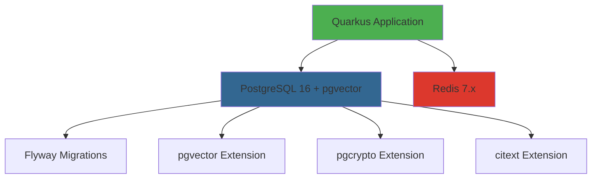

# Quarkus Dev Services Configuration Strategy

> **Document Version**: 1.0  
> **Last Updated**: 2026-05-01  
> **Status**: Planning Phase

---

## 1. Executive Summary

This document outlines the comprehensive strategy for configuring Quarkus Dev Services for the Talent Pool platform. Dev Services automatically provision and configure PostgreSQL 16 (with pgvector) and Redis 7.x for local development. Chat LLM calls use **mock stubs** by default (`app.llm.use-mock-llm=true`); use OpenAI with a real API key when you need live responses.

### Key Benefits

- **Zero-config local development**: Developers can run `mvn quarkus:dev` without manual database/Redis setup
- **Automatic service lifecycle**: Services start/stop automatically with the application
- **Consistent environments**: All developers use identical service versions and configurations
- **Fast feedback loops**: Integration tests use the same services via Testcontainers
- **Production parity**: Dev Services mirror production configurations closely

---

## 2. Architecture Overview

### 2.1 Service Dependencies



### 2.2 Dev Services vs Manual Setup

| Aspect | Dev Services (Recommended) | Manual Setup (Fallback) |
|--------|---------------------------|-------------------------|
| **Setup Time** | 0 minutes (automatic) | 15-30 minutes |
| **Consistency** | Guaranteed identical | Varies by developer |
| **Maintenance** | Automatic updates | Manual updates required |
| **CI/CD Integration** | Native Testcontainers | Requires service mocking |
| **Resource Usage** | Optimized (shared containers) | Higher (always running) |
| **Use Case** | Primary development mode | Network restrictions, air-gapped |

---

## 3. PostgreSQL 16 + pgvector Configuration

### 3.1 Dev Services Configuration

Quarkus will automatically start a PostgreSQL container with the following characteristics:

**Container Image**: `pgvector/pgvector:pg16`
- PostgreSQL 16.x (latest stable)
- pgvector 0.7.x pre-installed
- Optimized for development workloads

**Automatic Features**:
- Database creation: `talentpool_dev`
- User creation: `talentpool` / `talentpool_dev_pass`
- Port mapping: Random available port (exposed via `quarkus.datasource.jdbc-url`)
- Volume persistence: Optional (configurable)
- Extension initialization: pgvector, pgcrypto, citext

### 3.2 Required Extensions

```sql
-- Automatically executed on first startup
CREATE EXTENSION IF NOT EXISTS "uuid-ossp";      -- UUID generation
CREATE EXTENSION IF NOT EXISTS "pgcrypto";       -- Cryptographic functions
CREATE EXTENSION IF NOT EXISTS "citext";         -- Case-insensitive text
CREATE EXTENSION IF NOT EXISTS "vector";         -- pgvector for embeddings
```

### 3.3 Flyway Integration

Dev Services will work seamlessly with Flyway:
- Migrations run automatically on startup
- Schema versioning maintained
- Rollback support for development
- Seed data for testing (V22__seed_prompt_versiones_iniciales.sql)

### 3.4 Performance Tuning for Development

```properties
# Optimized for local development (not production values)
shared_buffers = 256MB
effective_cache_size = 1GB
maintenance_work_mem = 128MB
checkpoint_completion_target = 0.9
wal_buffers = 16MB
default_statistics_target = 100
random_page_cost = 1.1
effective_io_concurrency = 200
work_mem = 8MB
min_wal_size = 1GB
max_wal_size = 4GB
```

---

## 4. Redis Configuration

### 4.1 Dev Services Configuration

**Container Image**: `redis:7-alpine`
- Redis 7.x (latest stable)
- Alpine Linux base (minimal footprint)
- No persistence in dev mode (faster)

**Use Cases in Talent Pool**:
- Session storage (JWT refresh tokens)
- Rate limiting (API throttling)
- Cache layer (challenge listings, rankings)
- Pub/Sub (real-time evaluation updates)
- Distributed locks (concurrent evaluation processing)

### 4.2 Cache Strategy

```yaml
# Cache TTL Configuration
cache:
  desafios-publicos: 300s      # 5 minutes
  ranking-candidatos: 60s      # 1 minute
  perfil-talento: 600s         # 10 minutes
  organizacion-info: 1800s     # 30 minutes
```

---

## 5. LLM (chat) — mock by default, OpenAI optional

Quarkus Dev Services **do not** start a local inference server. Align with [`application-dev.yml`](../../backend/src/main/resources/application-dev.yml):

- **`app.llm.use-mock-llm: true`**: `ChatService` returns deterministic stub text (no external LLM).
- **Live OpenAI**: set `use-mock-llm=false`, `quarkus.langchain4j.openai.enable-integration=true`, and `OPENAI_API_KEY`.

Challenge/evaluation flows already honor `use-mock-llm` via mock generators where implemented.

---

## 6. Application Configuration Files

### 6.1 File Structure

```
backend/src/main/resources/
├── application.yml                    # Base configuration (all environments)
├── application-dev.yml                # Dev Services overrides
├── application-test.yml               # Integration test configuration
├── application-prod.yml               # Production configuration
└── application-staging.yml            # Staging configuration
```

### 6.2 Configuration Hierarchy

```
application.yml (base)
    ↓
application-dev.yml (Dev Services)
    ↓
Environment Variables (runtime overrides)
```

### 6.3 Profile Activation

```bash
# Development (default)
mvn quarkus:dev
# Profile: dev (automatic)

# Integration Tests
mvn verify
# Profile: test (automatic)

# Production
java -jar target/quarkus-app/quarkus-run.jar
# Profile: prod (via QUARKUS_PROFILE=prod)
```

---

## 7. Testcontainers Integration

### 7.1 Integration Test Strategy

```java
@QuarkusTest
@TestProfile(IntegrationTestProfile.class)
public class DesafioServiceIT {
    
    // Testcontainers automatically reuses Dev Services containers
    // No additional configuration needed!
    
    @Inject
    DesafioService desafioService;
    
    @Test
    public void testGenerarDesafio() {
        // Test uses same PostgreSQL + Redis as dev mode
        // LLM calls are mocked (no external LLM in tests)
    }
}
```

### 7.2 Test Isolation

- **Database**: Each test class gets a clean schema (Flyway clean + migrate)
- **Redis**: Flushed between test classes
- **LLM**: Always mocked (see ADR-0003)

---

## 8. Environment-Specific Configurations

### 8.1 Development (Dev Services)

**Characteristics**:
- Automatic service provisioning
- Logging: root `INFO`, categorías clave en `DEBUG`/`TRACE` (evita ruido del JDK en consola)
- Hot reload enabled
- No authentication required for local services
- Seed data included

**Service Endpoints**:
- PostgreSQL: `localhost:<random-port>` (auto-discovered)
- Redis: `localhost:<random-port>` (auto-discovered)

### 8.2 Testing (Testcontainers)

**Characteristics**:
- Isolated containers per test suite
- Fast startup (reuses images)
- Automatic cleanup
- LLM calls mocked
- Minimal seed data

### 8.3 Production (IBM Cloud)

**Characteristics**:
- Managed PostgreSQL (IBM Cloud Databases)
- Managed Redis (IBM Cloud Databases for Redis)
- OpenAI GPT-4o-mini (production LLM)
- TLS/SSL required
- Connection pooling optimized
- Monitoring and alerting enabled

---

## 9. Migration Strategy

### 9.1 From Terraform to Dev Services

**Current State**: Terraform provisions IBM Cloud PostgreSQL for all environments

**Target State**: 
- **Local Development**: Dev Services (automatic)
- **CI/CD**: Testcontainers (automatic)
- **Staging/Production**: Terraform + IBM Cloud (unchanged)

**Migration Steps**:

1. **Phase 1**: Add Dev Services configuration (non-breaking)
   - Developers can opt-in to Dev Services
   - Terraform setup remains available

2. **Phase 2**: Update documentation
   - Mark Terraform as "production only"
   - Promote Dev Services as primary dev method

3. **Phase 3**: Deprecate local Terraform usage
   - Remove local database setup instructions
   - Keep Terraform for staging/prod only

### 9.2 Backward Compatibility

Developers who prefer manual setup can disable Dev Services:

```properties
# application.yml
quarkus.devservices.enabled=false
```

Then provide their own connection strings:

```properties
quarkus.datasource.jdbc.url=jdbc:postgresql://localhost:5432/talentpool
quarkus.datasource.username=postgres
quarkus.datasource.password=postgres
```

---

## 10. Developer Experience

### 10.1 First-Time Setup

```bash
# Clone repository
git clone <repository-url>
cd hackathon/backend

# Start development (that's it!)
mvn quarkus:dev

# Output:
# [INFO] Pulling container image: pgvector/pgvector:pg16
# [INFO] Container started in 8.2s
# [INFO] Database initialized with Flyway migrations
# [INFO] Pulling container image: redis:7-alpine
# [INFO] Container started in 2.1s
# [INFO] Application started in 45.2s
# [INFO] Listening on http://localhost:8080
```

**Total time**: ~2-3 minutes (first run), ~15 seconds (subsequent runs)

### 10.2 Daily Workflow

```bash
# Start development
mvn quarkus:dev

# Make code changes → automatic hot reload
# Run tests → same containers reused
# Stop development (Ctrl+C) → containers stop automatically
```

### 10.3 Troubleshooting

**Issue**: "Port already in use"
```bash
# Dev Services automatically finds available ports
# No manual configuration needed
```

**Issue**: "Out of disk space"
```bash
# Clean up unused containers
docker system prune -a --volumes

# Dev Services will re-download on next startup
```

---

## 11. Performance Considerations

### 11.1 Resource Requirements

**Minimum**:
- RAM: 8GB (4GB for services, 4GB for IDE/OS)
- Disk: 20GB free (10GB for Docker images/volumes)
- CPU: 4 cores (2 for services, 2 for application)

**Recommended**:
- RAM: 16GB
- Disk: 50GB free (SSD preferred)
- CPU: 8 cores

### 11.2 Container Resource Limits

```yaml
# Dev Services will apply these limits automatically
postgresql:
  memory: 512MB
  cpu: 1.0

redis:
  memory: 256MB
  cpu: 0.5
```

### 11.3 Optimization Tips

1. **Use Docker Desktop with WSL2** (Windows) or **Colima** (macOS) for better performance
2. **Enable BuildKit** for faster image builds
3. **Use volume mounts** for PostgreSQL data persistence (optional)
4. **Keep `use-mock-llm=true`** when you do not need live OpenAI calls (avoids API usage and latency)

---

## 12. Security Considerations

### 12.1 Development Security

**Safe Practices**:
- Dev Services containers are isolated (no external access)
- Random passwords generated per session
- No production credentials in dev mode
- LLM prompts can contain test data (never production data)

**Unsafe Practices to Avoid**:
- Don't use production API keys in dev mode
- Don't commit `.env` files with secrets
- Don't expose Dev Services ports to network

### 12.2 Secrets Management

```bash
# Development (local only)
export OPENAI_API_KEY="sk-test-..."  # Optional, for testing OpenAI integration

# Production (never in code)
# Use IBM Cloud Secrets Manager or Kubernetes Secrets
```

---

## 13. Monitoring and Observability

### 13.1 Dev Services Health Checks

Quarkus automatically monitors Dev Services health:

```bash
# Check service status
curl http://localhost:8080/q/health

# Expected output:
{
  "status": "UP",
  "checks": [
    {"name": "Database connection", "status": "UP"},
    {"name": "Redis connection", "status": "UP"}
  ]
}
```

### 13.2 Container Logs

```bash
# View PostgreSQL logs
docker logs <postgres-container-id>

# View Redis logs
docker logs <redis-container-id>

# Or use Quarkus Dev UI
# http://localhost:8080/q/dev
```

### 13.3 Metrics Collection

Dev Services exposes metrics for monitoring:

```bash
# Prometheus metrics endpoint
curl http://localhost:8080/q/metrics

# Key metrics:
# - database_connections_active
# - redis_commands_processed_total
# - llm_inference_duration_seconds
```

---

## 14. CI/CD Integration

### 14.1 GitHub Actions Configuration

```yaml
name: CI

on: [push, pull_request]

jobs:
  test:
    runs-on: ubuntu-latest
    steps:
      - uses: actions/checkout@v3
      
      - name: Set up JDK 21
        uses: actions/setup-java@v3
        with:
          java-version: '21'
          distribution: 'temurin'
      
      - name: Run tests
        run: mvn verify
        # Testcontainers automatically provisions services
        # No manual setup required!
      
      - name: Upload coverage
        uses: codecov/codecov-action@v3
```

### 14.2 Test Execution Time

| Test Suite | Without Testcontainers | With Testcontainers |
|------------|----------------------|-------------------|
| Unit Tests | 15s | 15s (no change) |
| Integration Tests | N/A (requires manual setup) | 45s (automatic) |
| E2E Tests | N/A | 2m (automatic) |

---

## 15. Cost Analysis

### 15.1 Development Costs

| Approach | Setup Time | Monthly Cost | Developer Satisfaction |
|----------|-----------|--------------|----------------------|
| **Dev Services** | 0 min | $0 | ⭐⭐⭐⭐⭐ |
| Manual Local Setup | 30 min | $0 | ⭐⭐⭐ |
| IBM Cloud Dev Instance | 15 min | $30-50 | ⭐⭐⭐⭐ |

### 15.2 CI/CD Costs

| Approach | Per Build | Monthly (100 builds) |
|----------|-----------|---------------------|
| **Testcontainers** | $0 | $0 |
| Managed Test DB | $0.10 | $10 |
| Mocked Services | $0 | $0 (but limited coverage) |

**Recommendation**: Dev Services + Testcontainers provide the best cost/benefit ratio.

---

## 16. Roadmap

### 16.1 Phase 1: MVP (Current)
- [x] PostgreSQL 16 + pgvector Dev Services
- [x] Redis Dev Services
- [x] Mock LLM path for local chat (`use-mock-llm`)
- [ ] Basic documentation
- [ ] Developer onboarding guide

### 16.2 Phase 2: Enhanced (Next 2 weeks)
- [ ] Persistent volumes for faster restarts
- [ ] Custom Docker images with pre-loaded data
- [ ] Performance profiling tools
- [ ] Advanced troubleshooting guide

### 16.3 Phase 3: Production Parity (Next 4 weeks)
- [ ] TLS/SSL in dev mode (optional)
- [ ] Connection pooling configuration
- [ ] Replica lag simulation
- [ ] Chaos engineering tools

---

## 17. References

- [Quarkus Dev Services Documentation](https://quarkus.io/guides/dev-services)
- [Testcontainers Documentation](https://www.testcontainers.org/)
- [pgvector Documentation](https://github.com/pgvector/pgvector)
- [ADR-0001: Stack Base](../docs/adr/0001-stack-base.md)
- [ADR-0002: RAG Vector Store](../docs/adr/0002-rag-vector-store.md)
- [ADR-0003: LLM Evals](../docs/adr/0003-llm-evals.md)
- [ADR-0008: asignación costos LLM roadmap práctica (UC-024)](../docs/adr/0008-asignacion-costos-llm-roadmap-practica.md)

---

## 18. Appendix: Configuration Examples

See the following files for complete configuration examples:
- `backend/src/main/resources/application.yml` (base configuration)
- `backend/src/main/resources/application-dev.yml` (Dev Services)
- `backend/src/main/resources/application-test.yml` (Testcontainers)
- `infra/compose/docker-compose.dev.yml` (manual fallback)

---

**Document Status**: ✅ Ready for Implementation  
**Next Steps**: Create configuration files and test with sample Quarkus project