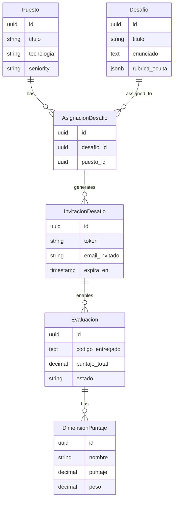
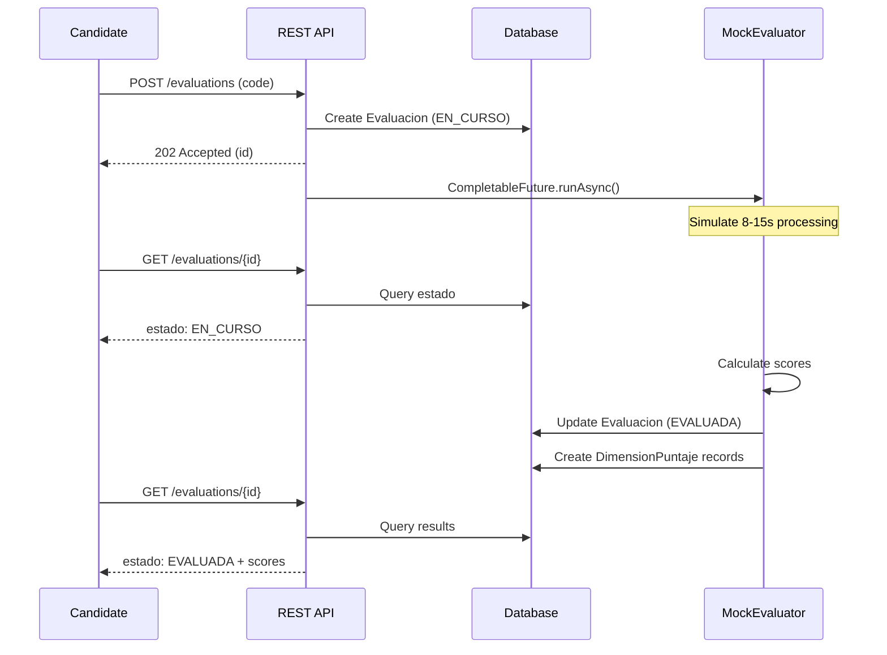

# Phase 3: REST Endpoints Implementation Plan

> **Status**: Demo Implementation In Progress  
> **Estimated Time**: ~2.5 hours  
> **Target**: 7 REST endpoints for core recruiting workflow  
> **Date**: 2026-05-02

---

## Demo Notes (Hackathon)

- Backend now uses mock-driven challenge generation/evaluation for demo stability.
- `POST /api/v1/evaluations` is intentionally public (token-based) for faster candidate flow in demo.
- Evaluation is asynchronous (`202 Accepted` + polling to `GET /api/v1/evaluations/{id}`).
- Invitation links use frontend format: `/eval?token=...`.
- Password hashes in demo seed are valid argon2id values for `Demo123!`.

---

## 1. Overview

This document outlines the implementation plan for the 7 core REST endpoints that enable the complete recruiting workflow: from creating job positions, generating challenges, inviting candidates, to evaluating submissions and ranking results.

### 1.1 Architectural Decisions

Based on MVP requirements and time constraints:

- **Async Processing**: Use `CompletableFuture` for simulated async evaluation (simpler than full job queue)
- **Email Service**: Mock email service for invitations (log to console)
- **Token Generation**: Secure random strings (64 chars) for invitation tokens
- **Ranking Algorithm**: Pure score-based ranking (descending by `puntajeTotal`)
- **Mock LLM**: Use existing [`MockChallengeGenerator`](../backend/src/main/java/com/talentpool/infrastructure/mock/MockChallengeGenerator.java) and [`MockEvaluator`](../backend/src/main/java/com/talentpool/infrastructure/mock/MockEvaluator.java)

### 1.2 Endpoints Summary

| Endpoint | Method | Auth | Time Est. | Priority |
|----------|--------|------|-----------|----------|
| `/api/v1/positions` | POST | ✓ | 20min | Critical |
| `/api/v1/challenges` | POST | ✓ | 1h | Critical |
| `/api/v1/challenges/{id}/invitations` | POST | ✓ | 30min | Critical |
| `/api/v1/invitations/by-token/{token}` | GET | ✗ | 20min | High |
| `/api/v1/evaluations` | POST | ✗ (token) | 1h | Critical |
| `/api/v1/evaluations/{id}` | GET | ✓ | 15min | High |
| `/api/v1/positions/{id}/ranking` | GET | ✓ | 30min | High |

---

## 2. Data Flow Architecture

### 2.1 Complete Workflow

```
┌─────────────┐
│ Recruiter   │
└──────┬──────┘
       │
       │ 1. POST /positions
       ▼
┌─────────────────┐
│ Puesto Created  │
└──────┬──────────┘
       │
       │ 2. POST /challenges
       ▼
┌──────────────────────┐
│ Desafio Generated    │
│ (MockChallengeGen)   │
└──────┬───────────────┘
       │
       │ 3. POST /challenges/{id}/invitations
       ▼
┌──────────────────────┐
│ InvitacionDesafio    │
│ + AsignacionDesafio  │
└──────┬───────────────┘
       │
       │ 4. Email sent (mocked)
       ▼
┌─────────────┐
│ Candidate   │
└──────┬──────┘
       │
       │ 5. GET /invitations/by-token/{token}
       ▼
┌──────────────────────┐
│ View Challenge       │
└──────┬───────────────┘
       │
       │ 6. POST /evaluations (submit code)
       ▼
┌──────────────────────┐
│ Evaluacion Created   │
│ Async Processing     │
│ (MockEvaluator)      │
└──────┬───────────────┘
       │
       │ 7. GET /evaluations/{id} (poll status)
       ▼
┌──────────────────────┐
│ Evaluation Complete  │
└──────┬───────────────┘
       │
       │ 8. GET /positions/{id}/ranking
       ▼
┌──────────────────────┐
│ Candidate Ranking    │
└──────────────────────┘
```

---

## 3. Detailed Endpoint Specifications

### 3.1 POST /api/v1/positions

**Purpose**: Create a new job position for recruiting.

**Request DTO**:
```java
public record CreatePuestoRequest(
    @NotBlank String titulo,
    @NotBlank String tecnologiaPrincipal,
    @NotBlank String seniority, // TRAINEE, JR, SSR, SR, LEAD
    String descripcion,
    UUID organizacionId // Optional, defaults to user's org
) {}
```

**Response DTO**:
```java
public record PuestoResponse(
    UUID id,
    UUID organizacionId,
    UUID reclutadorId,
    String titulo,
    String tecnologiaPrincipal,
    String seniority,
    String descripcion,
    String estado,
    Instant createdAt
) {
    public static PuestoResponse from(Puesto puesto) { ... }
}
```

**Business Logic**:
1. Extract user ID from JWT
2. Validate user has RECLUTADOR or ADMIN role
3. If `organizacionId` not provided, get from user's membership
4. Create [`Puesto`](../backend/src/main/java/com/talentpool/domain/Puesto.java) with estado=BORRADOR
5. Return 201 Created

**Validation**:
- `seniority` must be in: TRAINEE, JR, SSR, SR, LEAD
- User must belong to the organization
- `titulo` max 200 chars
- `tecnologiaPrincipal` max 100 chars

---

### 3.2 POST /api/v1/challenges

**Purpose**: Generate a technical challenge for a position using LLM (mocked).

**Request DTO**:
```java
public record GenerateChallengeRequest(
    @NotNull UUID puestoId,
    Integer minutosEstimados, // Optional, default 60
    String contextoAdicional // Optional hints for LLM
) {}
```

**Response DTO**:
```java
public record DesafioResponse(
    UUID id,
    UUID puestoId,
    String titulo,
    String enunciado,
    String tecnologia,
    String seniority,
    Integer minutosEstimados,
    String estado,
    Instant createdAt
) {
    public static DesafioResponse from(Desafio desafio) { ... }
}
```

**Business Logic**:
1. Validate user owns the position
2. Fetch [`Puesto`](../backend/src/main/java/com/talentpool/domain/Puesto.java) details
3. Call [`MockChallengeGenerator.generate()`](../backend/src/main/java/com/talentpool/infrastructure/mock/MockChallengeGenerator.java:158) (simulates 3-8s latency)
4. Get active [`PromptVersion`](../backend/src/main/java/com/talentpool/domain/PromptVersion.java) for challenge generation
5. Create [`Desafio`](../backend/src/main/java/com/talentpool/domain/Desafio.java) with:
   - `rubricaOculta` from mock generator
   - `contextoOrigen` = CORPORATIVO
   - `estado` = ACTIVO
6. Create [`AsignacionDesafio`](../backend/src/main/java/com/talentpool/domain/AsignacionDesafio.java) linking to position
7. Return 201 Created

**Error Handling**:
- 404 if position not found
- 403 if user doesn't own position
- 500 if LLM generation fails

---

### 3.3 POST /api/v1/challenges/{id}/invitations

**Purpose**: Invite candidates to take a challenge via email.

**Request DTO**:
```java
public record InviteCandidatesRequest(
    @NotEmpty List<@Email String> emails,
    Instant expiraEn, // Optional, default +7 days
    Integer maxIntentos // Optional, default 1
) {}
```

**Response DTO**:
```java
public record InvitacionesResponse(
    List<InvitacionResponse> invitaciones,
    int totalEnviadas,
    int totalFallidas
) {}

public record InvitacionResponse(
    UUID id,
    String email,
    String token,
    String estado,
    Instant expiraEn,
    String invitationUrl
) {}
```

**Business Logic**:
1. Validate challenge exists and user has access
2. Get or create [`AsignacionDesafio`](../backend/src/main/java/com/talentpool/domain/AsignacionDesafio.java) for the challenge
3. For each email:
   - Generate secure random token (64 chars)
   - Create [`InvitacionDesafio`](../backend/src/main/java/com/talentpool/domain/InvitacionDesafio.java)
   - Mock send email (log to console)
   - Build invitation URL: `{frontend_url}/challenges/accept/{token}`
4. Return 201 Created with all invitations

**Token Generation**:
```java
SecureRandom random = new SecureRandom();
byte[] bytes = new byte[48];
random.nextBytes(bytes);
String token = Base64.getUrlEncoder().withoutPadding().encodeToString(bytes);
```

**Email Mock**:
```java
LOG.infof("📧 [MOCK EMAIL] To: %s | Subject: Challenge Invitation | Token: %s", email, token);
```

---

### 3.4 GET /api/v1/invitations/by-token/{token}

**Purpose**: View invitation details (public endpoint for candidates).

**Response DTO**:
```java
public record InvitationDetailsResponse(
    UUID invitacionId,
    UUID asignacionId,
    String emailInvitado,
    String organizacion,
    String estado,
    Instant expiraEn,
    boolean isValid,
    DesafioPublicResponse desafio,
    PuestoPublicResponse puesto
) {}

public record DesafioPublicResponse(
    UUID id,
    String titulo,
    String enunciado,
    String tecnologia,
    String seniority,
    Integer minutosEstimados
) {}

public record PuestoPublicResponse(
    String titulo,
    String tecnologiaPrincipal,
    String seniority
) {}
```

**Business Logic**:
1. Find [`InvitacionDesafio`](../backend/src/main/java/com/talentpool/domain/InvitacionDesafio.java) by token
2. Check if valid (not expired, estado=PENDIENTE)
3. Fetch related [`Desafio`](../backend/src/main/java/com/talentpool/domain/Desafio.java) and [`Puesto`](../backend/src/main/java/com/talentpool/domain/Puesto.java)
4. Return public view (no rubrica, no sensitive data)

**Security**:
- No authentication required (token is the auth)
- Don't expose `rubricaOculta`
- Rate limit by IP (10 req/min)

---

### 3.5 POST /api/v1/evaluations

**Purpose**: Submit code for evaluation (async processing).

**Request DTO**:
```java
public record SubmitEvaluationRequest(
    @NotBlank String token, // Invitation token
    @NotBlank String codigoEntregado,
    @NotBlank String lenguaje,
    Integer minutosEmpleados
) {}
```

**Response DTO**:
```java
public record EvaluacionResponse(
    UUID id,
    UUID desafioId,
    UUID candidatoId,
    String estado, // BORRADOR, EN_CURSO, ENTREGADA, EVALUADA
    BigDecimal puntajeTotal,
    Instant inicio,
    Instant entrega,
    Instant evaluadoEn
) {}
```

**Business Logic**:
1. Validate invitation token
2. Check if candidate already submitted (max attempts)
3. Create [`Evaluacion`](../backend/src/main/java/com/talentpool/domain/Evaluacion.java) with estado=EN_CURSO
4. Launch async evaluation using `CompletableFuture`:
   ```java
   CompletableFuture.runAsync(() -> {
       // Call MockEvaluator (8-15s latency)
       var result = mockEvaluator.evaluate(codigo, lenguaje);
       // Update Evaluacion with results
       // Create DimensionPuntaje records
   });
   ```
5. Mark invitation as ACEPTADA
6. Return 202 Accepted immediately

**Async Processing**:
- Use [`MockEvaluator.evaluate()`](../backend/src/main/java/com/talentpool/infrastructure/mock/MockEvaluator.java:30)
- Update [`Evaluacion`](../backend/src/main/java/com/talentpool/domain/Evaluacion.java) estado to EVALUADA
- Create [`DimensionPuntaje`](../backend/src/main/java/com/talentpool/domain/DimensionPuntaje.java) records
- Store feedback in `reporteFeedback` JSON field

---

### 3.6 GET /api/v1/evaluations/{id}

**Purpose**: Get evaluation status and results (polling endpoint).

**Response DTO**:
```java
public record EvaluacionDetailResponse(
    UUID id,
    UUID desafioId,
    String desafioTitulo,
    UUID candidatoId,
    String candidatoEmail,
    String estado,
    BigDecimal puntajeTotal,
    List<DimensionResponse> dimensiones,
    JsonObject reporteFeedback,
    Integer minutosEmpleados,
    Instant inicio,
    Instant entrega,
    Instant evaluadoEn
) {}

public record DimensionResponse(
    String nombre,
    BigDecimal puntaje,
    BigDecimal peso,
    String justificacion
) {}
```

**Business Logic**:
1. Fetch [`Evaluacion`](../backend/src/main/java/com/talentpool/domain/Evaluacion.java) by ID
2. Validate user has access (candidate or recruiter)
3. If estado=EVALUADA, include [`DimensionPuntaje`](../backend/src/main/java/com/talentpool/domain/DimensionPuntaje.java) details
4. Return current state

**Access Control**:
- Candidate can only see their own evaluations
- Recruiter can see all evaluations for their positions

---

### 3.7 GET /api/v1/positions/{id}/ranking

**Purpose**: View candidate ranking for a position.

**Response DTO**:
```java
public record RankingResponse(
    UUID puestoId,
    String puestoTitulo,
    int totalCandidatos,
    List<CandidateRankingEntry> ranking
) {}

public record CandidateRankingEntry(
    int posicion,
    UUID candidatoId,
    String candidatoEmail,
    String candidatoNombre,
    BigDecimal puntajeTotal,
    List<DimensionResponse> dimensiones,
    Integer minutosEmpleados,
    Instant evaluadoEn
) {}
```

**Business Logic**:
1. Validate user owns the position
2. Find [`AsignacionDesafio`](../backend/src/main/java/com/talentpool/domain/AsignacionDesafio.java) for position
3. Get all [`Evaluacion`](../backend/src/main/java/com/talentpool/domain/Evaluacion.java) with estado=EVALUADA
4. Sort by `puntajeTotal` DESC
5. Assign ranking positions (1, 2, 3...)
6. Include dimension breakdown for each candidate

**Ranking Algorithm**:
```sql
SELECT e.*, u.email, u.nombre_completo
FROM evaluaciones e
JOIN usuarios u ON e.candidato_id = u.id
WHERE e.asignacion_id = ? AND e.estado = 'EVALUADA'
ORDER BY e.puntaje_total DESC, e.evaluado_en ASC
```

---

## 4. Service Layer Design

### 4.1 PuestoService

```java
@ApplicationScoped
public class PuestoService {
    @Inject EntityManager em;
    
    @Transactional
    public Puesto create(CreatePuestoRequest req, UUID userId) {
        // Validate user membership
        // Create Puesto
        // Return entity
    }
    
    public Puesto findById(UUID id) { ... }
    public List<Puesto> findByOrganizacion(UUID orgId) { ... }
}
```

### 4.2 DesafioService

```java
@ApplicationScoped
public class DesafioService {
    @Inject MockChallengeGenerator mockGenerator;
    @Inject EntityManager em;
    
    @Transactional
    public Desafio generateForPuesto(GenerateChallengeRequest req, UUID userId) {
        // Validate access
        // Call mock generator
        // Create Desafio + AsignacionDesafio
        // Return entity
    }
}
```

### 4.3 InvitacionService

```java
@ApplicationScoped
public class InvitacionService {
    @Inject EntityManager em;
    
    @Transactional
    public List<InvitacionDesafio> inviteCandidates(
        UUID desafioId, 
        InviteCandidatesRequest req,
        UUID emisorId
    ) {
        // Generate tokens
        // Create invitations
        // Mock send emails
        // Return invitations
    }
    
    public InvitacionDesafio findByToken(String token) { ... }
}
```

### 4.4 EvaluacionService

```java
@ApplicationScoped
public class EvaluacionService {
    @Inject MockEvaluator mockEvaluator;
    @Inject EntityManager em;
    
    @Transactional
    public Evaluacion submitForEvaluation(SubmitEvaluationRequest req) {
        // Validate token
        // Create Evaluacion (estado=EN_CURSO)
        // Launch async evaluation
        // Return entity
    }
    
    private void evaluateAsync(UUID evaluacionId, String codigo, String lenguaje) {
        CompletableFuture.runAsync(() -> {
            var result = mockEvaluator.evaluate(codigo, lenguaje);
            updateEvaluacionWithResults(evaluacionId, result);
        });
    }
    
    @Transactional
    void updateEvaluacionWithResults(UUID id, MockEvaluator.EvaluationResult result) {
        // Update Evaluacion
        // Create DimensionPuntaje records
    }
    
    public List<CandidateRankingEntry> getRankingForPuesto(UUID puestoId) { ... }
}
```

---

## 5. Configuration Updates

### 5.1 application.yml

Add mock LLM flag:

```yaml
app:
  features:
    mock-llm-enabled: true  # Use mock generators in dev
    
  challenge:
    generation:
      use-mock: ${app.features.mock-llm-enabled}
    evaluation:
      use-mock: ${app.features.mock-llm-enabled}
      
  invitations:
    default-expiry-days: 7
    max-attempts: 1
    base-url: ${FRONTEND_URL:http://localhost:5173}
```

---

## 6. Error Handling Strategy

### 6.1 Custom Exceptions

```java
public class PuestoNotFoundException extends WebApplicationException {
    public PuestoNotFoundException(UUID id) {
        super("Position not found: " + id, Response.Status.NOT_FOUND);
    }
}

public class UnauthorizedAccessException extends WebApplicationException {
    public UnauthorizedAccessException(String message) {
        super(message, Response.Status.FORBIDDEN);
    }
}

public class InvalidInvitationException extends WebApplicationException {
    public InvalidInvitationException(String reason) {
        super("Invalid invitation: " + reason, Response.Status.BAD_REQUEST);
    }
}
```

### 6.2 Global Exception Mapper

```java
@Provider
public class GlobalExceptionMapper implements ExceptionMapper<Exception> {
    @Override
    public Response toResponse(Exception e) {
        // Log error
        // Return appropriate status + error DTO
    }
}
```

---

## 7. Testing Strategy

### 7.1 Unit Tests

For each endpoint:
- Happy path
- Validation errors
- Authorization failures
- Not found scenarios

### 7.2 Integration Tests

```java
@QuarkusTest
public class PositionsResourceTest {
    @Test
    public void testCreatePosition() {
        given()
            .auth().oauth2(getValidToken())
            .contentType(ContentType.JSON)
            .body(new CreatePuestoRequest(...))
        .when()
            .post("/api/v1/positions")
        .then()
            .statusCode(201)
            .body("id", notNullValue())
            .body("estado", equalTo("BORRADOR"));
    }
}
```

---

## 8. Implementation Checklist

### Phase 1: DTOs & Services (45 min)
- [x] Create all request/response DTOs
- [x] Implement PuestoService
- [x] Implement DesafioService
- [x] Implement InvitacionService
- [x] Implement EvaluacionService

### Phase 2: REST Resources (60 min)
- [x] PositionsResource (POST /positions)
- [x] ChallengesResource (POST /challenges)
- [x] ChallengesResource (POST /challenges/{id}/invitations)
- [x] InvitationsResource (GET /invitations/by-token/{token})
- [x] EvaluationsResource (POST /evaluations)
- [x] EvaluationsResource (GET /evaluations/{id})
- [x] PositionsResource (GET /positions/{id}/ranking)

### Phase 3: Configuration & Testing (45 min)
- [x] Update application.yml
- [x] Add error handling
- [x] Write unit tests
- [x] Integration testing
- [x] OpenAPI documentation

---

## 9. API Documentation Examples

### 9.1 Complete Flow Example

```bash
# 1. Create position
curl -X POST http://localhost:8080/api/v1/positions \
  -H "Authorization: Bearer $TOKEN" \
  -H "Content-Type: application/json" \
  -d '{
    "titulo": "Senior Backend Developer",
    "tecnologiaPrincipal": "Java",
    "seniority": "SR",
    "descripcion": "Spring Boot expert needed"
  }'

# Response: { "id": "uuid-1", ... }

# 2. Generate challenge
curl -X POST http://localhost:8080/api/v1/challenges \
  -H "Authorization: Bearer $TOKEN" \
  -H "Content-Type: application/json" \
  -d '{
    "puestoId": "uuid-1",
    "minutosEstimados": 60
  }'

# Response: { "id": "uuid-2", "titulo": "Thread-Safe LRU Cache", ... }

# 3. Invite candidates
curl -X POST http://localhost:8080/api/v1/challenges/uuid-2/invitations \
  -H "Authorization: Bearer $TOKEN" \
  -H "Content-Type: application/json" \
  -d '{
    "emails": ["candidate@example.com"]
  }'

# Response: { "invitaciones": [{ "token": "abc123...", ... }] }

# 4. Candidate views invitation (no auth)
curl http://localhost:8080/api/v1/invitations/by-token/abc123...

# Response: { "desafio": { "enunciado": "..." }, ... }

# 5. Submit evaluation
curl -X POST http://localhost:8080/api/v1/evaluations \
  -H "Content-Type: application/json" \
  -d '{
    "token": "abc123...",
    "codigoEntregado": "public class LRUCache { ... }",
    "lenguaje": "Java",
    "minutosEmpleados": 45
  }'

# Response: { "id": "uuid-3", "estado": "EN_CURSO" }

# 6. Poll evaluation status
curl http://localhost:8080/api/v1/evaluations/uuid-3 \
  -H "Authorization: Bearer $TOKEN"

# Response: { "estado": "EVALUADA", "puntajeTotal": 85.5, ... }

# 7. View ranking
curl http://localhost:8080/api/v1/positions/uuid-1/ranking \
  -H "Authorization: Bearer $TOKEN"

# Response: { "ranking": [{ "posicion": 1, "puntajeTotal": 85.5, ... }] }
```

---

## 10. Next Steps After Implementation

1. **Frontend Integration**: Connect React/Vue frontend to these endpoints
2. **Real LLM Integration**: Replace mocks with actual LangChain4j calls
3. **Email Service**: Integrate real SMTP or SendGrid
4. **WebSocket Updates**: Real-time evaluation progress
5. **Advanced Ranking**: Multi-factor algorithm (score + time + code quality)
6. **Caching**: Redis cache for rankings and challenge details
7. **Rate Limiting**: Per-user limits on challenge generation

---

## 11. Mermaid Diagrams

### 11.1 Entity Relationships



### 11.2 Async Evaluation Flow



---

**Document Status**: ✅ Ready for Implementation  
**Next Action**: Switch to Code mode and begin implementation
