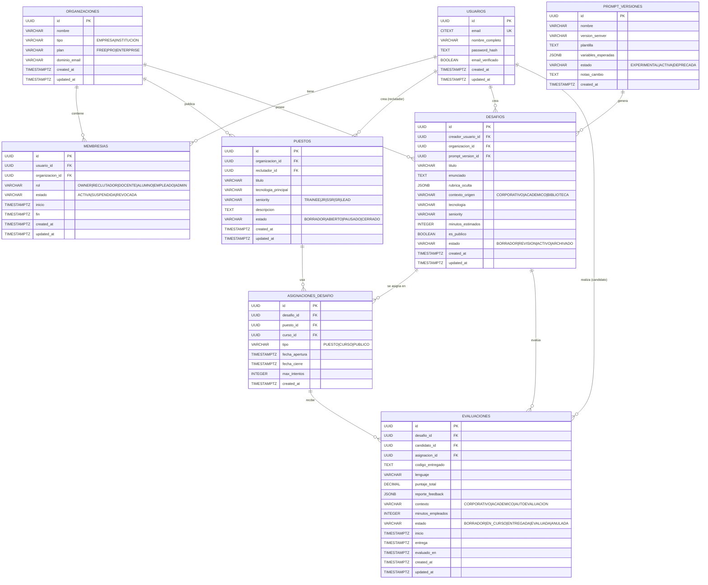

# ARCHITECTURE.md — arquitectura del sistema

> Decisiones cerradas. El agente NO debe re-decidir lo que está acá.
> Cada cambio requiere un ADR nuevo en `docs/adr/`.
> Última revisión: 2026-05-01

---

## 1. visión general

### 1.1 estilo arquitectónico
**Decisión**: monolito modular en backend + SPA desacoplada en frontend.
**Justificación**: simplicidad operativa para MVP de hackathon, despliegue independiente de UI y API, evolución a microservicios solo si la escala lo exige post-fase 3 (ver ADR-0001).

### 1.2 diagrama C4 — nivel 1 (contexto)
```
┌─────────────────┐
│  Reclutador     │
│  (Docente)      │
└────────┬────────┘
         │ HTTPS
         ↓
┌─────────────────┐         ┌──────────────────┐
│   Candidato     │────────→│  Talent Pool     │
│  (Estudiante)   │  HTTPS  │   Platform       │
└─────────────────┘         └────────┬─────────┘
                                     │
                    ┌────────────────┼────────────────┐
                    ↓                ↓                ↓
            ┌───────────────┐ ┌──────────┐  ┌──────────────┐
            │ LLM Providers │ │PostgreSQL│  │ Email Service│
            │(OpenAI/Gemini)│ │+ pgvector│  │   (futuro)   │
            └───────────────┘ └──────────┘  └──────────────┘
```

### 1.3 diagrama C4 — nivel 2 (contenedores)
```
┌──────────────────────────────────────────────────────────────┐
│                      Frontend Layer                          │
│  ┌────────────────────────────────────────────────────┐     │
│  │  React SPA (TypeScript + Vite)                     │     │
│  │  - Panel reclutador (UC-001, UC-003)               │     │
│  │  - Panel candidato (UC-002, UC-004)                │     │
│  │  - Editor de código integrado (Monaco)             │     │
│  └────────────────────────────────────────────────────┘     │
└───────────────────────────┬──────────────────────────────────┘
                            │ HTTPS / JSON (REST)
                            ↓
┌──────────────────────────────────────────────────────────────┐
│                      Backend Layer                           │
│  ┌────────────────────────────────────────────────────┐     │
│  │  Quarkus API (Java 21)                             │     │
│  │  ┌──────────────────────────────────────────────┐ │     │
│  │  │ API Layer (JAX-RS / RESTEasy Reactive)      │ │     │
│  │  │  - /api/v1/puestos                           │ │     │
│  │  │  - /api/v1/desafios                          │ │     │
│  │  │  - /api/v1/evaluaciones                      │ │     │
│  │  └──────────────────────────────────────────────┘ │     │
│  │  ┌──────────────────────────────────────────────┐ │     │
│  │  │ Service Layer (Casos de Uso)                 │ │     │
│  │  │  - GenerarDesafioService (UC-001)            │ │     │
│  │  │  - EvaluarSolucionService (UC-002)           │ │     │
│  │  │  - ConsultarRankingService (UC-003)          │ │     │
│  │  └──────────────────────────────────────────────┘ │     │
│  │  ┌──────────────────────────────────────────────┐ │     │
│  │  │ Infrastructure Layer                         │ │     │
│  │  │  - LangChain4j AI Services                   │ │     │
│  │  │  - Hibernate ORM with Panache                │ │     │
│  │  │  - Flyway Migrations                         │ │     │
│  │  └──────────────────────────────────────────────┘ │     │
│  └────────────────────────────────────────────────────┘     │
└───────────────┬──────────────────────┬───────────────────────┘
                │                      │
                ↓                      ↓
    ┌───────────────────┐    ┌────────────────────┐
    │  PostgreSQL 16    │    │  LLM Providers     │
    │  + pgvector 0.7.x │    │  - OpenAI GPT-4    │
    │  + pgcrypto       │    │  - Anthropic Claude│
    │  + citext         │    │  - Mock LLM (dev)   │
    │                   │    │                    │
    │  20 Tablas:       │    │  via LangChain4j   │
    │  Ver DATABASE.md  │    └────────────────────┘
    │  para esquema     │
    │  completo         │
    └───────────────────┘
```

---

## 2. stack tecnológico (cerrado)

> Una sola opción por capa. Versión fija. Cambios → ADR.

### 2.1 backend (Quarkus + LangChain4j)

| capa | tecnología | versión | ADR |
|------|------------|---------|-----|
| JDK | Eclipse Temurin | 21 LTS | ADR-0001 |
| GraalVM (build nativo) | GraalVM CE for JDK 21 | última estable | ADR-0001 |
| framework | Quarkus | 3.17.x (LTS más reciente) | ADR-0001 |
| build | Maven | 3.9.x | ADR-0001 |
| LLM toolkit | LangChain4j (extensión Quarkus) | 1.x estable | ADR-0001 |
| API REST | RESTEasy Reactive (JAX-RS) | incluida en Quarkus | ADR-0001 |
| ORM | Hibernate ORM with Panache | incluida en Quarkus | ADR-0001 |
| validación | Hibernate Validator (Bean Validation) | incluida | ADR-0001 |
| migraciones | Flyway | incluida (extensión Quarkus) | ADR-0001 |
| auth | Quarkus OIDC + SmallRye JWT | incluidas | ADR-0001 |
| BD relacional | PostgreSQL | 16 | ADR-0001 |
| vector store | pgvector (extensión de PostgreSQL) | 0.7.x+ | ADR-0002 |
| caché | Redis | 7.x | ADR-0001 |
| testing | JUnit 5 + AssertJ + Mockito | últimas | ADR-0001 |
| testing HTTP | REST Assured | última | ADR-0001 |
| testing infra | Testcontainers + Quarkus Dev Services | últimas | ADR-0001 |
| testing LLM | WireMock + LangChain4j MockChatModel | últimas | ADR-0001 |
| evals LLM | suite propia + framework definido en | ADR-0003 |
| observabilidad | Micrometer + OpenTelemetry (extensiones Quarkus) | incluidas | ADR-0001 |

### 2.2 frontend

| capa | tecnología | versión | ADR |
|------|------------|---------|-----|
| lenguaje | TypeScript | 5.x | ADR-0001 |
| framework UI | React | 18.x | ADR-0001 |
| build | Vite | 5.x | ADR-0001 |
| gestor de paquetes | pnpm | 9.x | ADR-0001 |
| router | React Router | 6.x | ADR-0001 |
| state server | TanStack Query | 5.x | ADR-0001 |
| state cliente | Zustand o Context API | última | ADR-0001 |
| editor de código | Monaco Editor (VS Code) | última | ADR-0001 |
| cliente HTTP | fetch nativo o openapi-fetch (tipado desde OpenAPI) | última | ADR-0001 |
| testing unitario | Vitest + Testing Library | últimas | ADR-0001 |
| testing e2e | Playwright | última | ADR-0001 |
| servidor estático | nginx (o CDN en producción) | última estable | ADR-0001 |

### 2.3 infraestructura y operación

| capa | tecnología | versión | ADR |
|------|------------|---------|-----|
| contenedores | Docker + docker compose | última estable | ADR-0001 |
| imagen runtime backend | JVM o nativa (distroless) | — | ADR-0001 |
| CI/CD | GitHub Actions | — | ADR-0001 |
| análisis estático | SonarQube / SonarCloud | — | ADR-0001 |
| SAST adicional | GitHub CodeQL | — | ADR-0001 |
| cloud | Render / Railway (MVP), AWS/GCP (prod) | — | pendiente ADR |

---

## 3. estructura de carpetas (obligatoria)

```
/
├── backend/
│   ├── src/
│   │   ├── main/
│   │   │   ├── java/com/talentpool/
│   │   │   │   ├── api/              # recursos JAX-RS (endpoints)
│   │   │   │   │   ├── dto/          # records de request/response
│   │   │   │   │   │   ├── PuestoRequest.java
│   │   │   │   │   │   ├── DesafioResponse.java
│   │   │   │   │   │   ├── EvaluacionRequest.java
│   │   │   │   │   │   └── RankingResponse.java
│   │   │   │   │   ├── exception/    # mappers de excepciones
│   │   │   │   │   │   ├── GlobalExceptionMapper.java
│   │   │   │   │   │   └── LLMTimeoutExceptionMapper.java
│   │   │   │   │   ├── PuestoResource.java
│   │   │   │   │   ├── DesafioResource.java
│   │   │   │   │   └── EvaluacionResource.java
│   │   │   │   ├── domain/           # entidades de negocio, value objects, lógica pura
│   │   │   │   │   ├── Usuario.java
│   │   │   │   │   ├── Puesto.java
│   │   │   │   │   ├── Desafio.java
│   │   │   │   │   ├── Evaluacion.java
│   │   │   │   │   └── vo/           # value objects
│   │   │   │   │       ├── TipoUsuario.java (enum)
│   │   │   │   │       ├── NivelSeniority.java (enum)
│   │   │   │   │       └── Puntaje.java
│   │   │   │   ├── service/          # casos de uso (uno por UC, orquestación)
│   │   │   │   │   ├── GenerarDesafioService.java    # UC-001
│   │   │   │   │   ├── EvaluarSolucionService.java   # UC-002
│   │   │   │   │   ├── ConsultarRankingService.java  # UC-003
│   │   │   │   │   └── ListarDesafiosService.java    # UC-004
│   │   │   │   ├── infrastructure/
│   │   │   │   │   ├── persistence/  # repositorios Panache, mapeos JPA
│   │   │   │   │   │   ├── UsuarioRepository.java
│   │   │   │   │   │   ├── PuestoRepository.java
│   │   │   │   │   │   ├── DesafioRepository.java
│   │   │   │   │   │   └── EvaluacionRepository.java
│   │   │   │   │   ├── ai/           # AiServices de LangChain4j, prompts, retrievers
│   │   │   │   │   │   ├── services/
│   │   │   │   │   │   │   ├── DesafioGeneratorAiService.java
│   │   │   │   │   │   │   └── CodigoEvaluadorAiService.java
│   │   │   │   │   │   ├── prompts/
│   │   │   │   │   │   │   ├── DesafioPromptBuilder.java
│   │   │   │   │   │   │   └── EvaluacionPromptBuilder.java
│   │   │   │   │   │   └── guardrails/
│   │   │   │   │   │       ├── InputSanitizationGuardrail.java
│   │   │   │   │   │       └── OutputValidationGuardrail.java
│   │   │   │   │   ├── llm/          # configuración de modelos, guardrails
│   │   │   │   │   │   ├── LLMConfig.java
│   │   │   │   │   │   └── ModelProvider.java
│   │   │   │   │   └── client/       # clientes REST/MicroProfile a APIs externas
│   │   │   │   ├── config/           # ConfigProperties, beans CDI, producers
│   │   │   │   │   ├── ApplicationConfig.java
│   │   │   │   │   └── LangChain4jConfig.java
│   │   │   │   └── security/         # autorización, filtros, identity providers
│   │   │   │       └── RoleBasedAccessControl.java
│   │   │   └── resources/
│   │   │       ├── application.yml   # configuración Quarkus
│   │   │       ├── application-dev.yml
│   │   │       ├── application-test.yml
│   │   │       ├── db/migration/     # scripts Flyway: V1__init.sql, V2__...
│   │   │       │   ├── V1__create_initial_schema.sql
│   │   │       │   └── V2__add_indexes.sql
│   │   │       └── prompts/          # plantillas de prompt (.txt o .ftl)
│   │   │           ├── generar-desafio.txt
│   │   │           └── evaluar-codigo.txt
│   │   └── test/
│   │       ├── java/com/talentpool/
│   │       │   ├── unit/
│   │       │   │   ├── service/
│   │       │   │   └── domain/
│   │       │   ├── integration/      # @QuarkusTest con Testcontainers
│   │       │   │   ├── api/
│   │       │   │   └── persistence/
│   │       │   ├── e2e/              # tests REST end-to-end del backend
│   │       │   │   └── DesafioFlowE2ETest.java
│   │       │   └── evals/            # evaluaciones de LLM (ver ADR-0003)
│   │       │       ├── DesafioGenerationEvalTest.java
│   │       │       └── CodigoEvaluacionEvalTest.java
│   │       └── resources/
│   │           ├── application-test.yml
│   │           └── fixtures/
│   │               ├── golden-dataset.json
│   │               └── mock-responses.json
│   ├── pom.xml
│   └── README.md
├── frontend/
│   ├── src/
│   │   ├── components/
│   │   │   ├── common/
│   │   │   │   ├── Button.tsx
│   │   │   │   ├── Card.tsx
│   │   │   │   └── LoadingSpinner.tsx
│   │   │   ├── reclutador/
│   │   │   │   ├── FormularioDesafio.tsx      # UC-001
│   │   │   │   ├── TablaRanking.tsx           # UC-003
│   │   │   │   └── DetalleEvaluacion.tsx
│   │   │   └── candidato/
│   │   │       ├── CatalogoDesafios.tsx       # UC-004
│   │   │       ├── EditorCodigo.tsx           # UC-002
│   │   │       └── ResultadoEvaluacion.tsx
│   │   ├── pages/
│   │   │   ├── DashboardReclutador.tsx
│   │   │   ├── DashboardCandidato.tsx
│   │   │   ├── GenerarDesafio.tsx
│   │   │   ├── ResolverDesafio.tsx
│   │   │   └── VerResultados.tsx
│   │   ├── hooks/
│   │   │   ├── useDesafios.ts
│   │   │   ├── useEvaluaciones.ts
│   │   │   └── useAuth.ts
│   │   ├── services/                 # clientes de API generados desde OpenAPI
│   │   │   ├── api-client.ts
│   │   │   └── types.ts
│   │   ├── store/
│   │   │   └── authStore.ts
│   │   ├── App.tsx
│   │   └── main.tsx
│   ├── tests/
│   │   ├── unit/
│   │   ├── integration/
│   │   └── e2e/
│   │       └── flujo-completo.spec.ts
│   ├── package.json
│   ├── vite.config.ts
│   └── README.md
├── infra/
│   ├── docker/
│   │   ├── Dockerfile.backend.jvm
│   │   ├── Dockerfile.backend.native
│   │   └── Dockerfile.frontend
│   ├── compose/                      # docker-compose para entornos
│   └── terraform/                    # si aplica
├── docs/
│   ├── adr/
│   │   ├── 0000-template.md
│   │   ├── 0001-stack-base.md
│   │   ├── 0002-rag-vector-store.md
│   │   └── 0003-llm-evals.md
│   ├── uc/
│   │   ├── UC-template.md
│   │   └── UC-001-generar-desafio.md
│   ├── runbooks/
│   │   └── incident-template.md
│   └── diagrams/
│       └── architecture-c4.png
├── product/
│   ├── PRODUCT.md
│   ├── ARCHITECTURE.md
│   ├── ROADMAP.md
│   └── rf-rnf.md
├── CONTRIBUTING.md
├── CHANGELOG.md
├── TECH_DEBT.md
├── README.md
└── sonar-project.properties
```

**Regla**: el agente no crea carpetas raíz nuevas sin ADR.

---

## 4. modelo de datos

> **Referencia completa**: Ver `product/DATABASE.md` para el esquema detallado de 20 tablas con todas las reglas de integridad, constraints y estrategia de migraciones.

### 4.1 visión general del esquema

El sistema utiliza un modelo de datos multi-tenant con **20 tablas** organizadas en 7 dominios:

| Dominio | Tablas | Propósito |
|---------|--------|-----------|
| **Identidad** | `usuarios`, `organizaciones`, `membresias` | Multi-tenancy y roles flexibles |
| **Académico** | `cursos`, `inscripciones` | Gestión de cursos y alumnos |
| **Corporativo** | `puestos` | Vacantes laborales |
| **Núcleo** | `desafios`, `asignaciones_desafio`, `invitaciones_desafio`, `evaluaciones`, `evaluaciones_versiones`, `dimensiones_puntaje` | Motor de evaluación |
| **Puente** | `recomendaciones` | Conexión educación-empleo |
| **Pool** | `perfiles_talento`, `habilidades_perfil` | Base de talento |
| **Colaboración** | `consultas_llm`, `votos_consulta` | Repositorio colectivo |
| **Trazabilidad** | `prompt_versiones`, `llamadas_llm`, `eventos_auditoria` | Auditoría y reproducibilidad |

### 4.2 entidades MVP (fase 0)

Para el MVP del hackathon, se implementan **8 tablas core**:



### 4.3 principios de diseño

**Reglas universales** (aplican a TODA tabla):
- **IDs**: UUID v7 generados por aplicación o `gen_random_uuid()` como fallback
- **Timestamps**: `created_at TIMESTAMPTZ NOT NULL DEFAULT NOW()` obligatorio; `updated_at` en tablas con cambios frecuentes
- **Soft delete**: Solo donde está justificado funcionalmente (ej: `membresias.estado = REVOCADA`)
- **Snake case**: Tablas en español plural, columnas en `snake_case`
- **Charset**: UTF-8, timezone UTC para todos los timestamps

**Multi-tenancy**:
- Tenancy lógica vía `organizacion_id` en tablas relevantes
- Una sola BD multi-tenant (no schemas separados)
- Row-Level Security (RLS) opcional para v2; en v1 se controla por capa de aplicación

**Trazabilidad de LLM**:
- Toda salida generada por LLM referencia su `prompt_version_id`
- Todo lo que costó tokens registra una fila en `llamadas_llm`

### 4.4 estructura JSONB clave

**`desafios.rubrica_oculta`** (nunca visible al candidato):
```json
{
  "version_rubrica": "1.0",
  "dimensiones": [
    {
      "nombre": "LOGICA",
      "peso": 0.4,
      "criterios": ["resuelve el caso base", "maneja edge cases"]
    },
    {
      "nombre": "EFICIENCIA",
      "peso": 0.3,
      "criterios": ["complejidad temporal apropiada"]
    },
    {
      "nombre": "ESTILO",
      "peso": 0.2,
      "criterios": ["nombres descriptivos", "estructura clara"]
    },
    {
      "nombre": "PRACTICAS",
      "peso": 0.1,
      "criterios": ["manejo de errores", "tests"]
    }
  ],
  "puntaje_maximo": 100
}
```

**`evaluaciones.reporte_feedback`**:
```json
{
  "version_evaluador": "1.2.0",
  "resumen": "Solución correcta con buena estructura, falta optimización en X",
  "puntos_fuertes": ["Lógica clara", "Manejo de errores robusto"],
  "puntos_a_mejorar": ["Complejidad O(n²) puede optimizarse a O(n)"],
  "ejemplos_codigo_mejor": [
    {"linea": 42, "sugerencia": "Usar dict comprehension en lugar de loop"}
  ]
}
```

### 4.5 reglas de integridad

**Políticas de `ON DELETE`** (explícitas en todas las FK):
- `CASCADE`: Cuando la entidad padre es dueña de los hijos (ej: `organizacion` → `membresias`)
- `RESTRICT`: Cuando hay dependencias críticas (ej: `desafio` → `evaluaciones`)
- `SET NULL`: Para referencias opcionales que deben preservarse (ej: `asignacion_id` en evaluaciones de autoevaluación)

**Constraints CHECK**:
- Todos los campos tipo string que son enums tienen CHECK constraints hasta migrar a tipos ENUM nativos
- Validaciones de rangos numéricos (ej: `puntaje_total BETWEEN 0 AND 100`)
- Validaciones de fechas (ej: `fecha_cierre > fecha_apertura`)

**Índices obligatorios** (ver DATABASE.md §3 para lista completa):
- Todos los campos de FK
- Campos usados en WHERE frecuentes (`estado`, `es_publico`)
- Campos de ordenamiento (`puntaje_total DESC`, `created_at DESC`)
- GIN indexes en columnas JSONB para búsquedas

### 4.6 migraciones (Flyway)

**Estrategia**:
- Toda alteración de esquema pasa por scripts Flyway en `db/migration/`
- Nomenclatura: `V<n>__<descripcion_snake_case>.sql`
- Nunca editar una migración mergeada; crear una nueva
- Migraciones idempotentes y reversibles cuando sea posible
- Backfills en migraciones separadas de cambios de esquema

**Orden propuesto para MVP** (ver DATABASE.md §6 para secuencia completa de 24 migraciones):
```
V1__create_extensions.sql                  -- pgcrypto, citext, pgvector
V2__create_usuarios.sql
V3__create_organizaciones.sql
V4__create_membresias.sql
V5__create_puestos.sql
V8__create_prompt_versiones.sql            -- antes de desafios (FK)
V9__create_desafios.sql
V10__create_asignaciones_desafio.sql
V12__create_evaluaciones.sql
V22__seed_prompt_versiones_iniciales.sql   -- datos iniciales
V23__create_triggers_updated_at.sql        -- triggers para updated_at
```

**Migración inicial de extensiones (V1)**:
```sql
-- V1__create_extensions.sql
CREATE EXTENSION IF NOT EXISTS "pgcrypto";   -- gen_random_uuid()
CREATE EXTENSION IF NOT EXISTS "citext";     -- case-insensitive text
CREATE EXTENSION IF NOT EXISTS "pgvector";   -- para RAG futuro
```

---

## 5. API

### 5.1 estilo
REST + JSON. Versionado por path: `/api/v1/...`.

### 5.2 contrato
- OpenAPI 3.1 generado automáticamente por SmallRye OpenAPI (extensión Quarkus)
- Spec versionada en el repo: `backend/src/main/resources/META-INF/openapi.yaml` o exportada a `docs/api/openapi.yaml` por CI
- Cualquier cambio que rompa compatibilidad → nueva versión de path
- El frontend consume la spec con `openapi-typescript` o `openapi-fetch` para generar clientes tipados

### 5.3 endpoints MVP

#### Gestión de Puestos y Desafíos (UC-001)
```
POST /api/v1/puestos
Request:
{
  "reclutadorId": "uuid",
  "tituloRol": "Backend Developer",
  "tecnologiaPrincipal": "Java",
  "nivelSeniority": "SEMI_SENIOR"
}
Response: 201 Created
{
  "id": "uuid",
  "tituloRol": "Backend Developer",
  "tecnologiaPrincipal": "Java",
  "nivelSeniority": "SEMI_SENIOR",
  "createdAt": "2026-05-01T16:00:00Z"
}

POST /api/v1/desafios/generar
Request:
{
  "puestoId": "uuid"
}
Response: 201 Created (puede tardar 5-10s por LLM)
{
  "id": "uuid",
  "puestoId": "uuid",
  "enunciado": "Implementa un sistema de caché LRU...",
  "fechaGeneracion": "2026-05-01T16:00:00Z"
}
```

#### Resolución y Evaluación (UC-002)
```
GET /api/v1/desafios/{id}
Response: 200 OK
{
  "id": "uuid",
  "enunciado": "Implementa un sistema de caché LRU...",
  "tecnologia": "Java",
  "seniority": "SEMI_SENIOR"
}

POST /api/v1/evaluaciones
Request:
{
  "desafioId": "uuid",
  "candidatoId": "uuid",
  "codigoEntregado": "public class LRUCache { ... }"
}
Response: 201 Created (puede tardar 3-5s por LLM)
{
  "id": "uuid",
  "puntajeObtenido": 85,
  "reporteFeedback": {
    "puntaje_total": 85,
    "puntos_fuertes": ["Implementación correcta", "Buen uso de estructuras de datos"],
    "areas_mejora": ["Falta manejo de excepciones"],
    "sugerencias": ["Considera usar try-catch para..."]
  },
  "fechaEntrega": "2026-05-01T16:05:00Z"
}
```

#### Consulta de Rankings (UC-003)
```
GET /api/v1/desafios/{id}/ranking
Response: 200 OK
{
  "desafioId": "uuid",
  "evaluaciones": [
    {
      "candidatoId": "uuid",
      "candidatoNombre": "Carlos Pérez",
      "puntaje": 95,
      "fechaEntrega": "2026-05-01T15:00:00Z"
    },
    {
      "candidatoId": "uuid",
      "candidatoNombre": "Ana García",
      "puntaje": 85,
      "fechaEntrega": "2026-05-01T16:00:00Z"
    }
  ]
}

GET /api/v1/evaluaciones/{id}
Response: 200 OK
{
  "id": "uuid",
  "candidato": {...},
  "desafio": {...},
  "codigoEntregado": "...",
  "puntajeObtenido": 85,
  "reporteFeedback": {...},
  "fechaEntrega": "2026-05-01T16:05:00Z"
}
```

#### Catálogo de Desafíos (UC-004)
```
GET /api/v1/desafios?tecnologia=Java&seniority=SEMI_SENIOR
Response: 200 OK
{
  "desafios": [
    {
      "id": "uuid",
      "tituloRol": "Backend Developer",
      "tecnologia": "Java",
      "seniority": "SEMI_SENIOR",
      "fechaGeneracion": "2026-05-01T10:00:00Z"
    }
  ],
  "total": 1
}
```

### 5.4 convenciones
- Recursos en plural: `/usuarios`, `/puestos`, `/desafios`, `/evaluaciones`
- Códigos HTTP semánticos:
  - 200 OK: consulta exitosa
  - 201 Created: recurso creado
  - 204 No Content: operación exitosa sin respuesta
  - 400 Bad Request: validación fallida
  - 401 Unauthorized: no autenticado (fase 2)
  - 403 Forbidden: no autorizado (fase 2)
  - 404 Not Found: recurso no existe
  - 409 Conflict: conflicto de estado
  - 422 Unprocessable Entity: validación de negocio fallida
  - 429 Too Many Requests: rate limit excedido
  - 500 Internal Server Error: error del servidor
  - 503 Service Unavailable: LLM no disponible

- Errores con formato uniforme (`ExceptionMapper` global):
```json
{
  "error": {
    "code": "VALIDATION_ERROR",
    "message": "El campo 'tecnologiaPrincipal' es obligatorio",
    "details": [
      {
        "field": "tecnologiaPrincipal",
        "message": "no puede estar vacío"
      }
    ]
  },
  "request_id": "uuid",
  "timestamp": "2026-05-01T16:00:00Z"
}
```

- Paginación: cursor-based por defecto en fase 2+; offset para MVP
- Idempotencia: header `Idempotency-Key` obligatorio en POST que generan desafíos o evaluaciones (costosos en tokens LLM)

### 5.5 endpoints LLM (streaming)
- Fase 2: Usar `Multi<String>` (Mutiny) o SSE (`@RestStreamElementType(MediaType.SERVER_SENT_EVENTS)`) para respuestas streaming
- Cancelación del lado servidor cuando el cliente cierra la conexión (importante: corta el costo del token)

---

## 6. capa LLM (LangChain4j)

### 6.1 organización
- **AiServices** (interfaces anotadas) en `infrastructure/ai/services/`:
  - `DesafioGeneratorAiService`: genera desafíos técnicos (UC-001)
  - `CodigoEvaluadorAiService`: evalúa código estáticamente (UC-002)
- **Prompts** versionados en `resources/prompts/`:
  - `generar-desafio.txt`: template para UC-001
  - `evaluar-codigo.txt`: template para UC-002
- **Retrievers RAG** en `infrastructure/ai/retrieval/` (fase 2 con pgvector)
- **Tools** en `infrastructure/ai/tools/` (fase 3+)
- **Modelos** configurados como CDI beans en `config/LangChain4jConfig.java`

### 6.2 prompts principales

#### Prompt: Generar Desafío (UC-001)
```
Eres un experto en diseño de evaluaciones técnicas para procesos de selección.

Genera un desafío técnico práctico para el siguiente puesto:
- Rol: {tituloRol}
- Tecnología principal: {tecnologiaPrincipal}
- Nivel de seniority: {nivelSeniority}

El desafío debe:
1. Ser resoluble en 30-60 minutos
2. Simular un problema real del día a día
3. Permitir consulta de documentación (a libro abierto)
4. Evaluar lógica, eficiencia y buenas prácticas

Responde ÚNICAMENTE con un JSON válido con esta estructura:
{
  "enunciado": "descripción detallada del problema",
  "rubrica": {
    "criterios": [
      {"nombre": "Lógica y corrección", "peso": 40, "descripcion": "..."},
      {"nombre": "Eficiencia algorítmica", "peso": 30, "descripcion": "..."},
      {"nombre": "Buenas prácticas", "peso": 30, "descripcion": "..."}
    ],
    "casos_prueba": [
      {"entrada": "...", "salida_esperada": "..."}
    ]
  }
}
```

#### Prompt: Evaluar Código (UC-002)
```
Eres un revisor de código experto y mentor técnico.

Evalúa la siguiente solución según la rúbrica proporcionada:

DESAFÍO:
{enunciado}

RÚBRICA:
{rubrica}

CÓDIGO ENTREGADO:
{codigoEntregado}

Realiza un análisis estático evaluando:
1. Corrección lógica (¿resuelve el problema?)
2. Eficiencia algorítmica (complejidad temporal/espacial)
3. Buenas prácticas (legibilidad, nomenclatura, estructura)

Responde ÚNICAMENTE con un JSON válido con esta estructura:
{
  "puntaje_total": 85,
  "desglose": [
    {"criterio": "Lógica y corrección", "puntaje": 38, "comentario": "..."},
    {"criterio": "Eficiencia algorítmica", "puntaje": 25, "comentario": "..."},
    {"criterio": "Buenas prácticas", "puntaje": 22, "comentario": "..."}
  ],
  "puntos_fuertes": ["...", "..."],
  "areas_mejora": ["...", "..."],
  "sugerencias": ["...", "..."]
}

El puntaje_total debe ser la suma de los puntajes del desglose (0-100).
```

### 6.3 reglas
- Ningún string de prompt vive en producción sin haber pasado por la suite de evals (ver ADR-0003)
- Cambios en prompts requieren entrada en `CHANGELOG.md` y bump de versión menor
- Toda llamada a LLM tiene timeout explícito: 15s para generación, 10s para evaluación
- Toda llamada a LLM tiene reintentos con backoff exponencial (`@Retry` de SmallRye Fault Tolerance): max 3 intentos
- Toda llamada a LLM tiene límite de tokens:
  - Input: 4000 tokens max
  - Output: 2000 tokens max para generación, 1500 para evaluación
- El proveedor LLM se configura por entorno:
  - `dev`: respuestas mock por defecto (`app.llm.use-mock-llm=true`); OpenAI opcional con API key
  - `staging`: OpenAI GPT-4o-mini (costo controlado)
  - `prod`: OpenAI GPT-4o o Anthropic Claude 3.5 Sonnet

### 6.4 guardrails
- **InputGuardrail**:
  - Detección de inyección de prompts (patrones sospechosos)
  - Longitud máxima de código: 10,000 caracteres
  - Filtrado de PII en código (emails, teléfonos, direcciones)
- **OutputGuardrail**:
  - Validación de formato JSON estructurado
  - Verificación de rangos de puntaje (0-100)
  - Detección de contenido tóxico o inapropiado
- Implementados con la API nativa de LangChain4j 1.x (`@InputGuardrails`, `@OutputGuardrails`)

### 6.5 configuración (application.yml)
```yaml
quarkus:
  langchain4j:
    openai:
      api-key: ${OPENAI_API_KEY}
      chat-model:
        model-name: gpt-4o-mini
        temperature: 0.3  # baja para consistencia
        max-tokens: 2000
        timeout: 15s

# Configuración de costos (para métricas)
app:
  llm:
    cost-per-1k-tokens:
      input: 0.00015  # GPT-4o-mini
      output: 0.0006
    budget:
      daily-limit-usd: 50
      alert-threshold-usd: 40
```

---

## 7. autenticación y autorización

### 7.1 autenticación (fase 2)
- Mecanismo: JWT firmado propio o OIDC con Keycloak
- Hashing de contraseñas: bcrypt con factor 12
- Recuperación de contraseña: token de un solo uso con expiración de 1 hora
- Sesiones: stateless con JWT, refresh tokens en fase 3

### 7.2 autorización (fase 2)
- Modelo: RBAC con anotaciones `@RolesAllowed("RECLUTADOR")` o `@RolesAllowed("CANDIDATO")`
- **Deny by default**: cada endpoint declara explícitamente quién puede acceder
- Verificación adicional en capa de servicio:
  - Un reclutador solo puede ver sus propios puestos/desafíos
  - Un candidato solo puede ver sus propias evaluaciones
- Auditoría de accesos sensibles (logs estructurados)

### 7.3 secretos
- Nunca en el repo
- En desarrollo: `.env.local` (en .gitignore) cargado por `quarkus.config.locations`
- En producción: variables de entorno inyectadas por el orquestador (Render, Railway, K8s)
- Rotación documentada en runbook (fase 3)

---

## 8. seguridad transversal

Aplicada a CADA UC, verificada en CI:

- **Validación de input**: Bean Validation `@Valid` en todos los DTOs. No confiar en cliente.
- **Sanitización de output**: escape de HTML en feedback generado por LLM
- **Protección contra inyección SQL**: Hibernate parametrizado, nunca concatenación
- **Rate limiting** (fase 2):
  - Login: 5 intentos/minuto por IP
  - Generación de desafíos: 10/hora por reclutador
  - Evaluación de código: 20/hora por candidato
  - Endpoints públicos: 100/minuto por IP
- **Headers de seguridad**: CSP, HSTS, X-Content-Type-Options, Referrer-Policy (configurables en Quarkus)
- **CORS**: allowlist explícita (solo frontend en producción)
- **Auditoría de dependencias**:
  - Backend: `mvn dependency-check:check` (OWASP) en CI
  - Frontend: `pnpm audit` en CI
- **Logs sin PII**: sanitización automática de campos sensibles (email, código con datos personales)
- **Logs sin prompts completos**: solo en nivel DEBUG en dev
- **Backups**: cifrados con AES-256, restauración probada cada release mayor (fase 3)

---

## 9. observabilidad

### 9.1 logs
- Formato JSON estructurado (extensión `quarkus-logging-json`)
- Campos obligatorios: `timestamp`, `level`, `request_id`, `user_id` (si aplica), `service`, `message`
- Niveles: DEBUG (solo dev), INFO (eventos normales), WARNING (recuperable), ERROR (falla), CRITICAL (sistema en riesgo)
- MDC propagado en hilos reactivos

### 9.2 métricas (Micrometer)
Mínimas obligatorias:
- Latencia p50/p95/p99 por endpoint
- Throughput por endpoint (requests/segundo)
- Tasa de error por endpoint (4xx, 5xx)
- Saturación del datasource (pool de conexiones)
- Consumo de CPU/memoria (JVM exporter)
- **Métricas de LLM**:
  - Tokens consumidos por modelo (input/output)
  - Latencia por modelo (p50/p95/p99)
  - Costo estimado acumulado (USD)
  - Tasa de fallos LLM (timeouts, errores)
  - Tokens promedio por request
  - Time-to-first-token (streaming, fase 2)
  - Desafíos generados exitosamente vs fallidos
  - Evaluaciones completadas exitosamente vs fallidas

### 9.3 trazas (OpenTelemetry)
- `quarkus-opentelemetry` instrumenta automáticamente HTTP, JDBC, llamadas LangChain4j
- `request_id` propagado de frontend a backend a BD y a servicios externos
- Spans específicos para cada llamada LLM con atributos: modelo, tokens, latencia, costo

### 9.4 alertas
Definidas en función de SLOs (`PRODUCT.md` §6.2). Cada alerta tiene runbook asociado.
Alertas específicas LLM: costo diario excedido, latencia LLM degradada, tasa de error LLM > umbral.

### 9.5 endpoints de salud
- `/q/health/live`: el proceso responde (Quarkus default)
- `/q/health/ready`: dependencias críticas (BD, LLM provider, vector store) responden
- `/q/metrics`: endpoint Prometheus

---

## 10. estrategia de testing

### 10.1 pirámide
```
        evals LLM (calidad de prompts) — ver ADR-0003
        e2e (pocos, críticos)
      integración (cobertura de bordes, @QuarkusTest)
   unitarios (mayoría, rápidos, aislados)
```

### 10.2 reglas
- Cada UC requiere: unitarios de su lógica de dominio + integración del endpoint + e2e del flujo crítico
- UCs con LLM requieren además: tests de unidad con `MockChatModel` (LangChain4j) + entrada en suite de evals
- Cobertura mínima por módulo: 80% de líneas en backend (JaCoCo), 70% en frontend
- **Tests inmutables**: si un test falla, se arregla el código, nunca el test, salvo que el test esté demostrablemente mal escrito
- Tests deterministas: nada de `Thread.sleep`, nada de fechas reales (`Clock` inyectable). Tests LLM SIEMPRE con mock, jamás llamando al modelo real.
- Datos de test aislados: Testcontainers + transacción rollback por test (`@TestTransaction`)

### 10.3 testing con Quarkus
- `@QuarkusTest` para tests de integración con CDI completo
- `@QuarkusIntegrationTest` para tests contra el binario compilado (incluye nativo si aplica)
- Quarkus Dev Services levanta automáticamente PostgreSQL y otros servicios en tests
- WireMock para simular APIs externas (incluyendo proveedores LLM en tests de integración cuando se quiere comportamiento determinista pero pasando por la pila HTTP real)

### 10.4 CI
Pipeline obligatorio antes de merge:
1. lint backend (Checkstyle / Spotless)
2. format check backend (Spotless)
3. lint y format frontend (eslint, prettier)
4. type check frontend (tsc)
5. tests unitarios + integración backend (`mvn verify`)
6. tests unitarios + integración frontend
7. tests e2e (al menos los críticos, Playwright contra build)
8. evals LLM (subset rápido, ver ADR-0003)
9. audit de dependencias (OWASP Dependency-Check, pnpm audit)
10. análisis estático SonarQube (ver §10.5)
11. build de imágenes Docker (JVM mode siempre, nativo en pipelines lentos)

Ningún PR mergea sin todos en verde.

### 10.5 análisis estático de calidad

**Herramienta**: SonarQube / SonarCloud.
Alternativa complementaria: GitHub CodeQL (gratis para repos públicos y muchos privados).

**Quality gate**:
- **Fase 0 a 2**: gate suave (warning, no bloqueante)
- **Fase 3 (hardening) en adelante**: gate bloqueante con umbrales:
  - 0 vulnerabilidades nuevas
  - 0 bugs nuevos de severidad alta o crítica
  - cobertura de código nuevo ≥ 80%
  - duplicación de código nuevo < 3%
  - mantenibilidad: ratio de deuda técnica < 5%

---

## 11. presupuesto de performance

| operación | objetivo p95 | bloqueante | referencia PRODUCT.md |
|-----------|--------------|------------|----------------------|
| Endpoints CRUD (sin LLM) | < 300 ms | sí | §6.2 |
| Generación de desafío (LLM) | < 8 s | sí | §6.2 |
| Evaluación de código (LLM) | < 5 s | sí | §6.2 |
| Time-to-first-token (streaming, fase 2) | < 2 s | sí | §6.2 |
| Listado de desafíos/rankings | < 400 ms | sí | — |
| Carga inicial de página | < 2 s | no | — |

**Presupuestos adicionales**:
- Tamaño de bundle frontend inicial: < 250 KB gzip. Excedente requiere ADR.
- Imagen Docker backend JVM: < 250 MB. Imagen nativa: < 100 MB.
- Arranque JVM: < 5 s. Arranque nativo: < 1 s.
- Costo por 100 evaluaciones: < USD 5 (ver PRODUCT.md §6.2)

---

## 12. estrategia de despliegue

### 12.1 entornos
- `local`: docker compose con Postgres + pgvector + Redis + backend en dev mode + frontend en dev mode
- `staging`: réplica de producción a menor escala, datos anónimos, proveedor LLM real con presupuesto acotado
- `production`: real

### 12.2 pipeline
- merge a `main` → build, push de imagen, deploy automático a staging
- tag `vX.Y.Z` → deploy a producción con aprobación manual
- Migraciones Flyway: ejecutadas al arranque del backend; deben ser compatibles hacia atrás durante una versión

### 12.3 imágenes
- **Modo JVM** (default): `Dockerfile.backend.jvm` con OpenJDK 21 distroless. Más rápido de construir, soporta hot reload remoto si se desea.
- **Modo nativo** (opcional, recomendado para producción): `Dockerfile.backend.native` con GraalVM. Arranque sub-segundo, RAM mínima, ideal para escalado horizontal y serverless.
- La elección entre JVM y nativo en producción se documenta en ADR.

### 12.4 rollback
Plan documentado en runbook. Tiempo objetivo de rollback: < 10 min.

---

## 13. decisiones pendientes

Lista de decisiones aún no tomadas. Cada una se cierra con un ADR antes de necesitarla.

- [ ] proveedor cloud
- [ ] proveedor LLM principal en producción
- [ ] estrategia de chat memory persistente (Postgres / Redis / in-memory por sesión)
- [ ] envío de emails transaccionales
- [ ] gateway de pagos (si aplica)


---

## 14. referencias

- **Modelo de datos completo**: `product/DATABASE.md` - Esquema detallado de 20 tablas con constraints, índices y estrategia de migraciones
- **Definición de producto**: `product/PRODUCT.md` - Casos de uso, métricas y alcance
- **Roadmap**: `product/ROADMAP.md` - Fases de desarrollo y Definition of Done
- **ADRs**: `docs/adr/` - Decisiones arquitectónicas documentadas
  - ADR-0001: Stack base (Quarkus + LangChain4j)
  - ADR-0002: Estrategia RAG y vector store
  - ADR-0003: Estrategia de evaluación de LLMs
- **Casos de uso**: `docs/uc/` - Especificaciones detalladas de UC-001 a UC-012
- **Contribución**: `CONTRIBUTING.md` - Guías de desarrollo y convenciones
