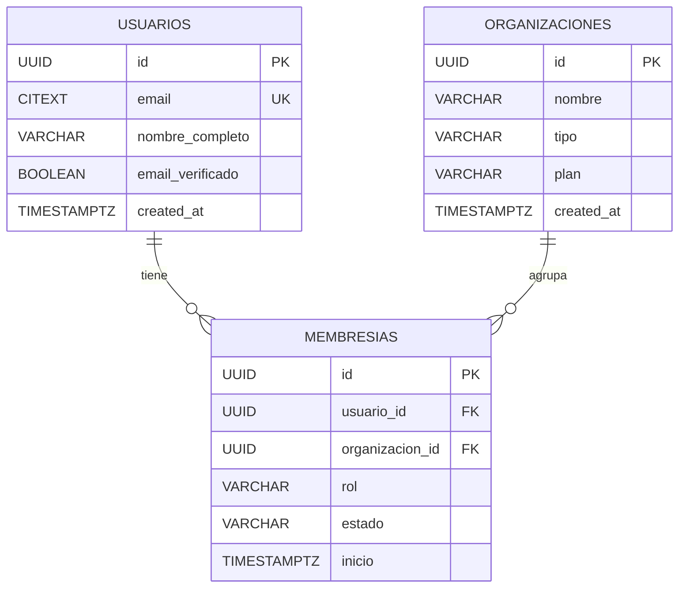
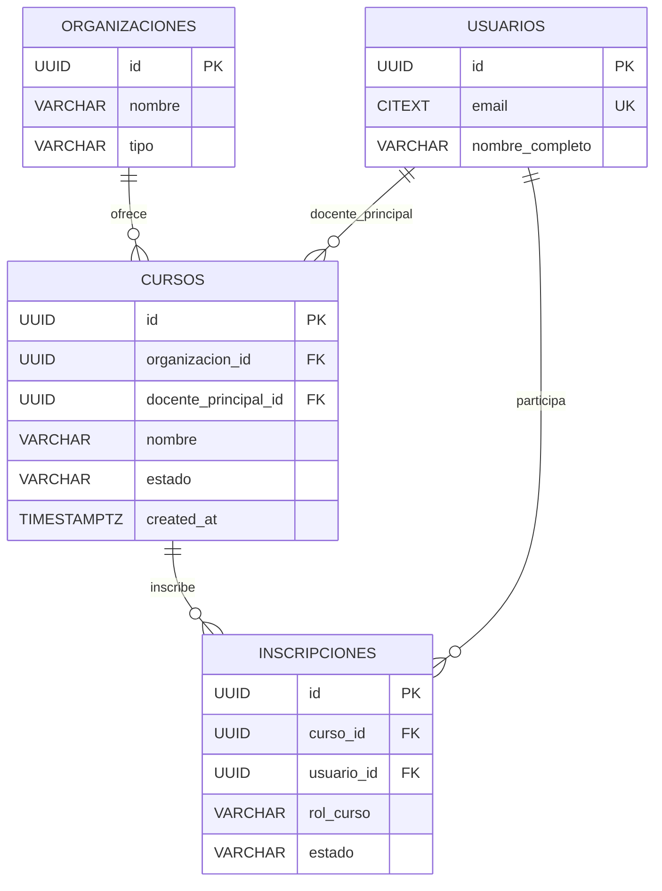
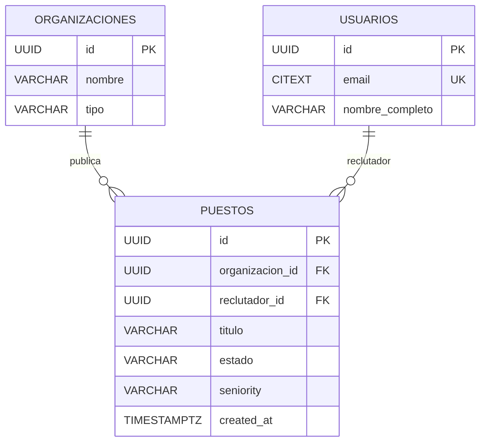
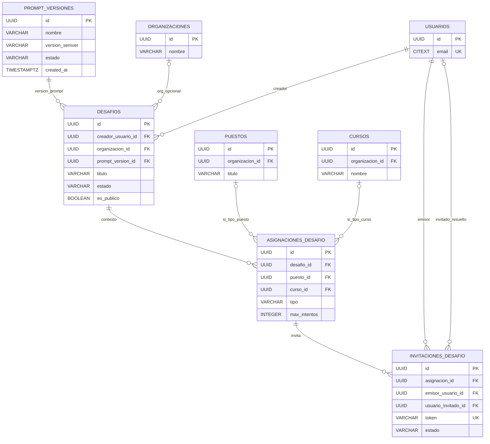
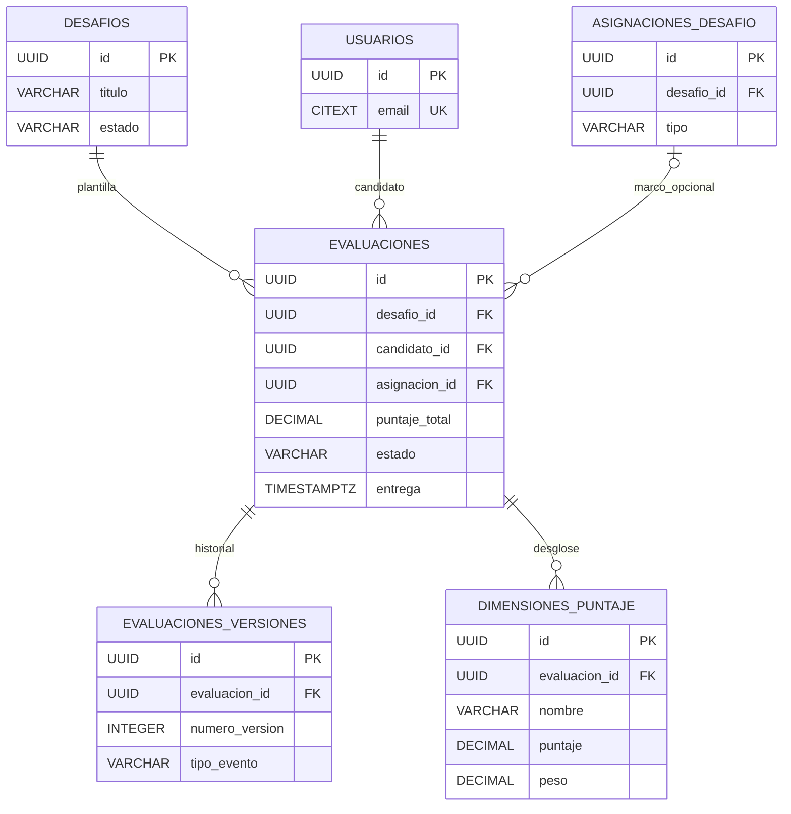
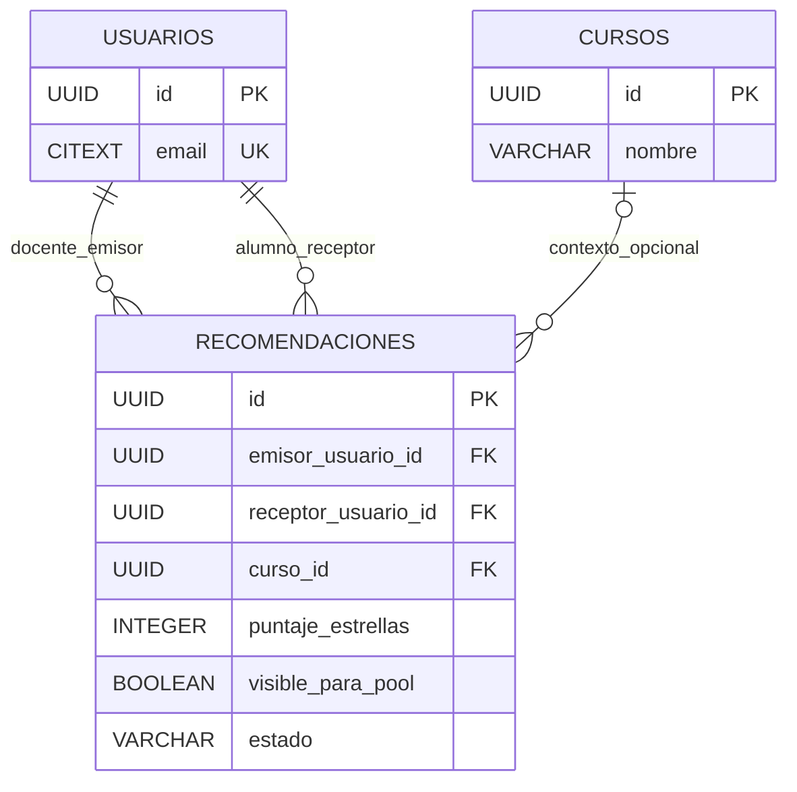
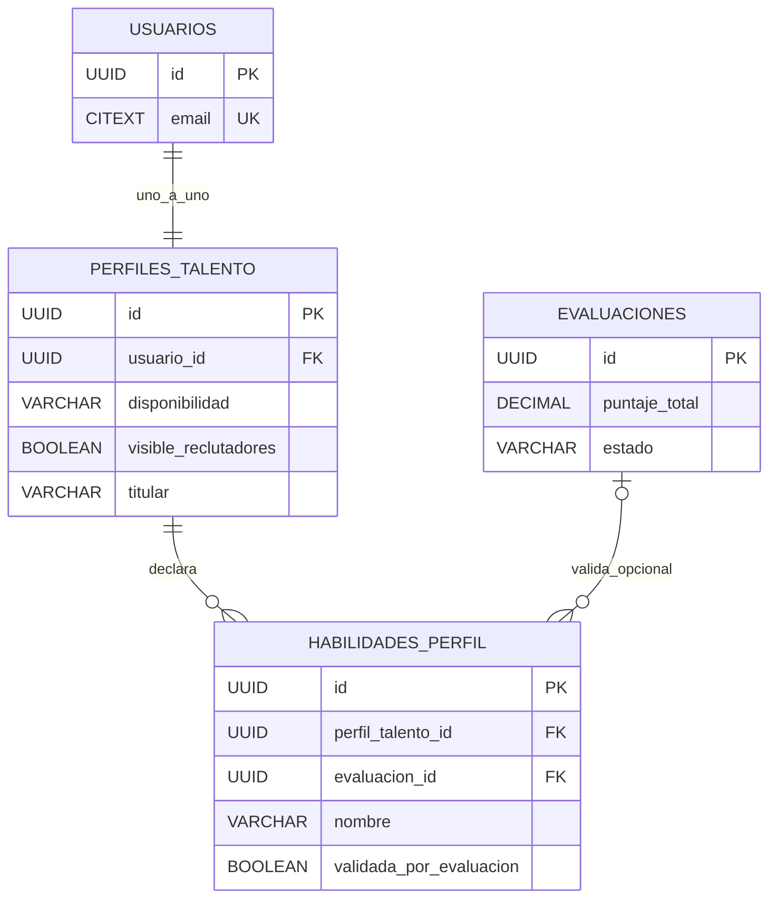
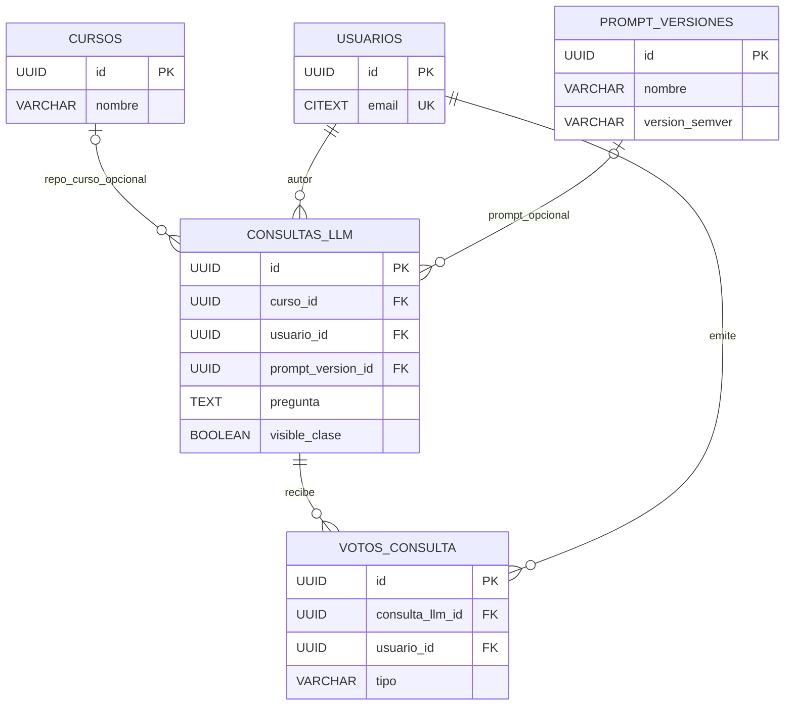
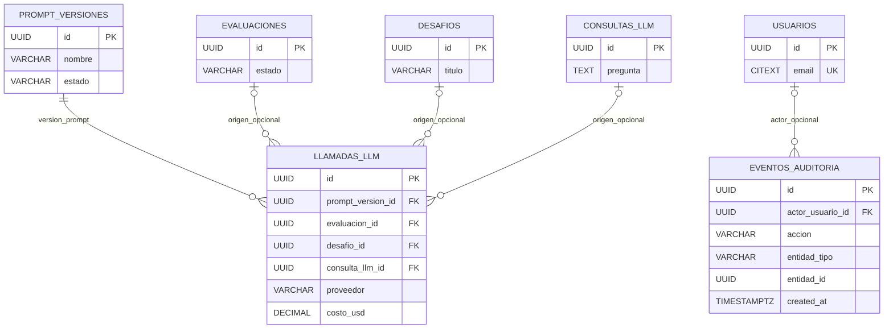

# DER — Diagrama entidad-relación (Talent Pool)

Documento de diagramación del modelo lógico. La **fuente de verdad** para columnas, constraints, índices y políticas `ON DELETE` es [product/DATABASE.md](../product/DATABASE.md).

**Motor objetivo:** PostgreSQL 16 con extensiones `pgcrypto`, `citext` y `pgvector` (según DATABASE.md).

---

## Dominios y tablas

| Dominio | Tablas |
|---------|--------|
| Identidad | `usuarios`, `organizaciones`, `membresias` |
| Académico | `cursos`, `inscripciones` |
| Corporativo | `puestos` |
| Núcleo | `desafios`, `asignaciones_desafio`, `invitaciones_desafio`, `evaluaciones`, `evaluaciones_versiones`, `dimensiones_puntaje` |
| Puente | `recomendaciones` |
| Pool | `perfiles_talento`, `habilidades_perfil` |
| Colaboración | `consultas_llm`, `votos_consulta` |
| Trazabilidad | `prompt_versiones`, `llamadas_llm`, `eventos_auditoria` |

---

## Vista integrada (solo relaciones)

Entidades en **MAYÚSCULAS**; cardinalidades en sintaxis Mermaid `erDiagram`. No se listan atributos para evitar duplicar el SSOT.

```mermaid
erDiagram
    USUARIOS ||--o{ MEMBRESIAS : "usuario_id"
    ORGANIZACIONES ||--o{ MEMBRESIAS : "organizacion_id"
    ORGANIZACIONES ||--o{ CURSOS : "organizacion_id"
    USUARIOS ||--o{ CURSOS : "docente_principal_id"
    CURSOS ||--o{ INSCRIPCIONES : "curso_id"
    USUARIOS ||--o{ INSCRIPCIONES : "usuario_id"
    ORGANIZACIONES ||--o{ PUESTOS : "organizacion_id"
    USUARIOS ||--o{ PUESTOS : "reclutador_id"
    USUARIOS ||--o{ DESAFIOS : "creador_usuario_id"
    ORGANIZACIONES |o--o{ DESAFIOS : "organizacion_id_nullable"
    PROMPT_VERSIONES ||--o{ DESAFIOS : "prompt_version_id"
    DESAFIOS ||--o{ ASIGNACIONES_DESAFIO : "desafio_id"
    PUESTOS |o--o{ ASIGNACIONES_DESAFIO : "puesto_id_nullable"
    CURSOS |o--o{ ASIGNACIONES_DESAFIO : "curso_id_nullable"
    ASIGNACIONES_DESAFIO ||--o{ INVITACIONES_DESAFIO : "asignacion_id"
    USUARIOS ||--o{ INVITACIONES_DESAFIO : "emisor_usuario_id"
    USUARIOS |o--o{ INVITACIONES_DESAFIO : "usuario_invitado_id_nullable"
    DESAFIOS ||--o{ EVALUACIONES : "desafio_id"
    USUARIOS ||--o{ EVALUACIONES : "candidato_id"
    ASIGNACIONES_DESAFIO |o--o{ EVALUACIONES : "asignacion_id_nullable"
    EVALUACIONES ||--o{ EVALUACIONES_VERSIONES : "evaluacion_id"
    EVALUACIONES ||--o{ DIMENSIONES_PUNTAJE : "evaluacion_id"
    USUARIOS ||--o{ RECOMENDACIONES : "emisor_usuario_id"
    USUARIOS ||--o{ RECOMENDACIONES : "receptor_usuario_id"
    CURSOS |o--o{ RECOMENDACIONES : "curso_id_nullable"
    USUARIOS ||--|| PERFILES_TALENTO : "usuario_id_unico"
    PERFILES_TALENTO ||--o{ HABILIDADES_PERFIL : "perfil_talento_id"
    EVALUACIONES |o--o{ HABILIDADES_PERFIL : "evaluacion_id_nullable"
    CURSOS |o--o{ CONSULTAS_LLM : "curso_id_nullable"
    USUARIOS ||--o{ CONSULTAS_LLM : "usuario_id"
    PROMPT_VERSIONES |o--o{ CONSULTAS_LLM : "prompt_version_id_nullable"
    CONSULTAS_LLM ||--o{ VOTOS_CONSULTA : "consulta_llm_id"
    USUARIOS ||--o{ VOTOS_CONSULTA : "usuario_id"
    PROMPT_VERSIONES ||--o{ LLAMADAS_LLM : "prompt_version_id"
    EVALUACIONES |o--o{ LLAMADAS_LLM : "evaluacion_id_nullable"
    DESAFIOS |o--o{ LLAMADAS_LLM : "desafio_id_nullable"
    CONSULTAS_LLM |o--o{ LLAMADAS_LLM : "consulta_llm_id_nullable"
    USUARIOS |o--o{ EVENTOS_AUDITORIA : "actor_usuario_id_nullable"
```

---

## Vistas por dominio

Las siguientes figuras son **vistas parciales** del mismo esquema (entidades compartidas pueden repetirse entre diagramas).

### Identidad y multi-tenancy

### Académico

### Corporativo

### Núcleo — desafíos, asignaciones e invitaciones

### Núcleo — evaluaciones y puntajes

### Puente educativo-corporativo

### Pool de talento

### Colaboración (consultas LLM)

### Trazabilidad y auditoría

---

## Notas de modelado

- **Multi-tenancy:** la mayoría de los datos de negocio se acotan por `organizacion_id` en tablas como `cursos`, `puestos`, `desafios` (cuando aplica) y vía `membresias` para roles.
- **FK opcionales:** `desafios.organizacion_id`, `asignaciones_desafio.puesto_id` / `curso_id`, `evaluaciones.asignacion_id`, `recomendaciones.curso_id`, `consultas_llm.curso_id` y `prompt_version_id`, `habilidades_perfil.evaluacion_id`, `invitaciones_desafio.usuario_invitado_id`, `eventos_auditoria.actor_usuario_id` pueden ser NULL según reglas en [DATABASE.md](../product/DATABASE.md).
- **`perfiles_talento.usuario_id`:** relación 1:1 con `usuarios` (restricción `UNIQUE` en la FK).
- **`llamadas_llm`:** las FKs `evaluacion_id`, `desafio_id` y `consulta_llm_id` son mutuamente opcionales; en aplicación debe cumplirse **exactamente un origen** por fila ([DATABASE.md](../product/DATABASE.md) §3.8).
- **Invitaciones y evaluaciones:** el acceso nominal usa `invitaciones_desafio.token`; no hay FK directa desde `evaluaciones` hacia `invitaciones_desafio` en el esquema documentado.
