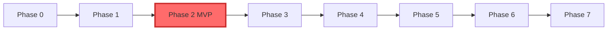
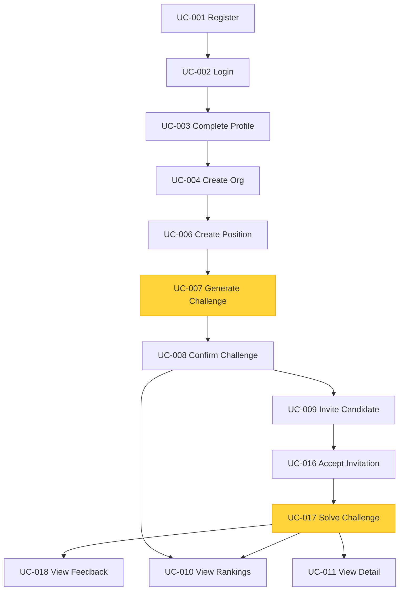

# ROADMAP ENHANCED — Talent Pool Development Plan

> **Comprehensive development roadmap based on PRODUCT.md and ARCHITECTURE.md**
> 
> Last updated: 2026-05-03

---

## Executive Summary

### Project Vision
Talent Pool is an AI-powered platform bridging technical education and employment through automated challenge generation and evaluation using LangChain4j.

### Timeline Overview

| Phase | Duration | Status | Priority | Deliverable |
|-------|----------|--------|----------|-------------|
| **0 - Foundations** | 3-5 days | Mostly complete* | CRITICAL | Infrastructure ready |
| **1 - Walking Skeleton** | 5-7 days | Partial* | CRITICAL | End-to-end validation |
| **2 - MVP Hackathon** | 48-72h | Partial* | **CRITICAL** | **Demo ready** |
| **3 - Hardening** | 2-3 weeks | Pending | HIGH | Production ready |
| **4 - Beta Launch** | 3-4 weeks | Pending | HIGH | 30 users live |
| **5 - Academic Module** | 4-6 weeks | Planned | MEDIUM | Education features |
| **6 - Corporate Expansion** | 8-12 weeks | Planned | MEDIUM | Enterprise ready |
| **7 - Monetization** | 12-16 weeks | Planned | LOW | Revenue generation |
| **8 - Continuous** | Ongoing | Planned | MEDIUM | Iterative enhancement |

\* **Phase 0**: Local stack, backend/frontend apps, ADRs and docs are in place; **CI, production Dockerfiles, full compose stack (backend+frontend services), Sonar, openapi-typescript client** remain open — see Phase 0 checklist. **Phase 1**: **Auth + chat API + guardrails + Redis rate limit** implemented; **dedicated `/home` chat UI** from the original spec was not built (product evolved to hackathon dashboard flow); **Grafana, CI E2E, executable LLM eval suite at 100%, JWT refresh endpoint** remain gaps — see Phase 1 checklist. **Phase 2**: End-to-end **recruiter/candidate hackathon UI + REST** (incl. **UC-004** `GET/POST/PUT/DELETE /api/v1/organizations`, Flyway **V015** `descripcion`) is in the repo; **CI, Playwright E2E, coverage ≥75/60%, LLM eval gate, staging, demo video** are still open vs the aspirational DoD below.

### Critical Path to Hackathon Demo

```
Phase 0 (5d) → Phase 1 (7d) → Phase 2 (3d) = 15 days total
```

**Hackathon Demo Date**: Day 15

---

## Development Principles

1. **Closed Decisions, Not Open** - Architecture is final (ADRs document changes)
2. **Immutable Tests** - Fix code, never tests
3. **LLM Tests Always Mocked** - Real calls only in eval suite
4. **Documented Debt or It Doesn't Exist** - All shortcuts in TECH_DEBT.md
5. **No Ambiguity** - Every UC has verifiable criteria
6. **Security and Observability from Day 1** - Not final phases
7. **Measured Quality, Not Assumed** - Linters, tests, evals block in CI
8. **Controlled Costs** - Every LLM UC declares token budget

### Checklist legend (Phases 0–1 audit)

- `[x]` Implemented as specified  
- `[~]` Partial / alternate implementation (see note on the line)  
- `[ ]` Not done or not in repo  

---

## Phase 0: Foundations (Days 1-5)

### Objective
Establish infrastructure so feature development is mechanical and safe.

### Implementation notes (audit 2026-05-02)

- **Layers**: Code uses `com.talentpool.service` for application/orchestration logic (no folder named `application`). Other layers match (`api`, `domain`, `infrastructure`).
- **Auth “me” endpoint**: Implemented as `GET /api/v1/auth/me`, not `GET /api/v1/users/me` (same responsibility).

### Key Deliverables

**Backend (Quarkus)**
- [~] Project structure with mandatory folders (api, domain, application, infrastructure) — use `service` instead of `application`
- [x] pom.xml with fixed versions (Quarkus 3.17.x, LangChain4j 1.x, PostgreSQL, Flyway)
- [x] Maven wrapper committed
- [~] Spotless + Checkstyle configured (Google Java Style) — Spotless + Google Java Format; **no separate Checkstyle plugin**
- [x] Flyway with V001__initial_schema.sql placeholder — **superseded**: migrations V001–V013 (extensions, usuarios, hackathon schema)
- [x] application.yml with profiles (dev/test/prod)
- [~] Quarkus Dev Services for PostgreSQL + pgvector — Dev Services + manual compose fallback (`infra/compose/docker-compose.dev.yml`)
- [x] Health endpoints responding (/q/health/live, /q/health/ready, /q/metrics)
- [x] OpenAPI generating (/q/openapi)
- [x] Minimal @QuarkusTest passing
- [ ] LangChain4j configured with MockChatModel test

**Frontend (React + TypeScript)**
- [x] Vite + React + TypeScript initialized
- [x] ESLint + Prettier + Husky configured
- [ ] openapi-typescript client generation
- [ ] Health check page calling backend
- [~] Vitest + Playwright configured — scripts and deps present; **no committed `*.test.*` / `e2e/` specs yet**

**Infrastructure**
- [~] docker-compose.yml (postgres, redis, backend, frontend) — **only** postgres + redis (+ optional pgAdmin); **no backend/frontend containers**
- [ ] Dockerfile.backend.jvm (multi-stage build)
- [ ] Dockerfile.frontend (nginx for SPA)
- [ ] GitHub Actions CI pipeline (lint, test, build)
- [ ] Staging deployment configured (Fly.io/Render/Railway)
- [ ] SonarQube/SonarCloud integrated (warning mode)

**Documentation**
- [x] CHANGELOG.md created
- [x] TECH_DEBT.md created
- [x] ADR-0001: Stack base closed
- [x] ADR-0002: RAG strategy closed
- [x] ADR-0003: LLM evals closed

### Definition of Done
- [x] `./mvnw quarkus:dev` and `pnpm dev` work on fresh clone
- [ ] CI pipeline passes in green
- [ ] Staging "hello world" accessible via HTTPS
- [x] README.md setup validated

### Success Metrics
- Setup time: < 15 minutes
- CI duration: < 10 minutes
- Docker startup: < 2 minutes

---

## Phase 1: Walking Skeleton (Days 6-12)

### Objective
Validate complete architecture end-to-end with trivial LLM capability.

### Scope
User can: Register → Login → Send message to LLM → See response

**Current product note**: Register/login and a **chat API** exist; the UI focuses on the **hackathon dashboard** (organizations, challenges, etc.) rather than a dedicated Phase-1 chat page. For audit detail see Implementation notes under Phase 0.

### Key Deliverables

**Backend**
- [x] Migration V002__users_table.sql (usuarios with email, password_hash) — file: `V002__create_usuarios.sql`
- [x] POST /api/v1/auth/register (Argon2id hashing, JWT tokens)
- [x] POST /api/v1/auth/login (JWT with SmallRye JWT)
- [~] GET /api/v1/users/me (authenticated endpoint) — implemented as **`GET /api/v1/auth/me`**
- [x] POST /api/v1/chat (LangChain4j integration, rate limiting)
- [x] Input guardrails (max 2000 chars, prompt injection detection)
- [x] Redis-based rate limiter (10 req/min per user)
- [~] Tests: unit (>80%), integration (@QuarkusTest >70%), E2E — `@QuarkusTest` present; JaCoCo bundle gate 70%; **roadmap E2E/coverage targets not fully met**
- [~] LLM Evals (5 prompts, 100% pass rate) — dataset YAML + Maven `evals` profile; **no `@Tag("evals")` Java suite at 100%**
- [~] Structured logs (JSON with correlation ID) — MDC/correlation in chat; JSON logs in prod profile
- [~] Metrics (Micrometer): auth, chat, tokens, cost — chat-focused; auth metrics not exhaustively audited
- [~] Traces (OpenTelemetry): LLM call spans — OTel config present (off by default dev; sampled in prod); **explicit LLM spans not verified**

**Frontend**
- [x] /register page (form with validation)
- [x] /login page (JWT token handling)
- [ ] /home page (chat interface with Monaco-like input) — **not implemented**; `/dashboard` and hackathon flows used instead
- [~] AuthContext (login, logout, token refresh) — login/logout + refresh token **stored**; **no `POST /auth/refresh`**, 401 clears session
- [ ] ChatContext (messages, sendMessage)
- [x] Axios instance with interceptors
- [~] Error boundaries + toast notifications — **toasts** (Sonner); **no React Error Boundary** wired globally
- [ ] Loading skeletons

**Observability**
- [ ] Dashboard (Grafana): request rate, latency, tokens, cost
- [ ] Alerts: latency >10s, error rate >5%, cost >$50/day

### Definition of Done
- [~] Human can register, login, chat on staging — register/login + **chat via API**; **no dedicated Phase-1 chat UI** on staging
- [~] Metrics show latency, tokens, cost — backend metrics for chat path; **not full Grafana**
- [ ] E2E test passes in CI (no flakiness)
- [ ] LLM eval suite passes (100%)
- [ ] Demo video recorded (2-3 min)

### Success Metrics
- Login latency p95: < 500ms
- Chat latency p95: < 8s
- Token cost per chat: < $0.05
- E2E stability: 100% (10 runs)

---

## Phase 2: MVP Hackathon (Days 13-15) 🎯

### Objective
Implement 11 critical use cases for complete hackathon demo.

### Duration
**48-72 hours** (CRITICAL DEADLINE)

### Use Cases

**Identity & Onboarding** (from Phase 1)
- UC-001: Register user ✅
- UC-002: Login ✅
- UC-003: Complete profile (enhanced with role selection)

**Organization & Job Management**
- UC-004: Create organization (4-6h) — **UI + REST** (`/api/v1/organizations`); column `descripcion` (V015) ✅
- UC-006: Create job position (6-8h) ✅

**AI Challenge Generation**
- UC-007: Generate challenge from position (12-16h) - **CORE FEATURE** ✅
- UC-008: Confirm or regenerate challenge (4-6h) ✅

**Challenge Assignment & Solving**
- UC-009: Invite candidate to challenge (6-8h) ✅
- UC-016: Accept invitation and access challenge (4-6h) ✅
- UC-017: Solve challenge with AI evaluation (16-20h) - **CORE FEATURE** ✅
- UC-018: View feedback (4-6h) ✅

**Recruiter Analytics**
- UC-010: View candidate rankings (8-12h) ✅
- UC-011: View detailed evaluation (4-6h) ✅

### Database Schema (8 Tables)

```sql
-- Core tables for MVP
usuarios              -- User accounts (from Phase 1)
organizaciones        -- Companies/institutions
membresias           -- User-organization relationships with roles
puestos              -- Job positions
prompt_versiones     -- Versioned LLM prompts
desafios             -- AI-generated challenges with hidden rubrics
asignaciones_desafio -- Challenge invitations
evaluaciones         -- Solutions with AI feedback
```

### Critical Features

#### UC-007: Generate Challenge (12-16h)
**LangChain4j AiService**
```java
@SystemMessage("Eres un experto en diseño de desafíos técnicos...")
@UserMessage("""
    Tecnología: {{tecnologia}}
    Seniority: {{seniority}}
    Genera desafío en JSON: {titulo, enunciado, rubrica, minutosEstimados}
    """)
String generarDesafio(@V("tecnologia") String tech, @V("seniority") String sen);
```

**Acceptance Criteria**
- ✅ Generation < 30s (RNF-001)
- ✅ Valid JSONB rubrica
- ✅ Relevance ≥ 85% (evals)
- ✅ Personalized by tech + seniority

#### UC-017: Solve & Evaluate (16-20h)
**LangChain4j AiService**
```java
@SystemMessage("Eres un evaluador técnico experto...")
@UserMessage("""
    Desafío: {{enunciado}}
    Rúbrica: {{rubrica}}
    Código: {{codigo}}
    Evalúa y retorna JSON: {puntaje, feedback, dimensiones}
    """)
String evaluarCodigo(@V("enunciado") String e, @V("rubrica") String r, @V("codigo") String c);
```

**Acceptance Criteria**
- ✅ Evaluation < 10s
- ✅ Score 0-100 with detailed feedback
- ✅ Precision ≥ 80% vs golden set
- ✅ Consistency ≥ 90% (repeated evals)

### Frontend Components

**Recruiter Dashboard** (routes in [`frontend/src/App.tsx`](../frontend/src/App.tsx); audit 2026-05-03)
- [x] Organization creation form (`/organizations`, `/organizations/new`, `/organizations/:id/edit`)
- [x] Job position form (tech dropdown, seniority selector)
- [x] Generate challenge button (with loading state)
- [x] Challenge review page (confirm/regenerate)
- [x] Invite candidate form
- [x] Rankings table (sortable, filterable)
- [x] Evaluation detail view (code + rubric analysis)

**Candidate Dashboard**
- [x] Challenge invitation list
- [x] Challenge detail view (without rubric)
- [x] Monaco Editor integration (syntax highlighting)
- [x] Submit solution button
- [x] Feedback view (score, strengths, improvements)

### Testing Strategy

**Backend**
- Unit: >75% coverage
- Integration: @QuarkusTest with Testcontainers
- E2E: Critical flows (register → create challenge → solve → view results)
- Demo smoke (hackathon): `cd backend && ./mvnw compile exec:java` ejecuta `DemoSmokeClient` (HTTP end-to-end con seed demo; ver `docs/runbooks/demo-smoke-flow.md`)
- LLM Evals: 30 cases (precision ≥80%, consistency ≥90%)

**Frontend**
- Unit: >60% coverage (Vitest)
- E2E: Playwright (recruiter flow, candidate flow)

### Definition of Done
- [~] UC-001 to UC-011, UC-016 to UC-018 — **implemented in codebase** (flows + API); formal product acceptance / load testing not fully closed
- [ ] Coverage: backend ≥75%, frontend ≥60%
- [ ] LLM evals: quality ≥85%, precision ≥80%, consistency ≥90% (CI gate)
- [ ] Metrics: ≥50 challenges, ≥100 evaluations, completeness ≥60% (demo data may satisfy ad hoc)
- [ ] Staging stable (HTTPS)
- [ ] **Demo video 5 minutes for hackathon**

### Success Metrics
- Challenge generation time: < 30s
- Evaluation time: < 10s
- Challenge relevance: ≥ 85%
- Evaluation accuracy: ≥ 80%
- System availability: ≥ 99%
- Cost per 100 evaluations: < $5

### Demo Script (5 minutes)

**Minute 1: Problem Statement**
- Show pain points: manual grading, isolated learning, expensive onboarding

**Minute 2: Recruiter Flow**
- Create organization
- Create job position (Java Backend SSR)
- Generate AI challenge (show 15s generation)
- Review and confirm challenge

**Minute 3: Candidate Flow**
- Accept invitation
- View challenge
- Write solution in Monaco Editor
- Submit for evaluation

**Minute 4: AI Evaluation**
- Show evaluation in progress (< 10s)
- Display detailed feedback (score, strengths, improvements)
- Show rubric analysis

**Minute 5: Analytics & Value**
- Show candidate rankings
- Highlight time saved (80% reduction in grading)
- Show cost efficiency ($0.05 per evaluation)
- Future roadmap teaser

---

## Phase 3: Hardening (Days 16-36)

### Objective
Prepare system for real users.

### Key Deliverables

**Security**
- [ ] OWASP Top 10 audit
- [ ] Password encryption (bcrypt), data encryption (RNF-004)
- [ ] MFA for recruiters (RNF-005)
- [ ] GDPR/LGPD compliance (RNF-007)
- [ ] Privacy policy + terms of use

**Quality**
- [ ] SonarQube quality gate bloqueante (coverage ≥80%)
- [ ] Load testing: 100 concurrent users (RNF-003)
- [ ] Cost testing: monthly projection < $500
- [ ] Chaos testing: DB failure, LLM failure, high latency

**Operations**
- [ ] Daily backups with tested restore (< 1h)
- [ ] Alerts for all SLOs
- [ ] Runbooks: DB down, LLM down, latency spike, cost spike
- [ ] GraalVM native build (startup <100ms, memory <256MB)
- [ ] Rollback plan tested (< 5 min)

### Definition of Done
- ✅ Load: p95 latency <400ms with 300 users
- ✅ Restore from backup successful (<1h)
- ✅ Zero critical security findings
- ✅ Availability ≥99.5% for 1 week in staging

---

## Phase 4: Beta Launch (Days 37-64)

### Objective
Validate with real users.

### Strategy
- [ ] Beta cerrada: 30 users (10 recruiters, 20 candidates)
- [ ] Onboarding guiado + support
- [ ] Feedback loop: NPS surveys, bug reports, feature requests
- [ ] Telemetry: Mixpanel/Amplitude (events, funnels, retention)
- [ ] Real-time cost monitoring

### Success Metrics
- Challenges generated: ≥ 50
- Evaluations completed: ≥ 100
- NPS: ≥ 7/10
- Availability: ≥ 99%
- Cost per 100 evaluations: < $5

### Gradual Rollout
- Week 1-2: 30 users
- Week 3: 100 users
- Week 4: 500 users
- Post-week 4: General availability

### Definition of Done
- ✅ Product metrics met with real data
- ✅ SLOs met for 4 weeks
- ✅ NPS ≥ 7/10
- ✅ Zero critical incidents

---

## Phase 5: Academic Module (Days 65-106)

### Objective
Expand to educational institutions.

### Use Cases (11 additional)
- UC-005: Invite member with role
- UC-012: Create course
- UC-013: Enroll students
- UC-014: Generate challenge for course
- UC-015: Write student recommendation
- UC-019: Manage talent pool visibility
- UC-020: Accept/reject recommendation
- UC-021: LLM query repository (collaborative learning)
- UC-022: Vote on shared queries

### Technical Additions
- [ ] 12 new tables (cursos, inscripciones, perfiles_talento, consultas_llm, etc.)
- [ ] RAG with pgvector (embeddings, chunking, retrieval)
- [ ] Granular roles (DOCENTE, ESTUDIANTE, RECLUTADOR)
- [ ] Teacher admin panel
- [ ] Solution sharing

### Definition of Done
- ✅ UC-005 to UC-008, UC-012 to UC-015, UC-019 to UC-022 implemented
- ✅ RAG latency < 2s
- ✅ LLM cost reduction 30% (through query deduplication)

---

## Phase 6: Corporate Expansion (Days 107-190)

### Objective
Enterprise features.

### Use Cases
- UC-009: Filter talent database (RF-026, RF-027)
- UC-010: Company workflow simulators (RF-017, RF-018)

### Technical Additions
- [ ] Searchable talent database
- [ ] Advanced analytics + reports
- [ ] Public API v1 with documentation
- [ ] ATS integrations (Greenhouse, Lever, BambooHR)

### Definition of Done
- ✅ UC-009 and UC-010 implemented
- ✅ API stable
- ✅ ≥3 ATS integrations working

---

## Phase 7: Monetization (Days 191-302)

### Objective
Sustainable business model.

### Use Cases
- UC-011: Digital certificates (RF-031)
- UC-012: Subscriptions and payments (RF-032)

### Technical Additions
- [ ] Subscription tiers (Free, Pro, Enterprise)
- [ ] Payment processing (Stripe/MercadoPago)
- [ ] Premium challenge marketplace
- [ ] Certificate verification system

### Definition of Done
- ✅ Payments working in production
- ✅ ≥10 paying customers
- ✅ Verifiable certificates

---

## Phase 8: Continuous Iteration (Ongoing)

### Objective
Data-driven improvement.

### Mechanics
- Sprints: 2 weeks
- Backlog prioritized by impact
- Monthly: tech debt review, prompt optimization
- Quarterly: security audit

### Recurring Activities
- [ ] Product metrics (weekly)
- [ ] LLM costs (weekly)
- [ ] Tech debt (monthly)
- [ ] Eval suite (monthly)
- [ ] Security audit (quarterly)

---

## Critical Path Analysis

### Dependencies



**Critical Path to Hackathon**: P0 → P1 → P2 (15 days)

### Blockers

| Phase | Blocker | Mitigation |
|-------|---------|------------|
| P0 → P1 | Infrastructure not ready | Daily standup, clear DoD |
| P1 → P2 | Walking skeleton fails | Allocate buffer day |
| P2 → P3 | MVP incomplete | Prioritize ruthlessly, cut scope if needed |
| P3 → P4 | Security issues | Start security audit in P2 |

---

## Risk Management

### High-Priority Risks

| Risk | Probability | Impact | Mitigation |
|------|-------------|--------|------------|
| **LLM costs exceed budget** | High | Critical | Hard limits, cheaper models for dev, cost alerts |
| **LLM quality insufficient** | Medium | Critical | Extensive eval suite, golden dataset, prompt engineering |
| **Hackathon deadline missed** | Medium | Critical | Daily progress tracking, scope flexibility |
| **Security vulnerability** | Low | Critical | OWASP audit, automated SAST, penetration testing |
| **Performance degradation** | Medium | High | Load testing early, caching strategy, query optimization |
| **Data loss** | Low | Critical | Daily backups, tested restore, replication |

### Risk Response Plan

**If LLM costs spike:**
1. Activate cost alerts
2. Switch to cheaper model (GPT-3.5 vs GPT-4)
3. Implement aggressive caching
4. Reduce token limits

**If quality issues:**
1. Expand eval suite
2. Refine prompts with A/B testing
3. Add human-in-the-loop validation
4. Consider model fine-tuning

**If deadline at risk:**
1. Cut non-critical features
2. Increase team hours (with breaks)
3. Simplify UI/UX
4. Focus on core demo flow

---

## Resource Allocation

### Team Structure (Recommended)

**Phase 0-2 (Hackathon Sprint)**
- 1 Backend Lead (Quarkus + LangChain4j)
- 1 Frontend Lead (React + TypeScript)
- 1 DevOps/Infrastructure
- 1 Product Owner (demo script, testing)

**Phase 3-4 (Hardening + Beta)**
- Add: 1 QA Engineer
- Add: 1 Security Specialist (part-time)

**Phase 5+ (Expansion)**
- Scale team based on metrics

### Time Allocation by Phase

| Phase | Backend | Frontend | DevOps | Product | Total |
|-------|---------|----------|--------|---------|-------|
| P0 | 40% | 30% | 25% | 5% | 100% |
| P1 | 45% | 35% | 15% | 5% | 100% |
| P2 | 50% | 40% | 5% | 5% | 100% |
| P3 | 30% | 20% | 40% | 10% | 100% |

---

## Success Metrics Dashboard

### Phase 2 (MVP) Targets

| Category | Metric | Target | Measurement |
|----------|--------|--------|-------------|
| **Product** | Challenges generated | ≥ 50 | Database count |
| | Evaluations completed | ≥ 100 | Database count |
| | Completion rate | ≥ 60% | (completed / started) |
| | User satisfaction (NPS) | ≥ 7/10 | Survey |
| **Technical** | Challenge generation time | < 30s | p95 latency |
| | Evaluation time | < 10s | p95 latency |
| | System availability | ≥ 99% | Uptime monitoring |
| | Error rate | < 1% | 5xx / total requests |
| **LLM** | Challenge relevance | ≥ 85% | Eval suite |
| | Evaluation accuracy | ≥ 80% | vs human evaluator |
| | Consistency | ≥ 90% | Repeated evals |
| | Valid JSON responses | ≥ 98% | Parse success rate |
| **Cost** | Cost per evaluation | < $0.05 | Token tracking |
| | Daily cost | < $50 | Aggregated |
| | Monthly projection | < $500 | Extrapolated |

### Monitoring Tools

- **Metrics**: Prometheus + Grafana
- **Logs**: ELK Stack or Loki
- **Traces**: Jaeger or Tempo
- **Alerts**: PagerDuty or Opsgenie
- **Cost**: Custom dashboard with LLM provider APIs

---

## Technical Debt Strategy

### Debt Categories

1. **Intentional Shortcuts** (documented in TECH_DEBT.md)
   - Example: Email verification mocked in Phase 1
   - Remediation: Phase 3

2. **Discovered Issues** (from code reviews, incidents)
   - Example: N+1 query in rankings endpoint
   - Remediation: Next sprint

3. **Architectural Limitations** (requires ADR)
   - Example: Monolith → microservices
   - Remediation: Phase 6+

### Debt Management Process

**Registration**
```markdown
## DEBT-001: Email Verification Mocked

**Category**: Intentional Shortcut
**Phase Introduced**: Phase 1
**Impact**: Medium (users can't verify emails)
**Effort**: 8 hours
**Priority**: P1 (Phase 3)
**Remediation Plan**:
1. Integrate SendGrid/Postmark
2. Create email templates
3. Add verification flow
4. Test with real emails
```

**Monthly Review**
- [ ] Review all open debt items
- [ ] Prioritize by impact × effort
- [ ] Allocate 20% of sprint capacity to debt
- [ ] Close resolved items

**Quality Gates**
- No P0 debt in production
- Max 5 P1 debt items
- Debt ratio < 10% (debt / total code)

---

## Appendix: Use Case Dependencies

### UC Dependency Graph



### MVP Critical Path

**Minimum viable demo flow:**
```
UC-001 → UC-002 → UC-004 → UC-006 → UC-007 → UC-008 → 
UC-009 → UC-016 → UC-017 → UC-018 → UC-010 → UC-011
```

**Total estimated time**: 48-72 hours (Phase 2)

---

## Conclusion

This roadmap provides a clear path from infrastructure setup to a production-ready, monetizable platform. The critical focus is **Phase 2 (MVP Hackathon)**, which must deliver a compelling demo in 48-72 hours.

### Next Steps

1. **Validate this roadmap** with stakeholders
2. **Assign team members** to phases
3. **Set up project tracking** (Jira, Linear, GitHub Projects)
4. **Begin Phase 0** immediately
5. **Daily standups** during Phases 0-2
6. **Demo rehearsal** before hackathon presentation

### Success Criteria

**Hackathon Success** = Working demo + Clear value proposition + Technical excellence

**Long-term Success** = User adoption + Cost efficiency + Scalable architecture

---

**Document Version**: 1.0
**Last Updated**: 2026-05-01
**Next Review**: After Phase 2 completion